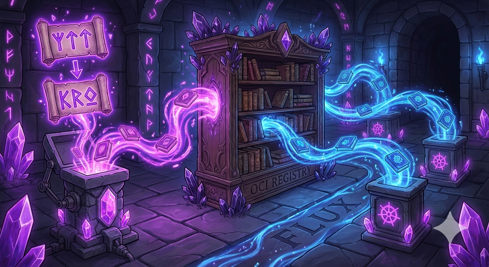

# fedCORE Platform (App Factory)

**A Kubernetes-based platform for building and managing multi-tenant infrastructure**

fedCORE is a framework for defining and delivering platform infrastructure across AWS, Azure, and on-premises environments using GitOps patterns. It provides the building blocks — component packaging, cluster configuration, overlay-based customization — that teams compose into their own platform.

---

---

## Getting Started

Install the `fedcore` CLI, then explore:

```bash
# Learn how fedCORE works
fedcore explain
fedcore explain workflow
fedcore explain components

# Scaffold a new project (interactive)
fedcore init project

# Create a cluster configuration (interactive — prompts for name, cloud, region, environment)
fedcore init cluster

# Add a component (interactive — prompts for name and type)
fedcore init component

# Generate bootstrap manifests for a cluster
fedcore bootstrap --cluster platform/clusters/dev-east

# Build artifacts
fedcore build --cluster platform/clusters/dev-east
fedcore build --all

# Inspect what was built
fedcore inspect --cluster platform/clusters/dev-east

# Validate configuration
fedcore validate
```

Use `fedcore --help` or `fedcore <command> --help` for full usage details.

---

## Documentation

Full documentation lives in the [docs/](docs/) directory. Start with the [Handbook Introduction](docs/HANDBOOK_INTRO.md).

**Quick starts by role:**

- [Platform Administrators](docs/QUICKSTART_ADMIN.md) -- onboard tenants, configure clusters, manage quotas
- [Application Developers](docs/QUICKSTART_DEVELOPER.md) -- deploy applications, provision resources
- [Architects](docs/QUICKSTART_ARCHITECT.md) -- evaluate design philosophy and trade-offs
- [Platform Engineers](docs/QUICKSTART_PLATFORM_ENGINEER.md) -- create RGDs, add integrations, extend the platform

**References:** [Glossary](docs/GLOSSARY.md) | [FAQ](docs/FAQ.md) | [Troubleshooting](docs/TROUBLESHOOTING.md)

---

## What is fedCORE?

- **Multi-tenant isolation** via Capsule with dedicated cloud accounts per tenant
- **Self-service infrastructure** via Kro ResourceGraphDefinitions (platform APIs)
- **Multi-cloud support** for AWS, Azure, and on-premises environments
- **GitOps delivery** with OCI artifact distribution
- **Security patterns** for layered policies and runtime enforcement

See [fedCORE Purposes](docs/FEDCORE_PURPOSES.md) for the full platform overview and [Architecture Diagrams](docs/ARCHITECTURE_DIAGRAMS.md) for visual guides.

---

## Repository Structure

```
app-factory/
├── src/                       # fedcore CLI (Rust)
├── platform/
│   ├── clusters/              # Cluster configurations
│   ├── components/            # Platform components (Kro, Capsule, Headlamp, etc.)
│   ├── rgds/                  # ResourceGraphDefinitions (platform APIs)
│   └── bootstrap/             # Bootstrap manifests for cluster setup
├── docs/                      # Documentation handbook
└── .github/workflows/         # CI/CD pipeline
```

See [Cluster Structure](docs/CLUSTER_STRUCTURE.md) for detailed directory organization.

---

## Contributing

1. Read the [Development Guide](docs/DEVELOPMENT.md)
2. Create a feature branch from `main`
3. Make changes and validate with `fedcore validate`
4. Submit a PR

Questions or issues? Open a [GitHub issue](../../issues) or [GitHub discussion](../../discussions).

---

## License

This project is licensed under the [GNU General Public License v3.0](LICENSE).
