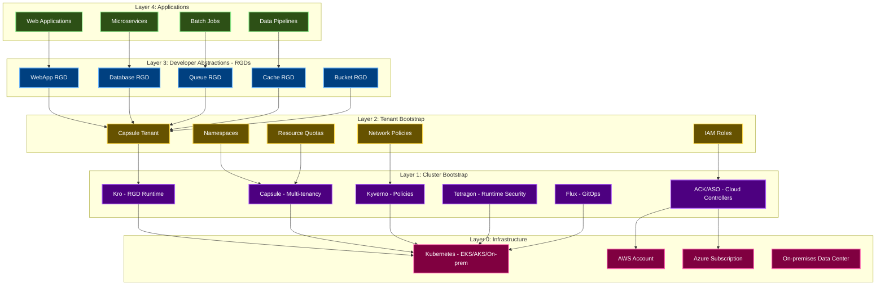
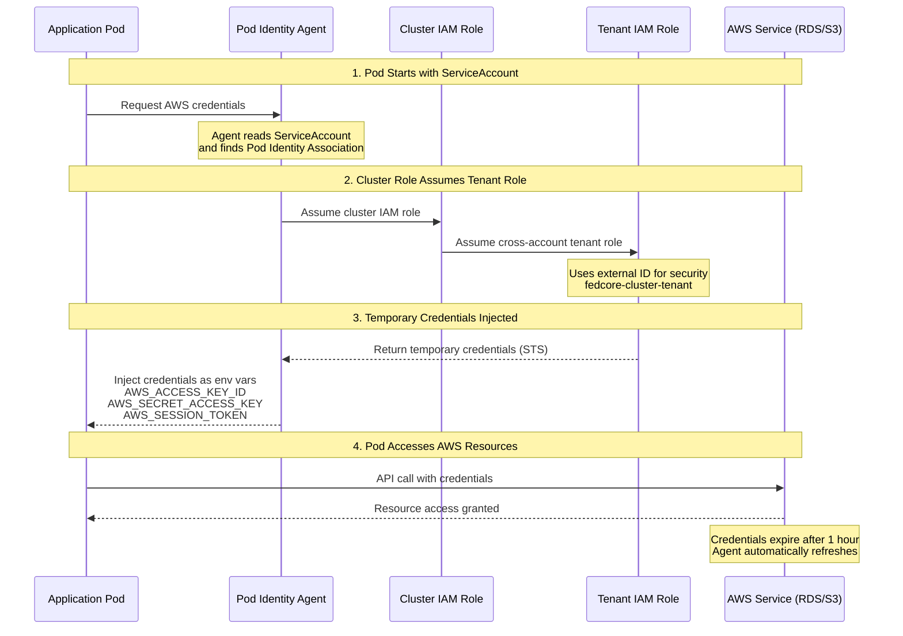
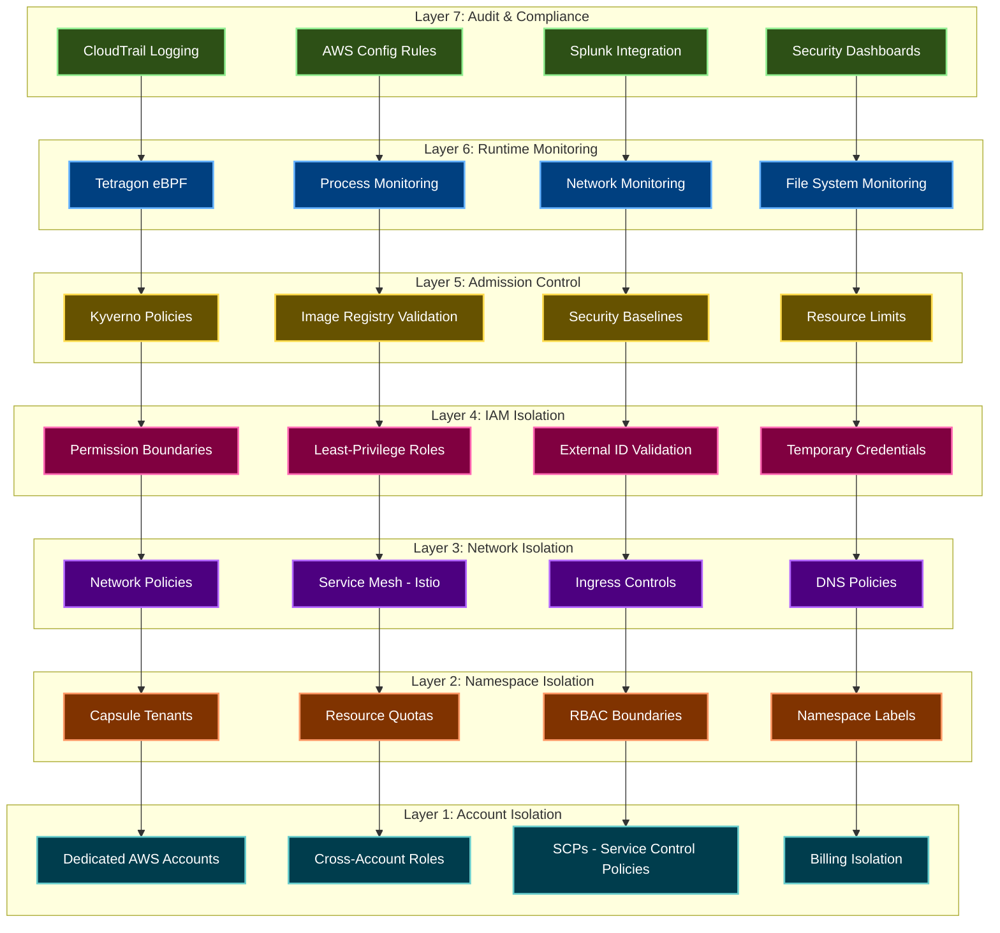
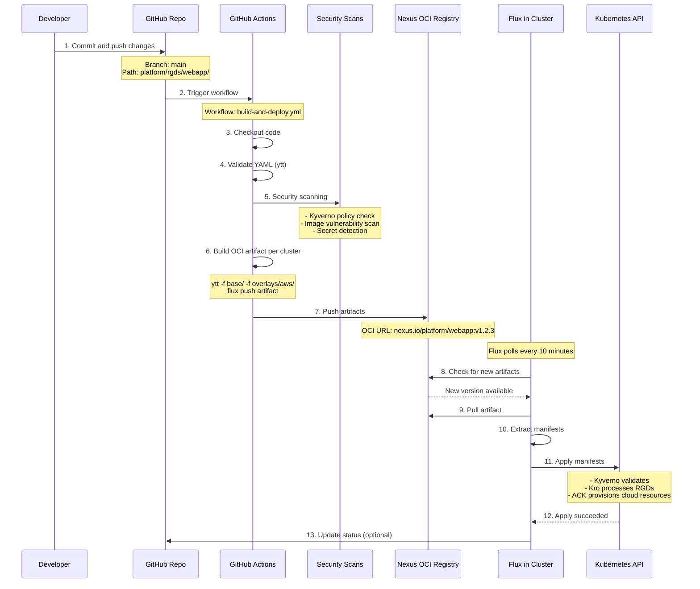
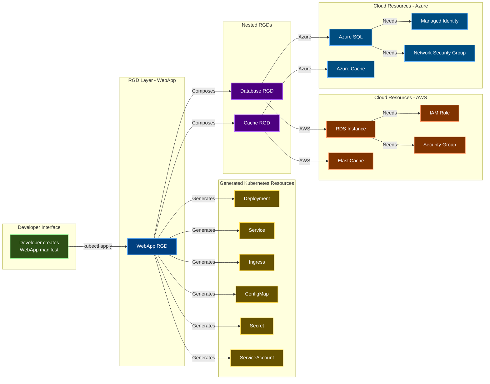

# Architecture Diagrams

Visual architecture reference for the fedCORE platform. Use these diagrams to understand system components, data flows, and integration patterns.

---

## Platform Layers Diagram

The fedCORE platform is built in layers, with each layer building on the previous:

**Key Takeaways:**
- Each layer abstracts complexity from the layer above
- Bootstrap layers (0-2) are managed by platform team
- RGDs (Layer 3) are created by platform engineers
- Applications (Layer 4) are deployed by developers

---

## Pod Identity Flow

How pods authenticate with AWS services using EKS Pod Identity:

**Components:**
- **Pod Identity Agent:** DaemonSet running on every node
- **Cluster IAM Role:** Lives in cluster AWS account, can assume tenant roles
- **Tenant IAM Role:** Lives in tenant AWS account, restricted by permission boundary
- **External ID:** Prevents "confused deputy" attacks

**See Also:** [Pod Identity Full Documentation](POD_IDENTITY_FULL.md)

---

## Multi-Account Architecture

Tenant isolation using dedicated AWS accounts:

```mermaid
graph TB
    subgraph "Cluster Account - 111111111111"
        EKS[EKS Cluster]
        PODS[Application Pods]
        ACK[ACK Controllers]
        FLUX[Flux GitOps]

        subgraph "Cluster IAM Roles"
            CLUSTERROLE[EKS Pod Identity Role]
        end
    end

    subgraph "Tenant A Account - 222222222222"
        subgraph "AWS Resources"
            RDS_A[RDS Database]
            S3_A[S3 Buckets]
            DDB_A[DynamoDB Tables]
        end

        subgraph "Tenant IAM Roles"
            ACK_ROLE_A[ACK Provisioner Role]
            APP_ROLE_A[Application IAM Role]
            DEPLOYER_A[Tenant Deployer Role]
        end

        BOUNDARY_A[Permission Boundary]
    end

    subgraph "Tenant B Account - 333333333333"
        subgraph "AWS Resources"
            RDS_B[RDS Database]
            S3_B[S3 Buckets]
            SQS_B[SQS Queues]
        end

        subgraph "Tenant IAM Roles"
            ACK_ROLE_B[ACK Provisioner Role]
            APP_ROLE_B[Application IAM Role]
            DEPLOYER_B[Tenant Deployer Role]
        end

        BOUNDARY_B[Permission Boundary]
    end

    subgraph "GitOps Flow"
        GIT[Git Repository]
        CICD[CI/CD Pipeline]
        NEXUS[Nexus OCI Registry]
    end

    GIT -->|1. Push| CICD
    CICD -->|2. Build artifacts| NEXUS
    FLUX -->|3. Pull artifacts| NEXUS
    FLUX -->|4. Apply manifests| PODS

    PODS -->|5. Request AWS access| CLUSTERROLE
    CLUSTERROLE -.->|6. Assume role| ACK_ROLE_A
    CLUSTERROLE -.->|6. Assume role| ACK_ROLE_B

    ACK -->|7. Provision resources| ACK_ROLE_A
    ACK -->|7. Provision resources| ACK_ROLE_B

    ACK_ROLE_A -->|8. Create resources| RDS_A
    ACK_ROLE_A -->|8. Create resources| S3_A
    ACK_ROLE_A -->|8. Create IAM roles| APP_ROLE_A

    ACK_ROLE_B -->|8. Create resources| RDS_B
    ACK_ROLE_B -->|8. Create resources| S3_B
    ACK_ROLE_B -->|8. Create IAM roles| APP_ROLE_B

    BOUNDARY_A -.->|Restricts| ACK_ROLE_A
    BOUNDARY_A -.->|Restricts| APP_ROLE_A
    BOUNDARY_A -.->|Restricts| DEPLOYER_A

    BOUNDARY_B -.->|Restricts| ACK_ROLE_B
    BOUNDARY_B -.->|Restricts| APP_ROLE_B
    BOUNDARY_B -.->|Restricts| DEPLOYER_B

    classDef clusterStyle fill:#004080,stroke:#66b3ff,stroke-width:2px,color:#fff
    classDef tenantStyle fill:#800040,stroke:#ff66b3,stroke-width:2px,color:#fff
    classDef resourceStyle fill:#2d5016,stroke:#90ee90,stroke-width:2px,color:#fff
    classDef roleStyle fill:#665200,stroke:#ffdb4d,stroke-width:2px,color:#fff
    classDef gitopsStyle fill:#4d0080,stroke:#b366ff,stroke-width:2px,color:#fff
    classDef boundaryStyle fill:#800000,stroke:#ff6666,stroke-width:2px,color:#fff

    class EKS,PODS,ACK,FLUX,CLUSTERROLE clusterStyle
    class RDS_A,S3_A,DDB_A,RDS_B,S3_B,SQS_B resourceStyle
    class ACK_ROLE_A,APP_ROLE_A,DEPLOYER_A,ACK_ROLE_B,APP_ROLE_B,DEPLOYER_B roleStyle
    class GIT,CICD,NEXUS gitopsStyle
    class BOUNDARY_A,BOUNDARY_B boundaryStyle
```

**Key Points:**
- Each tenant has a dedicated AWS account
- Cluster account hosts Kubernetes workloads
- ACK controllers assume cross-account roles to provision resources
- Permission boundaries prevent privilege escalation
- Tenants cannot access each other's AWS accounts

**See Also:** [Multi-Account Architecture](MULTI_ACCOUNT_ARCHITECTURE.md)

---

## Security Layers

Defense-in-depth security model with seven isolation layers:

**Defense-in-Depth Philosophy:**
- **Multiple layers:** Compromise of one layer doesn't breach security
- **Fail-safe:** If admission control fails, runtime monitoring detects
- **Audit trail:** All security events logged and alerted
- **Preventive + Detective:** Block bad actions, detect anomalies

**See Also:** [Security Overview](SECURITY_OVERVIEW.md)

---

## GitOps Workflow

End-to-end deployment pipeline from git commit to cluster:

**Pipeline Stages:**

1. **Source:** Developer commits changes to git
2. **Validate:** CI validates YAML syntax and schemas
3. **Security:** Scans for vulnerabilities, secrets, policy violations
4. **Build:** ytt generates cloud-specific manifests
5. **Package:** Flux bundles manifests into OCI artifacts
6. **Publish:** Artifacts pushed to Nexus OCI registry
7. **Sync:** Flux pulls artifacts and applies to cluster
8. **Reconcile:** Kro and ACK/ASO provision resources

**See Also:** [Deployment Pipeline](DEPLOYMENT.md)

---

## Tenant Isolation

How Capsule, Kyverno, IAM, and Network Policies enforce tenant isolation:

```mermaid
graph TB
    subgraph "Tenant A - acme"
        subgraph "Capsule Tenant: acme"
            NS_A1[acme-dev]
            NS_A2[acme-prod]
            NS_A3[acme-cicd]
        end

        subgraph "Namespace Resources"
            POD_A[Pods]
            SVC_A[Services]
            ING_A[Ingress]
        end

        subgraph "Tenant Quotas"
            QUOTA_A[CPU: 100 cores<br/>Memory: 200Gi<br/>Namespaces: 10]
        end

        subgraph "Network Policies"
            NP_A[Allow within tenant<br/>Deny cross-tenant]
        end
    end

    subgraph "Tenant B - globex"
        subgraph "Capsule Tenant: globex"
            NS_B1[globex-dev]
            NS_B2[globex-staging]
            NS_B3[globex-cicd]
        end

        subgraph "Namespace Resources"
            POD_B[Pods]
            SVC_B[Services]
            ING_B[Ingress]
        end

        subgraph "Tenant Quotas"
            QUOTA_B[CPU: 50 cores<br/>Memory: 100Gi<br/>Namespaces: 5]
        end

        subgraph "Network Policies"
            NP_B[Allow within tenant<br/>Deny cross-tenant]
        end
    end

    subgraph "Platform Enforcement"
        CAPSULE[Capsule Controller]
        KYVERNO[Kyverno Policies]
        TETRAGON[Tetragon Runtime Security]
    end

    subgraph "Cross-Cutting Controls"
        RBAC[RBAC: Tenant Owners<br/>can only access own namespaces]
        IAM[IAM: Pods can only access<br/>own tenant's AWS account]
        AUDIT[Audit Logs: All actions<br/>tracked per tenant]
    end

    CAPSULE -->|Enforces namespace naming| NS_A1
    CAPSULE -->|Enforces namespace naming| NS_B1
    CAPSULE -->|Enforces quotas| QUOTA_A
    CAPSULE -->|Enforces quotas| QUOTA_B

    KYVERNO -->|Validates resources| POD_A
    KYVERNO -->|Validates resources| POD_B
    KYVERNO -->|Blocks violations| SVC_A
    KYVERNO -->|Blocks violations| SVC_B

    TETRAGON -->|Monitors runtime| POD_A
    TETRAGON -->|Monitors runtime| POD_B

    NP_A -.->|Blocks| POD_B
    NP_B -.->|Blocks| POD_A

    RBAC -.->|Restricts| NS_A1
    RBAC -.->|Restricts| NS_B1

    IAM -.->|Isolates| POD_A
    IAM -.->|Isolates| POD_B

    classDef tenantAStyle fill:#2d5016,stroke:#90ee90,stroke-width:2px,color:#fff
    classDef tenantBStyle fill:#004080,stroke:#66b3ff,stroke-width:2px,color:#fff
    classDef platformStyle fill:#665200,stroke:#ffdb4d,stroke-width:2px,color:#fff
    classDef controlStyle fill:#4d0080,stroke:#b366ff,stroke-width:2px,color:#fff

    class NS_A1,NS_A2,NS_A3,POD_A,SVC_A,ING_A,QUOTA_A,NP_A tenantAStyle
    class NS_B1,NS_B2,NS_B3,POD_B,SVC_B,ING_B,QUOTA_B,NP_B tenantBStyle
    class CAPSULE,KYVERNO,TETRAGON platformStyle
    class RBAC,IAM,AUDIT controlStyle
```

**Isolation Mechanisms:**

1. **Capsule:** Enforces namespace naming (`tenant-*` pattern), quotas, and ownership
2. **Network Policies:** Deny all traffic between tenant namespaces
3. **RBAC:** Tenant owners can only access their own namespaces
4. **IAM:** Pods can only assume roles in their tenant's AWS account
5. **Kyverno:** Validates all resources comply with security policies
6. **Tetragon:** Monitors runtime for suspicious cross-tenant access attempts

**See Also:** [Tenant Admin Guide](TENANT_ADMIN_GUIDE.md), [Security Overview](SECURITY_OVERVIEW.md)

---

## RGD Composition

How RGDs compose multiple resources into a single abstraction:

**RGD Composition Benefits:**
- **Abstraction:** Single manifest creates entire stack
- **Reusability:** WebApp RGD reuses Database and Cache RGDs
- **Cloud Portability:** Same manifest works across AWS, Azure, on-prem
- **Best Practices:** RGDs enforce organizational standards
- **Versioning:** RGDs can evolve without breaking existing apps

**See Also:** [Development Guide](DEVELOPMENT.md), [Platform Engineer Quick Start](QUICKSTART_PLATFORM_ENGINEER.md)

---

## Additional Resources

### Related Documentation
- **[fedCORE Purposes](FEDCORE_PURPOSES.md)** - Platform overview and design goals
- **[Multi-Account Architecture](MULTI_ACCOUNT_ARCHITECTURE.md)** - Deep dive into account isolation
- **[Security Overview](SECURITY_OVERVIEW.md)** - Comprehensive security model
- **[Pod Identity](POD_IDENTITY_FULL.md)** - AWS authentication mechanism
- **[Deployment Pipeline](DEPLOYMENT.md)** - GitOps workflow details

### Diagram Sources

All diagrams use Mermaid syntax and can be edited in any Markdown editor with Mermaid support:
- [Mermaid Live Editor](https://mermaid.live/)
- VS Code with Mermaid extension
- GitHub renders Mermaid natively

### Contributing

To add new diagrams:
1. Use Mermaid syntax for consistency
2. Include a "Key Points" or "Key Takeaways" summary
3. Link to related documentation
4. Test rendering in GitHub preview

---

## Navigation

[← Previous: fedCORE Purposes](FEDCORE_PURPOSES.md) | [Next: Admin Quick Start →](QUICKSTART_ADMIN.md)

**Handbook Progress:** Page 4 of 35 | **Level 1:** Foundation & Quick Starts

[📚 Back to Handbook](HANDBOOK_INTRO.md) | [📖 Glossary](GLOSSARY.md) | [🔧 Troubleshooting](TROUBLESHOOTING.md)
