# Bootstrap Process Flow

```mermaid
flowchart TB
    subgraph entry["Script Entry"]
        A["fedcore bootstrap [options]<br/>--cluster, --deploy, --admin-prep, --registry"]
    end

    subgraph validation["1. Validation Phase"]
        B["Parse command line arguments"]
        C["Verify cluster directory exists"]
        D["Verify cluster.yaml exists"]
        E["Verify platform/clusters/schema.yaml exists"]
    end

    subgraph metadata["2. Metadata Extraction"]
        F["Load cluster.yaml with ytt"]
        G["Extract cluster metadata"]
        H["Extract: cluster_name, flux config,<br/>components list"]
    end

    subgraph mode_decision["3. Mode Decision"]
        L{"--admin-prep?"}
    end

    subgraph admin_prep["Admin-Prep Mode"]
        AP1["Build each enabled component<br/>to discover target namespaces"]
        AP2["Extract Flux CRDs via<br/>flux install --export"]
        AP3["Render admin-prep templates:<br/>CRDs, Namespace, ServiceAccounts,<br/>RBAC for flux + target namespaces"]
        AP4["Output manifest to stdout"]
    end

    subgraph generation["4. Bootstrap Configuration Generation"]
        direction TB

        subgraph flux_install["Flux Installation Manifest"]
            I1["flux install --export<br/>--components-extra=image-reflector-controller,<br/>image-automation-controller"]
            I2["Configure custom registry + image pull secret"]
            I3{"exclude_kinds<br/>configured?"}
            I4["Strip excluded resource kinds"]
            I5["Save to temp/flux-install.yaml"]
        end

        subgraph component_overlays["Component Overlay Detection"]
            CO1["For each enabled component:<br/>check for overlay.yaml in component root"]
            CO2["Collect overlay.yaml paths<br/>(e.g., depends_on declarations)"]
        end

        subgraph component_sources["Component OCIRepository Wiring"]
            J1["Build ytt arguments:<br/>-f schema.yaml<br/>-f cluster.yaml<br/>-f overlay.yaml (per component)<br/>-f temp/flux-install.yaml"]
            J2["Add component-sources template:<br/>platform/bootstrap/component-sources/base/"]
            J3["Add cluster overlays (if exist):<br/>platform/clusters/{cluster}/overlays/"]
            J4["ytt processing:<br/>Merge all inputs"]
        end

        subgraph secrets["Secret Substitution"]
            K1["Replace environment variables:<br/>${OCI_DOCKERCONFIG_JSON}<br/>${SPLUNK_HEC_HOST}<br/>${SPLUNK_HEC_TOKEN}"]
        end
    end

    subgraph output_mode["5. Output Mode Decision"]
        L2{"--deploy?"}
    end

    subgraph piped["Piped Mode (default)"]
        M1["Output to stdout"]
    end

    subgraph deploy["Deploy Mode"]
        N1["Verify kubectl connectivity"]
        O1["kubectl apply -f -"]
    end

    %% Main flow
    A --> B --> C --> D --> E
    E --> F --> G --> H
    H --> L

    %% Admin-prep branch
    L -->|"Yes"| AP1 --> AP2 --> AP3 --> AP4

    %% Normal bootstrap branch
    L -->|"No"| I1
    I1 --> I2 --> I3
    I3 -->|"Yes"| I4 --> I5
    I3 -->|"No"| I5
    I5 --> CO1 --> CO2
    CO2 --> J1 --> J2 --> J3 --> J4
    J4 --> K1 --> L2

    %% Output mode branching
    L2 -->|"No"| M1
    L2 -->|"Yes"| N1 --> O1

    %% Styling
    classDef entryStyle fill:#2d5016,stroke:#90ee90,stroke-width:2px,color:#fff
    classDef validationStyle fill:#004080,stroke:#66b3ff,stroke-width:2px,color:#fff
    classDef metadataStyle fill:#4d0080,stroke:#b366ff,stroke-width:2px,color:#fff
    classDef generationStyle fill:#665200,stroke:#ffdb4d,stroke-width:2px,color:#fff
    classDef decisionStyle fill:#800040,stroke:#ff66b3,stroke-width:2px,color:#fff
    classDef pipedStyle fill:#005050,stroke:#66cccc,stroke-width:2px,color:#fff
    classDef deployStyle fill:#660033,stroke:#ff66b3,stroke-width:2px,color:#fff
    classDef adminStyle fill:#004d4d,stroke:#66ffcc,stroke-width:2px,color:#fff

    class A entryStyle
    class B,C,D,E validationStyle
    class F,G,H metadataStyle
    class I1,I2,I3,I4,I5,CO1,CO2,J1,J2,J3,J4,K1 generationStyle
    class L,L2 decisionStyle
    class M1 pipedStyle
    class N1,O1 deployStyle
    class AP1,AP2,AP3,AP4 adminStyle
```



## Key Concepts

### Script Modes

**fedcore bootstrap** supports three modes:

1. **Piped Mode** (default)
   - Generates bootstrap configuration to stdout
   - User can redirect to file: `fedcore bootstrap -c <cluster> > bootstrap.yaml`
   - User can pipe to kubectl: `fedcore bootstrap -c <cluster> | kubectl apply -f -`

2. **Deploy Mode** (`--deploy` flag)
   - Generates and immediately applies bootstrap configuration
   - Requires kubectl to be configured for target cluster

3. **Admin-Prep Mode** (`--admin-prep` flag)
   - Generates a minimal manifest for cluster administrators
   - For namespace-scoped Flux on clusters without cluster-admin access
   - Includes only CRDs, namespace, service accounts, and RBAC

### Bootstrap Components

#### Flux Installation
- **Purpose**: GitOps toolkit for Kubernetes
- **Controllers**: source-controller, kustomize-controller, helm-controller,
  notification-controller, image-reflector-controller, image-automation-controller
- **Registry**: Custom OCI registry for air-gapped environments
- **Authentication**: Uses image-pull-secret for private registry
- **exclude_kinds**: Filter out resource types from the Flux install manifest
  (e.g., NetworkPolicy, ResourceQuota for namespace-scoped clusters)

#### Component Overlays
- **Purpose**: Component-level bootstrap configuration
- **Location**: `overlay.yaml` in the component root directory
- **Format**: Standard ytt data values overlay
- **Common Use**: Declaring component dependencies via `depends_on`
- **Detection**: Automatically included for each enabled component

#### Component Sources (OCIRepository Resources)
- **Purpose**: Wire components to OCI artifacts
- **Created For**: Each component listed in cluster.yaml
- **Format**: Flux OCIRepository + Kustomization pointing to:
  - `oci://{registry}/fedcore/{component}-{cluster}:{version}`
- **Template**: `platform/bootstrap/component-sources/base/`

#### Cluster Overlays
- **Purpose**: Cluster-specific customizations
- **Applied To**: Flux controllers and component sources
- **Common Uses**: Node selectors, tolerations, resource limits, additional labels
- **Location**: `platform/clusters/{cluster}/overlays/`

### Secret Substitution

Bootstrap requires several secrets from environment variables:

| Variable | Required | Purpose |
|---|---|---|
| OCI_DOCKERCONFIG_JSON | Yes | Docker config for pulling images from registry |
| SPLUNK_HEC_HOST | No | Splunk HTTP Event Collector endpoint |
| SPLUNK_HEC_TOKEN | No | Splunk HEC authentication token |

### Component Dependencies

Dependencies are declared in a component's `overlay.yaml` as a ytt data values
overlay. Bootstrap automatically detects and includes these files.

Example (`platform/rgds/namespace/overlay.yaml`):
```yaml
#@data/values
---
#@overlay/match missing_ok=True
components:
#@overlay/match by=lambda idx,old,new: old["name"] == "namespace"
- depends_on:
  - kro
```

This can be reproduced manually:
```bash
ytt -f schema.yaml -f cluster.yaml \
    -f rgds/namespace/overlay.yaml \
    -f components/tenant-instances/overlay.yaml \
    -f bootstrap/component-sources/base/
```

### Namespace-Scoped Flux (--admin-prep)

For clusters where you don't have cluster-admin access:

1. **Generate admin-prep manifest**:
   ```bash
   fedcore bootstrap -c platform/clusters/my-cluster --admin-prep -r registry.example.com
   ```

2. **Hand to cluster admin** to apply (CRDs, namespace, RBAC)

3. **Run normal bootstrap** with `exclude_kinds` configured:
   ```yaml
   flux:
     install: true
     exclude_kinds:
       - Namespace
       - CustomResourceDefinition
       - ClusterRole
       - ClusterRoleBinding
       - ServiceAccount
       - NetworkPolicy
       - ResourceQuota
   ```

Target namespaces for deployer RBAC are derived automatically by building
each enabled component and extracting namespace fields from the rendered output.

### File Structure Reference

```
platform/
├── bootstrap/
│   └── component-sources/
│       └── base/
│           └── *.yaml              # OCIRepository/Kustomization templates
├── components/{component}/
│   ├── component.yaml              # Helm chart config (if Helm)
│   ├── overlay.yaml                # Bootstrap data values overlay (optional)
│   ├── base/                       # Static manifests and ytt templates
│   └── overlays/                   # Build-time overlays (aws/, prod/, etc.)
├── rgds/{rgd}/
│   ├── overlay.yaml                # Bootstrap data values overlay (optional)
│   └── base/                       # Manifests and ytt templates
└── clusters/
    ├── schema.yaml                 # Cluster configuration schema
    └── {cluster}/
        ├── cluster.yaml            # Cluster configuration
        └── overlays/               # Cluster-specific bootstrap overlays
```

### Example Usage

```bash
# Generate bootstrap config to stdout (review before applying)
fedcore bootstrap -c platform/clusters/aws-example-usgw1-dev-app

# Generate and save to file
fedcore bootstrap -c platform/clusters/aws-example-usgw1-dev-app > bootstrap.yaml

# Generate and deploy in one step
fedcore bootstrap -c platform/clusters/aws-example-usgw1-dev-app --deploy

# Generate admin-prep manifest for namespace-scoped clusters
fedcore bootstrap -c platform/clusters/onprem-dc1-dev-app --admin-prep -r nexus.example.com/fedcore
```

### Prerequisites

Before running bootstrap:

1. **kubectl** configured for target cluster
   - AWS: `aws eks update-kubeconfig`
   - Azure: `az aks get-credentials`
   - On-Prem: Valid kubeconfig with credentials

2. **Cluster access** — either:
   - Full cluster-admin (standard bootstrap), or
   - Namespace-scoped access after admin-prep has been applied

3. **Environment variables** (for --deploy):
   - `OCI_DOCKERCONFIG_JSON`: Required
   - `OCI_REGISTRY` or `--registry`: Required when flux.install is true
   - `SPLUNK_HEC_HOST`: Optional
   - `SPLUNK_HEC_TOKEN`: Optional

4. **Required tools**:
   - `flux` CLI
   - `ytt` templating tool
   - `kubectl`
