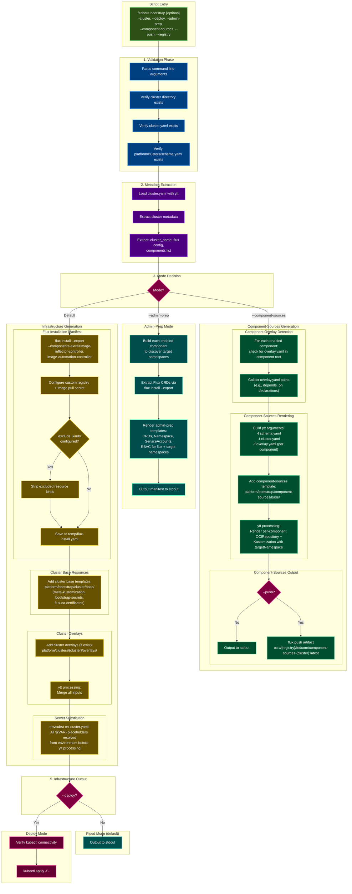

# Bootstrap Process Flow


```mermaid
flowchart TB
    subgraph entry["Script Entry"]
        A["fedcore bootstrap [options]<br/>--cluster, --deploy, --admin-prep,<br/>--component-sources, --push, --registry"]
    end

    subgraph validation["1. Validation Phase"]
        B["Parse command line arguments"]
        C["Verify cluster directory exists"]
        D["Verify cluster.yaml exists"]
        E["Verify platform/clusters/schema.yaml exists"]
    end

    subgraph metadata["2. Metadata Extraction"]
        F["Load cluster.yaml with ytt"]
        G["Extract cluster metadata"]
        H["Extract: cluster_name, flux config,<br/>components list"]
    end

    subgraph mode_decision["3. Mode Decision"]
        L{"Mode?"}
    end

    subgraph admin_prep["Admin-Prep Mode"]
        AP1["Build each enabled component<br/>to discover target namespaces"]
        AP2["Extract Flux CRDs via<br/>flux install --export"]
        AP3["Render admin-prep templates:<br/>CRDs, Namespace, ServiceAccounts,<br/>RBAC for flux + target namespaces"]
        AP4["Output manifest to stdout"]
    end

    subgraph cs_generation["Component-Sources Generation"]
        direction TB

        subgraph cs_overlays["Component Overlay Detection"]
            CS_CO1["For each enabled component:<br/>check for overlay.yaml in component root"]
            CS_CO2["Collect overlay.yaml paths<br/>(e.g., depends_on declarations)"]
        end

        subgraph cs_render["Component-Sources Rendering"]
            CS1["Build ytt arguments:<br/>-f schema.yaml<br/>-f cluster.yaml<br/>-f overlay.yaml (per component)"]
            CS2["Add component-sources template:<br/>platform/bootstrap/component-sources/base/"]
            CS3["ytt processing:<br/>Render per-component OCIRepository +<br/>Kustomization with targetNamespace"]
        end

        subgraph cs_output["Component-Sources Output"]
            CS_P{"--push?"}
            CS_PRINT["Output to stdout"]
            CS_PUSH["flux push artifact<br/>oci://{registry}/fedcore/component-sources-{cluster}:latest"]
        end
    end

    subgraph infra_generation["Infrastructure Generation"]
        direction TB

        subgraph flux_install["Flux Installation Manifest"]
            I1["flux install --export<br/>--components-extra=image-reflector-controller,<br/>image-automation-controller"]
            I2["Configure custom registry + image pull secret"]
            I3{"exclude_kinds<br/>configured?"}
            I4["Strip excluded resource kinds"]
            I5["Save to temp/flux-install.yaml"]
        end

        subgraph cluster_base["Cluster Base Resources"]
            CB1["Add cluster base templates:<br/>platform/bootstrap/cluster/base/<br/>(meta-kustomization, bootstrap-secrets,<br/>flux-ca-certificates)"]
        end

        subgraph cluster_overlays["Cluster Overlays"]
            CL1["Add cluster overlays (if exist):<br/>platform/clusters/{cluster}/overlays/"]
            CL2["ytt processing:<br/>Merge all inputs"]
        end

        subgraph secrets["Secret Substitution"]
            K1["envsubst on cluster.yaml:<br/>All ${VAR} placeholders resolved<br/>from environment before ytt processing"]
        end
    end

    subgraph output_mode["5. Infrastructure Output"]
        L2{"--deploy?"}
    end

    subgraph piped["Piped Mode (default)"]
        M1["Output to stdout"]
    end

    subgraph deploy["Deploy Mode"]
        N1["Verify kubectl connectivity"]
        O1["kubectl apply -f -"]
    end

    %% Main flow
    A --> B --> C --> D --> E
    E --> F --> G --> H
    H --> L

    %% Admin-prep branch
    L -->|"--admin-prep"| AP1 --> AP2 --> AP3 --> AP4

    %% Component-sources branch
    L -->|"--component-sources"| CS_CO1 --> CS_CO2
    CS_CO2 --> CS1 --> CS2 --> CS3
    CS3 --> CS_P
    CS_P -->|"No"| CS_PRINT
    CS_P -->|"Yes"| CS_PUSH

    %% Infrastructure branch (default)
    L -->|"Default"| I1
    I1 --> I2 --> I3
    I3 -->|"Yes"| I4 --> I5
    I3 -->|"No"| I5
    I5 --> CB1
    CB1 --> CL1 --> CL2
    CL2 --> K1 --> L2

    %% Output mode branching
    L2 -->|"No"| M1
    L2 -->|"Yes"| N1 --> O1

    %% Styling
    classDef entryStyle fill:#2d5016,stroke:#90ee90,stroke-width:2px,color:#fff
    classDef validationStyle fill:#004080,stroke:#66b3ff,stroke-width:2px,color:#fff
    classDef metadataStyle fill:#4d0080,stroke:#b366ff,stroke-width:2px,color:#fff
    classDef generationStyle fill:#665200,stroke:#ffdb4d,stroke-width:2px,color:#fff
    classDef decisionStyle fill:#800040,stroke:#ff66b3,stroke-width:2px,color:#fff
    classDef pipedStyle fill:#005050,stroke:#66cccc,stroke-width:2px,color:#fff
    classDef deployStyle fill:#660033,stroke:#ff66b3,stroke-width:2px,color:#fff
    classDef adminStyle fill:#004d4d,stroke:#66ffcc,stroke-width:2px,color:#fff
    classDef csStyle fill:#005030,stroke:#66cc99,stroke-width:2px,color:#fff

    class A entryStyle
    class B,C,D,E validationStyle
    class F,G,H metadataStyle
    class I1,I2,I3,I4,I5,CB1,CL1,CL2,K1 generationStyle
    class L,L2,CS_P decisionStyle
    class M1 pipedStyle
    class N1,O1 deployStyle
    class AP1,AP2,AP3,AP4 adminStyle
    class CS_CO1,CS_CO2,CS1,CS2,CS3,CS_PRINT,CS_PUSH csStyle
```

## Key Concepts

### Script Modes

**fedcore bootstrap** supports four modes:

1. **Piped Mode** (default)
   - Generates full bootstrap configuration (infrastructure + component-sources) to stdout
   - User can redirect to file: `fedcore bootstrap -c <cluster> > bootstrap.yaml`
   - User can pipe to kubectl: `fedcore bootstrap -c <cluster> | kubectl apply -f -`

2. **Deploy Mode** (`--deploy` flag)
   - Generates and immediately applies **infrastructure** configuration via kubectl
   - Does not include component-sources (use `--component-sources --push` separately)
   - Requires kubectl to be configured for target cluster

3. **Component-Sources Mode** (`--component-sources` flag)
   - Generates only the component-sources manifest (per-component OCIRepository + Kustomization)
   - Output to stdout by default, or push as OCI artifact with `--push`
   - The pushed artifact is watched by the meta-kustomization in the cluster, enabling Flux to prune removed components automatically

4. **Admin-Prep Mode** (`--admin-prep` flag)
   - Generates a minimal manifest for cluster administrators
   - For namespace-scoped Flux on clusters without cluster-admin access
   - Includes only CRDs, namespace, service accounts, and RBAC

### Bootstrap Components

#### Flux Installation
- **Purpose**: GitOps toolkit for Kubernetes
- **Controllers**: source-controller, kustomize-controller, helm-controller,
  notification-controller, image-reflector-controller, image-automation-controller
- **Registry**: Custom OCI registry for air-gapped environments
- **Authentication**: Uses image-pull-secret for private registry
- **exclude_kinds**: Filter out resource types from the Flux install manifest
  (e.g., NetworkPolicy, ResourceQuota for namespace-scoped clusters)

#### Component Overlays
- **Purpose**: Component-level bootstrap configuration
- **Location**: `overlay.yaml` in the component root directory
- **Format**: Standard ytt data values overlay
- **Common Use**: Declaring component dependencies via `depends_on`
- **Detection**: Automatically included for each enabled component

#### Component Sources (OCIRepository Resources)
- **Purpose**: Wire components to OCI artifacts
- **Created For**: Each component listed in cluster.yaml
- **Format**: Flux OCIRepository + Kustomization pointing to:
  - `oci://{registry}/fedcore/{component}-{cluster}:{version}`
- **Template**: `platform/bootstrap/component-sources/base/`
- **Namespace**: Each Kustomization sets `targetNamespace` from the component's namespace (defaults to component id)
- **Versioning**: Uses `tag: latest` when version is unset or "latest", `semver` for pinned versions

#### Meta-Kustomization
- **Purpose**: Flux watches a single component-sources OCI artifact and applies all per-component resources
- **Location**: `platform/bootstrap/cluster/base/meta-kustomization.yaml`
- **Pruning**: Because `prune: true` is set, removing a component from cluster.yaml and re-pushing the component-sources artifact causes Flux to automatically delete the corresponding OCIRepository + Kustomization
- **Artifact**: `oci://{registry}/fedcore/component-sources-{cluster}:latest`

#### Bootstrap Secrets
- **Purpose**: Secrets and ConfigMaps that must exist before Flux can pull OCI artifacts
- **Location**: `platform/bootstrap/cluster/base/bootstrap-secrets.yaml`
- **Includes**: Image pull secret (from `dockerconfigjson`), CA certificates secret and ConfigMap (from `ca_bundle`)
- **Conditional**: Only rendered when the corresponding cluster.yaml values are set

#### Cluster Overlays
- **Purpose**: Cluster-specific customizations
- **Applied To**: Flux controllers and infrastructure resources
- **Common Uses**: Node selectors, tolerations, resource limits, additional labels
- **Location**: `platform/clusters/{cluster}/overlays/`

### Secret Substitution

Any `${VAR}` placeholder in cluster.yaml is resolved from the environment before processing. Common variables:

| Variable | Required | Purpose |
|---|---|---|
| OCI_DOCKERCONFIG_JSON | Yes | Docker config for pulling images from registry |

Additional `${VAR}` placeholders can be added to cluster.yaml — they are resolved automatically.

**For `--component-sources --push`:**

| Variable | Required | Purpose |
|---|---|---|
| OCI_REGISTRY | Yes | OCI registry URL for pushing component-sources artifact |
| OCI_REGISTRY_USER | Yes | Registry username |
| OCI_REGISTRY_PASS | Yes | Registry password |

### Component Dependencies

Dependencies are declared in a component's `overlay.yaml` as a ytt data values
overlay. Bootstrap automatically detects and includes these files.

Example (`platform/rgds/namespace/overlay.yaml`):
```yaml
#@data/values
---
#@overlay/match missing_ok=True
components:
#@overlay/match by=lambda idx,old,new: old["name"] == "namespace", expects="1+"
- depends_on:
  - kro
```

This can be reproduced manually:
```bash
ytt -f schema.yaml -f cluster.yaml \
    -f rgds/namespace/overlay.yaml \
    -f components/tenant-instances/overlay.yaml \
    -f bootstrap/component-sources/base/
```

### Namespace-Scoped Flux (--admin-prep)

For clusters where you don't have cluster-admin access:

1. **Generate admin-prep manifest**:
   ```bash
   fedcore bootstrap -c platform/clusters/my-cluster --admin-prep -r registry.example.com
   ```

2. **Hand to cluster admin** to apply (CRDs, namespace, RBAC)

3. **Run normal bootstrap** with `exclude_kinds` configured:
   ```yaml
   flux:
     install: true
     exclude_kinds:
       - Namespace
       - CustomResourceDefinition
       - ClusterRole
       - ClusterRoleBinding
       - ServiceAccount
       - NetworkPolicy
       - ResourceQuota
   ```

Target namespaces for deployer RBAC are derived automatically by building
each enabled component and extracting namespace fields from the rendered output.

### File Structure Reference

```
platform/
├── bootstrap/
│   ├── component-sources/
│   │   └── base/
│   │       └── component-sources.yaml  # Per-component OCIRepository + Kustomization templates
│   └── cluster/
│       └── base/
│           ├── meta-kustomization.yaml # Watches component-sources OCI artifact (prune: true)
│           ├── bootstrap-secrets.yaml  # Image pull secret + CA certificates
│           └── flux-ca-certificates.yaml # Flux controller CA cert overlay
├── components/{component}/
│   ├── component.yaml              # Helm chart config (if Helm)
│   ├── overlay.yaml                # Bootstrap data values overlay (optional)
│   ├── base/                       # Static manifests and ytt templates
│   └── overlays/                   # Build-time overlays (aws/, prod/, etc.)
├── rgds/{rgd}/
│   ├── overlay.yaml                # Bootstrap data values overlay (optional)
│   └── base/                       # Manifests and ytt templates
└── clusters/
    ├── schema.yaml                 # Cluster configuration schema
    └── {cluster}/
        ├── cluster.yaml            # Cluster configuration
        └── overlays/               # Cluster-specific bootstrap overlays
```

### Example Usage

```bash
# Generate full bootstrap config to stdout (infrastructure + component-sources)
fedcore bootstrap -c platform/clusters/aws-example-usgw1-dev-app

# Generate and deploy infrastructure directly
fedcore bootstrap -c platform/clusters/aws-example-usgw1-dev-app --deploy

# Generate component-sources manifest only (review before pushing)
fedcore bootstrap -c platform/clusters/aws-example-usgw1-dev-app --component-sources

# Build and push component-sources as OCI artifact
fedcore bootstrap -c platform/clusters/aws-example-usgw1-dev-app --component-sources --push

# Generate admin-prep manifest for namespace-scoped clusters
fedcore bootstrap -c platform/clusters/onprem-dc1-dev-app --admin-prep -r nexus.example.com/fedcore
```

### Prerequisites

Before running bootstrap:

1. **kubectl** configured for target cluster
   - AWS: `aws eks update-kubeconfig`
   - Azure: `az aks get-credentials`
   - On-Prem: Valid kubeconfig with credentials

2. **Cluster access** — either:
   - Full cluster-admin (standard bootstrap), or
   - Namespace-scoped access after admin-prep has been applied

3. **Environment variables** (for --deploy):
   - `OCI_DOCKERCONFIG_JSON`: Required (or any `${VAR}` referenced in cluster.yaml)
   - `OCI_REGISTRY` or `--registry`: Required when flux.install is true

4. **Environment variables** (for --component-sources --push):
   - `OCI_REGISTRY`: Required
   - `OCI_REGISTRY_USER`: Required
   - `OCI_REGISTRY_PASS`: Required

5. **Required tools**:
   - `flux` CLI
   - `ytt` templating tool
   - `kubectl`
