# Build Process Flow

```mermaid
flowchart TB
    subgraph entry["🚀 Script Entry"]
        A["fedcore build [options]<br/>--all or --artifact <artifact> --cluster <cluster><br/>Optional: --push"]
    end

    subgraph discovery["1️⃣ Discovery Phase"]
        B{"Build Mode?"}
        C1["Run fedcore matrix<br/>Scan platform/clusters/*.yaml<br/>Scan platform/components/*"]
        C2["Generate Build Matrix<br/>component × cluster pairs"]
        D1["Use provided paths<br/>--artifact artifact_path<br/>--cluster cluster_dir"]
    end

    subgraph iteration["2️⃣ For Each Component × Cluster"]
        direction TB

        E["Load cluster.yaml<br/>Extract metadata using ytt"]
        F["Extract: cluster_name, cloud, environment, region"]
        G["Read component.yaml (if exists)"]
        H{"Component Type?"}

        subgraph helm_path["📦 Helm Component Path"]
            direction TB

            subgraph prerender["🔧 PRE-RENDER Phase"]
                I1["Scan overlays/{cloud}/<br/>Filter files with:<br/>#! overlay-phase: pre-render"]
                I2["Scan overlays/{env}/<br/>Filter files with:<br/>#! overlay-phase: pre-render"]
                I3["Apply overlays to component.yaml<br/>using ytt"]
                I4["Modify helm.values section<br/>in component metadata"]
            end

            subgraph render["🎨 RENDER Phase"]
                J1["Extract helm configuration:<br/>chart, version, repo, values"]
                J2["helm template {release_name} {chart_url}<br/>--version {version}<br/>--namespace {namespace}<br/>--values values.yaml<br/>--include-crds"]
                J3["Save rendered output to temp file"]
                J4["Scan base/ directory<br/>Find additional manifests<br/>e.g., namespace.yaml"]
                J5["Combine rendered chart + base manifests"]
            end
        end

        subgraph plain_path["📄 Plain Manifest Path"]
            K1["Load all files from base/*.yaml<br/>Plain Kubernetes manifests"]
        end

        subgraph postrender["🎯 POST-RENDER Phase (All Components)"]
            direction TB
            L1["Collect cloud overlays:<br/>overlays/{cloud}/*.yaml<br/>Files with #! overlay-phase: post-render<br/>or no phase metadata (default)"]
            L2["Collect environment overlays:<br/>overlays/{env}/*.yaml<br/>Files with #! overlay-phase: post-render<br/>or no phase metadata (default)"]
            L3["Collect cluster overlays:<br/>platform/clusters/{cluster}/overlays/*.yaml<br/>Always post-render phase"]
            L4["ytt processing:<br/>-f platform/clusters/schema.yaml<br/>-f cluster.yaml<br/>-f manifests<br/>-f cloud_overlays<br/>-f env_overlays<br/>-f cluster_overlays"]
        end

        M["💾 Output Artifact"]
        N["Save to dist/{component}-{cluster}.yaml<br/>or stdout if no --push"]
        O["Validate artifact with ytt"]
        P{"Validation OK?"}
    end

    subgraph push_phase["3️⃣ Push Phase (if --push flag)"]
        direction TB
        Q{"Push Mode?"}
        R1["Create OCI artifact layout:<br/>mkdir oci-layout/{component}-{cluster}"]
        R2["Copy artifact:<br/>cp dist/{component}-{cluster}.yaml<br/>→ oci-layout/{component}-{cluster}/platform.yaml"]
        R3["flux push artifact<br/>oci://{registry}/fedcore/{component}-{cluster}:{version}<br/>--path oci-layout/{component}-{cluster}<br/>--source {repo_url}<br/>--revision {ref}@sha1:{sha}<br/>--creds {user}:{pass}"]
        R4["Artifact pushed to registry"]
    end

    subgraph completion["4️⃣ Completion"]
        S["Report Results"]
        T{"All Successful?"}
        U["✓ Build completed<br/>Artifacts in dist/"]
        V["✗ Build failed<br/>List failed artifacts<br/>Exit code 1"]
    end

    %% Main flow
    A --> B
    B -->|"--all"| C1
    B -->|"-a & -c"| D1
    C1 --> C2 --> E
    D1 --> E

    %% Per-artifact flow
    E --> F --> G --> H

    %% Component type branching
    H -->|"type: helm<br/>in component.yaml"| I1
    H -->|"type: plain<br/>or no component.yaml"| K1

    %% Helm flow
    I1 --> I2 --> I3 --> I4
    I4 --> J1 --> J2 --> J3 --> J4 --> J5

    %% Flows converge at post-render
    J5 --> L1
    K1 --> L1

    %% Post-render and output
    L1 --> L2 --> L3 --> L4
    L4 --> M --> N --> O --> P
    P -->|"Valid"| Q
    P -->|"Invalid"| S

    %% Push decision
    Q -->|"--push provided"| R1
    Q -->|"No --push"| S
    R1 --> R2 --> R3 --> R4 --> S

    %% Final results
    S --> T
    T -->|"Yes"| U
    T -->|"No"| V

    %% Styling
    classDef entryStyle fill:#2d5016,stroke:#90ee90,stroke-width:2px,color:#fff
    classDef discoveryStyle fill:#004080,stroke:#66b3ff,stroke-width:2px,color:#fff
    classDef processStyle fill:#800040,stroke:#ff66b3,stroke-width:2px,color:#fff
    classDef phaseStyle fill:#665200,stroke:#ffdb4d,stroke-width:2px,color:#fff
    classDef pushStyle fill:#4d0080,stroke:#b366ff,stroke-width:2px,color:#fff
    classDef completeStyle fill:#004d00,stroke:#66ff66,stroke-width:2px,color:#fff
    classDef errorStyle fill:#800000,stroke:#ff6666,stroke-width:2px,color:#fff

    class A entryStyle
    class B,C1,C2,D1 discoveryStyle
    class E,F,G,H,M,N,O,P processStyle
    class I1,I2,I3,I4,J1,J2,J3,J4,J5,K1,L1,L2,L3,L4 phaseStyle
    class Q,R1,R2,R3,R4 pushStyle
    class S,T,U completeStyle
    class V errorStyle
```



## Example: Building an Artifact with Raw ytt + helm Commands

This walks through building the `capsule` component for the `aws-example-usgw1-dev-app` cluster using the same ytt and helm commands the Rust CLI executes under the hood.

### Setup

```bash
ARTIFACT=platform/components/capsule
CLUSTER=platform/clusters/aws-example-usgw1-dev-app
TMPDIR=$(mktemp -d)
```

### Step 1: Pre-Render — Merge component.yaml with cluster data values

ytt renders the component.yaml template (which uses `@ytt:data` for cluster-aware values) against the cluster schema and cluster config. If there were pre-render overlays (`#! overlay-phase: pre-render`), they'd be appended as additional `-f` args.

```bash
ytt \
  -f platform/clusters/schema.yaml \
  -f $CLUSTER/cluster.yaml \
  -f $ARTIFACT/component.yaml \
  > $TMPDIR/component-merged.yaml
```

This resolves all `data.values.*` references in `component.yaml`. For example, `data.values.helm_repositories.use_mirror` and `data.values.monitoring.enabled` are evaluated against the cluster's actual configuration.

**Output** (`component-merged.yaml`) — a plain YAML with all ytt expressions resolved:
```yaml
name: capsule
type: helm
helm:
  sourceRepo: https://projectcapsule.github.io/charts
  chart: capsule
  version: "0.12.4"
  mirrorRepo: https://projectcapsule.github.io/charts   # resolved from data.values
  release:
    name: capsule
    namespace: capsule-system
  values:
    manager:
      resources:
        limits:
          cpu: 200m
          memory: 256Mi
        requests:
          cpu: 100m
          memory: 128Mi
    options:
      forceTenantPrefix: true
    # monitoring.enabled=false in this cluster, so serviceMonitor block is omitted
```

### Step 2: Render — Run helm template

Extract the chart info from the merged component and run `helm template`:

```bash
# Pull the chart (cached after first download)
helm pull https://projectcapsule.github.io/charts/capsule \
  --version 0.12.4 \
  --destination .cache/helm-charts

# Extract the values section from the merged component into a values file
# (in practice the CLI does this with serde, but you can use yq)
yq '.helm.values' $TMPDIR/component-merged.yaml > $TMPDIR/values.yaml

# Render the chart
helm template capsule .cache/helm-charts/capsule-0.12.4.tgz \
  --namespace capsule-system \
  --values $TMPDIR/values.yaml \
  > $TMPDIR/helm-rendered.yaml
```

**Output** (`helm-rendered.yaml`) — standard Kubernetes manifests (ServiceAccount, Deployment, Webhooks, CRDs, etc.)

### Step 3: Merge base manifests

If the component has a `base/` directory (capsule has `base/namespace.yaml`), ytt merges them with the helm output:

```bash
ytt \
  -f platform/clusters/schema.yaml \
  -f $CLUSTER/cluster.yaml \
  -f $TMPDIR/helm-rendered.yaml \
  -f $ARTIFACT/base/ \
  > $TMPDIR/manifests.yaml
```

This combines the helm-rendered resources with the base `Namespace` manifest into a single stream.

> **Note:** Steps 3 and 4 are separate ytt invocations in the CLI, but could be combined into a single call by passing both `base/` and the cluster overlays together. They're shown separately here to match the current implementation.

### Step 4: Post-Render — Apply overlays to final manifests

Post-render overlays modify the rendered Kubernetes manifests. These come from component-level overlays (cloud/environment) plus cluster-level overlays:

```bash
ytt \
  --ignore-unknown-comments \
  -f platform/clusters/schema.yaml \
  -f $CLUSTER/cluster.yaml \
  -f $TMPDIR/manifests.yaml \
  -f $CLUSTER/overlays/ \
  > dist/capsule-aws-example-usgw1-dev-app.yaml
```

In this case, the cluster overlay `namespace-metadata.yaml` adds `app.kubernetes.io/managed-by: platform` to all `Namespace` resources in the output.

### Full Pipeline (one-liner)

```bash
ARTIFACT=platform/components/capsule
CLUSTER=platform/clusters/aws-example-usgw1-dev-app
T=$(mktemp -d)

# 1. Pre-render: resolve data values
ytt -f platform/clusters/schema.yaml -f $CLUSTER/cluster.yaml -f $ARTIFACT/component.yaml > $T/component-merged.yaml

# 2. Render: helm template
yq '.helm.values' $T/component-merged.yaml > $T/values.yaml
helm pull https://projectcapsule.github.io/charts/capsule --version 0.12.4 --destination $T
helm template capsule $T/capsule-0.12.4.tgz --namespace capsule-system --values $T/values.yaml > $T/helm-rendered.yaml

# 3. Merge base manifests
ytt -f platform/clusters/schema.yaml -f $CLUSTER/cluster.yaml -f $T/helm-rendered.yaml -f $ARTIFACT/base/ > $T/manifests.yaml

# 4. Post-render: apply cluster overlays
ytt --ignore-unknown-comments -f platform/clusters/schema.yaml -f $CLUSTER/cluster.yaml -f $T/manifests.yaml -f $CLUSTER/overlays/ > dist/capsule-aws-example-usgw1-dev-app.yaml
```

### Equivalent CLI Command

The Rust CLI does all of the above (plus image digest resolution via kbld) in a single command:

```bash
fedcore build --artifact platform/components/capsule --cluster platform/clusters/aws-example-usgw1-dev-app
```

---

## Key Concepts

### Script Modes

**fedcore build** supports two modes:

1. **Build All Mode** (default or `--all`)
   - Discovers all component × cluster combinations via `fedcore matrix`
   - Builds all artifacts in sequence
   - Reports success/failure summary

2. **Single Artifact Mode** (`--artifact <artifact> --cluster <cluster>`)
   - Builds one specific component for one specific cluster
   - Outputs to stdout by default (can redirect to file)
   - Useful for development and testing

### Overlay Processing Phases

#### PRE-RENDER Phase (Helm components only)
- **When**: Before `helm template` execution
- **Applies to**: `component.yaml` file
- **Effect**: Modifies `helm.values` section
- **Marker**: `#! overlay-phase: pre-render` comment in overlay file
- **Sources**:
  - `overlays/{aws|azure|onprem}/overlay.yaml`
  - `overlays/{dev|prod}/overlay.yaml`

#### RENDER Phase (Helm components only)
- **When**: After pre-render overlays applied
- **Tool**: `helm template` command
- **Inputs**:
  - Chart from OCI registry or HTTP repo
  - Merged values from component.yaml
  - Release name and namespace from component.yaml
- **Output**: Rendered Kubernetes manifests
- **Additional**: Combines with `base/*.yaml` files (e.g., namespace.yaml)

#### POST-RENDER Phase (All components)
- **When**: After Helm rendering (or directly for plain components)
- **Applies to**: Final Kubernetes manifests
- **Tool**: `ytt` with overlay syntax
- **Marker**: `#! overlay-phase: post-render` or no phase metadata (default)
- **Sources** (applied in order):
  1. Cloud overlays: `overlays/{aws|azure|onprem}/*.yaml`
  2. Environment overlays: `overlays/{dev|prod}/*.yaml`
  3. Cluster overlays: `platform/clusters/{cluster}/overlays/*.yaml`
- **Use cases**: Add labels, modify resources, add node selectors/tolerations

### Component Types

1. **Helm Components** (`type: helm` in `component.yaml`)
   - Chart rendered via `helm template`
   - Pre-render overlays modify values before rendering
   - Post-render overlays modify final manifests
   - Example: capsule, istio, kyverno

2. **Plain Components** (`type: plain` or no `component.yaml`)
   - Static manifests in `base/*.yaml`
   - Only post-render overlays applied
   - Example: simple operators, CRDs

### Build Outputs

#### Local Builds (default)
- **Location**: `dist/{component}-{cluster}.yaml`
- **Format**: Single YAML file with all manifests
- **Validation**: Checked with `ytt -f <file>`

#### OCI Registry Builds (`--push` mode)
- **Layout**: `oci-layout/{component}-{cluster}/platform.yaml`
- **Registry**: `oci://{registry}/fedcore/{component}-{cluster}:{version}`
- **Metadata**: Includes source repo URL, git ref, and commit SHA
- **Tool**: `flux push artifact` command

### File Structure Reference

```
platform/
├── components/{component}/
│   ├── component.yaml          # Component metadata (optional)
│   ├── base/                   # Base manifests
│   │   └── *.yaml
│   └── overlays/
│       ├── aws/
│       │   └── overlay.yaml   # PRE or POST-render
│       ├── azure/
│       │   └── overlay.yaml
│       ├── onprem/
│       │   └── overlay.yaml
│       ├── dev/
│       │   └── overlay.yaml
│       └── prod/
│           └── overlay.yaml
└── clusters/{cluster}/
    ├── cluster.yaml            # Cluster configuration
    └── overlays/               # Cluster-specific overlays
        └── *.yaml              # Always POST-render

dist/
└── {component}-{cluster}.yaml  # Built artifacts

oci-layout/
└── {component}-{cluster}/
    └── platform.yaml           # OCI artifact layout
```
