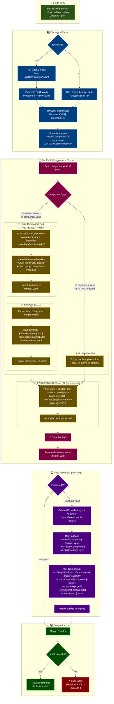

# Build Process Flow


```mermaid
flowchart TB
    subgraph entry["🚀 Script Entry"]
        A["fedcore build [options]<br/>--all or --artifact <artifact> --cluster <cluster><br/>Optional: --push"]
    end

    subgraph discovery["1️⃣ Discovery Phase"]
        B{"Build Mode?"}
        C1["Run fedcore matrix<br/>Scan platform/clusters/*.yaml"]
        C2["Generate Build Matrix<br/>component × cluster pairs"]
        D1["Use provided cluster path<br/>--cluster cluster_dir"]
        D2["envsubst cluster.yaml<br/>Resolve ${VAR} placeholders"]
        D3["ytt matrix template<br/>Resolve component id, namespace,<br/>data values per component"]
    end

    subgraph iteration["2️⃣ For Each Component × Cluster"]
        direction TB

        G["Read component.yaml (if exists)"]
        H{"Component Type?"}

        subgraph helm_path["📦 Helm Component Path"]
            direction TB

            subgraph prerender["🔧 PRE-RENDER Phase"]
                I1["ytt: schema + cluster.yaml +<br/>component.yaml + prerender/<br/>+ overlays/{id}/pre-render/"]
                I2["prerender/ overlay handles:<br/>• Chart mirror URL injection<br/>• Deep merge cluster helm overrides"]
                I3["Output: component-merged.yaml"]
            end

            subgraph render["🎨 RENDER Phase"]
                J1["Extract helm config from merged output"]
                J2["helm template {release_name} {chart}<br/>--namespace {namespace}<br/>--values values.yaml"]
                J3["Output: helm-rendered.yaml"]
            end
        end

        subgraph plain_path["📄 Plain Manifest Path"]
            K1["Empty manifest placeholder<br/>(base/ dir provides content)"]
        end

        subgraph postrender["🎯 POST-RENDER Phase (All Components)"]
            direction TB
            L1["ytt: schema + cluster.yaml +<br/>rendered manifests +<br/>base/ (if exists) +<br/>overlays/{id}/post-render/ +<br/>cluster/overlays/"]
            L2["All applied in single ytt call"]
        end

        M["💾 Output Artifact"]
        N["Save to dist/{component}-{cluster}.yaml"]
    end

    subgraph push_phase["3️⃣ Push Phase (if --push flag)"]
        direction TB
        Q{"Push Mode?"}
        R1["Create OCI artifact layout:<br/>mkdir oci-layout/{component}-{cluster}"]
        R2["Copy artifact:<br/>cp dist/{component}-{cluster}.yaml<br/>→ oci-layout/{component}-{cluster}/platform.yaml"]
        R3["flux push artifact<br/>oci://{registry}/fedcore/{component}-{cluster}:{version}<br/>--path oci-layout/{component}-{cluster}<br/>--source {repo_url}<br/>--revision {ref}@sha1:{sha}<br/>--creds {user}:{pass}"]
        R4["Artifact pushed to registry"]
    end

    subgraph completion["4️⃣ Completion"]
        S["Report Results"]
        T{"All Successful?"}
        U["✓ Build completed<br/>Artifacts in dist/"]
        V["✗ Build failed<br/>List failed artifacts<br/>Exit code 1"]
    end

    %% Main flow
    A --> B
    B -->|"--all"| C1
    B -->|"-c"| D1
    C1 --> C2
    C2 --> D2
    D1 --> D2
    D2 --> D3
    D3 --> G

    %% Per-artifact flow
    G --> H

    %% Component type branching
    H -->|"has helm: section<br/>in component.yaml"| I1
    H -->|"no component.yaml<br/>or no helm: section"| K1

    %% Helm flow
    I1 --> I2 --> I3
    I3 --> J1 --> J2 --> J3

    %% Flows converge at post-render
    J3 --> L1
    K1 --> L1

    %% Post-render and output
    L1 --> L2
    L2 --> M --> N --> Q
    
    %% Push decision
    Q -->|"--push provided"| R1
    Q -->|"No --push"| S
    R1 --> R2 --> R3 --> R4 --> S

    %% Final results
    S --> T
    T -->|"Yes"| U
    T -->|"No"| V

    %% Styling
    classDef entryStyle fill:#2d5016,stroke:#90ee90,stroke-width:2px,color:#fff
    classDef discoveryStyle fill:#004080,stroke:#66b3ff,stroke-width:2px,color:#fff
    classDef processStyle fill:#800040,stroke:#ff66b3,stroke-width:2px,color:#fff
    classDef phaseStyle fill:#665200,stroke:#ffdb4d,stroke-width:2px,color:#fff
    classDef pushStyle fill:#4d0080,stroke:#b366ff,stroke-width:2px,color:#fff
    classDef completeStyle fill:#004d00,stroke:#66ff66,stroke-width:2px,color:#fff
    classDef errorStyle fill:#800000,stroke:#ff6666,stroke-width:2px,color:#fff

    class A entryStyle
    class B,C1,C2,D1,D2,D3 discoveryStyle
    class G,H,M,N processStyle
    class I1,I2,I3,J1,J2,J3,K1,L1,L2 phaseStyle
    class Q,R1,R2,R3,R4 pushStyle
    class S,T,U completeStyle
    class V errorStyle
```

## Example: Building an Artifact with Raw ytt + helm Commands

This walks through building the `headlamp` component for the `aws-csb-usgw1-dev-app` cluster using the same tool invocations the Rust CLI executes.

### Setup

```bash
ARTIFACT=platform/components/headlamp
CLUSTER=platform/clusters/aws-csb-usgw1-dev-app
TMPDIR=$(mktemp -d)
```

### Step 1: Resolve cluster.yaml and discover components

Any `${VAR}` placeholders in cluster.yaml are resolved from environment variables before any tool processes the file. The matrix template then resolves each component's id, namespace, and data values.

```bash
# envsubst cluster.yaml (the CLI does this automatically)
envsubst < $CLUSTER/cluster.yaml > $TMPDIR/cluster.yaml

# Discover components from the resolved cluster config
ytt -f platform/clusters/schema.yaml \
    -f $TMPDIR/cluster.yaml \
    -f platform/build/matrix/

# Extract data values for a specific component
ytt -f platform/clusters/schema.yaml \
    -f $TMPDIR/cluster.yaml \
    -f platform/build/matrix/ | \
    yq 'select(.component.id == "headlamp")' > $TMPDIR/component-values.yaml
```

### Step 2: Pre-Render — Merge component.yaml with cluster data values

ytt processes the component.yaml template against the cluster config, applies the prerender overlay (which handles chart mirror URL injection and cluster-level helm value deep merging), and applies any component-specific pre-render overlays.

```bash
ytt \
  -f platform/clusters/schema.yaml \
  -f $TMPDIR/cluster.yaml \
  -f $ARTIFACT/component.yaml \
  -f platform/build/prerender/ \
  --data-values-file $TMPDIR/component-values.yaml \
  > $TMPDIR/component-merged.yaml
```

The `platform/build/prerender/` directory contains the helm-values-merge overlay which:
- Injects `resolvedChartRef` based on the cluster's `helm_repositories` mirror config
- Deep-merges any `helm.values` overrides from the component entry in cluster.yaml

**Output** (`component-merged.yaml`) — plain YAML with all ytt expressions resolved and overrides merged.

### Step 3: Render — Run helm template

Extract the chart info from the merged component and run `helm template`:

```bash
CHART_REF=$(yq '.helm.resolvedChartRef // .helm.sourceRepo' $TMPDIR/component-merged.yaml)
CHART=$(yq '.helm.chart' $TMPDIR/component-merged.yaml)
VERSION=$(yq '.helm.version' $TMPDIR/component-merged.yaml)

helm pull $CHART_REF/$CHART --version $VERSION --destination .cache/helm-charts

yq '.helm.values' $TMPDIR/component-merged.yaml > $TMPDIR/values.yaml

helm template headlamp .cache/helm-charts/headlamp-${VERSION}.tgz \
  --namespace headlamp \
  --values $TMPDIR/values.yaml \
  > $TMPDIR/helm-rendered.yaml
```

### Step 4: Post-Render — Base manifests + overlays + kbld

A single ytt call combines the helm output with base manifests, post-render overlays, and cluster overlays. Then kbld resolves image tags to digests.

```bash
ytt \
  --ignore-unknown-comments \
  -f platform/clusters/schema.yaml \
  -f $TMPDIR/cluster.yaml \
  -f $TMPDIR/helm-rendered.yaml \
  --data-values-file $TMPDIR/component-values.yaml \
  -f $ARTIFACT/base/ \
  -f $CLUSTER/overlays/ \
  | kbld -f - \
  > dist/headlamp-eks-private-test.yaml
```

### Full Pipeline (one-liner)

```bash
ARTIFACT=platform/components/headlamp
CLUSTER=platform/clusters/aws-csb-usgw1-dev-app
T=$(mktemp -d)

# 0. envsubst + matrix
envsubst < $CLUSTER/cluster.yaml > $T/cluster.yaml
ytt -f platform/clusters/schema.yaml -f $T/cluster.yaml -f platform/build/matrix/ | \
    yq 'select(.component.id == "headlamp")' > $T/component-values.yaml

# 1. Pre-render
ytt -f platform/clusters/schema.yaml -f $T/cluster.yaml -f $ARTIFACT/component.yaml \
    -f platform/build/prerender/ --data-values-file $T/component-values.yaml > $T/merged.yaml

# 2. Helm template
yq '.helm.values' $T/merged.yaml > $T/values.yaml
CHART_REF=$(yq '.helm.resolvedChartRef // .helm.sourceRepo' $T/merged.yaml)
CHART=$(yq '.helm.chart' $T/merged.yaml)
VERSION=$(yq '.helm.version' $T/merged.yaml)
helm pull $CHART_REF/$CHART --version $VERSION --destination $T
helm template headlamp $T/headlamp-${VERSION}.tgz --namespace headlamp --values $T/values.yaml > $T/rendered.yaml

# 3. Post-render + base + kbld
ytt --ignore-unknown-comments -f platform/clusters/schema.yaml -f $T/cluster.yaml \
    -f $T/rendered.yaml --data-values-file $T/component-values.yaml \
    -f $ARTIFACT/base/ -f $CLUSTER/overlays/ | kbld -f - > dist/headlamp-eks-private-test.yaml
```

### Equivalent CLI Command

The Rust CLI does all of the above in a single command:

```bash
fedcore build --artifact platform/components/headlamp --cluster platform/clusters/aws-csb-usgw1-dev-app
```

---

## Key Concepts

### Script Modes

**fedcore build** supports two modes:

1. **Build All Mode** (default or `--all`)
   - Discovers all component x cluster combinations via `fedcore matrix`
   - Builds all artifacts in parallel
   - Reports success/failure summary

2. **Single Cluster Mode** (`--cluster <cluster>`)
   - Only discovers components for the specified cluster (no wasted ytt calls)
   - Can be combined with `--artifact` or `--id` to build a single component

### Overlay Processing Phases

#### PRE-RENDER Phase (Helm components only)
- **When**: Before `helm template` execution
- **Applies to**: `component.yaml` file
- **Effect**: Modifies `helm.values` section
- **Location**: `overlays/{id}/pre-render/` subdirectory
- **Sources**:
  - `platform/build/prerender/` (chart mirror + helm value merge)
  - `overlays/{aws|azure|onprem}/pre-render/*.yaml`
  - `overlays/{dev|prod}/pre-render/*.yaml`

#### RENDER Phase (Helm components only)
- **When**: After pre-render overlays applied
- **Tool**: `helm template` command
- **Inputs**:
  - Chart from OCI registry or HTTP repo
  - Merged values from component.yaml + cluster overrides
  - Release name and namespace from component config
- **Output**: Rendered Kubernetes manifests

#### POST-RENDER Phase (All components)
- **When**: After Helm rendering (or directly for plain components)
- **Applies to**: Final Kubernetes manifests
- **Tool**: `ytt` with overlay syntax
- **Location**: `overlays/{id}/post-render/` subdirectory
- **Sources** (applied in single ytt call):
  1. Base manifests: `{component}/base/*.yaml`
  2. Cloud overlays: `overlays/{aws|azure|onprem}/post-render/*.yaml`
  3. Environment overlays: `overlays/{dev|prod}/post-render/*.yaml`
  4. Cluster overlays: `platform/clusters/{cluster}/overlays/*.yaml`
- **Use cases**: Add labels, modify resources, add node selectors/tolerations

### Component Types

1. **Helm Components** (`helm:` section in `component.yaml`)
   - Chart rendered via `helm template`
   - Pre-render overlays modify values before rendering
   - Post-render overlays modify final manifests
   - Example: capsule, istio, kyverno

2. **Plain Components** (no `component.yaml` or no `helm:` section)
   - Static manifests in `base/*.yaml`
   - Only post-render overlays applied
   - Example: simple operators, CRDs

### Build Outputs

#### Local Builds (default)
- **Location**: `dist/{component}-{cluster}.yaml`
- **Format**: Single YAML file with all manifests

#### OCI Registry Builds (`--push` mode)
- **Layout**: `oci-layout/{component}-{cluster}/platform.yaml`
- **Registry**: `oci://{registry}/fedcore/{component}-{cluster}:{version}`
- **Metadata**: Includes source repo URL, git ref, and commit SHA
- **Tool**: `flux push artifact` command

### File Structure Reference

```
platform/
├── build/
│   ├── matrix/
│   │   └── matrix-template.yaml    # Component resolution template
│   └── prerender/
│       └── helm-values-merge-overlay.yaml  # Chart ref + value merge
├── components/{component}/
│   ├── component.yaml              # Component metadata (optional)
│   ├── base/                       # Base manifests
│   │   └── *.yaml
│   └── overlays/
│       ├── aws/
│       │   ├── pre-render/         # Applied before helm template
│       │   │   └── *.yaml
│       │   └── post-render/        # Applied after helm template
│       │       └── *.yaml
│       ├── prod/
│       │   ├── pre-render/
│       │   └── post-render/
│       └── dev/
│           └── post-render/
└── clusters/{cluster}/
    ├── cluster.yaml                # Cluster configuration
    └── overlays/                   # Cluster-specific overlays (post-render)
        └── *.yaml

dist/
└── {component}-{cluster}.yaml     # Built artifacts

oci-layout/
└── {component}-{cluster}/
    └── platform.yaml               # OCI artifact layout
```
