# Deployment Guide

This guide explains how to configure automatic deployment of infrastructure artifacts to Kubernetes clusters using GitHub Actions with GitHub Environments.

---

## Overview

The deployment workflow automatically:
1. Builds RGD and infrastructure artifacts
2. Pushes artifacts to Nexus OCI registry
3. Bootstraps Flux CD if not installed
4. Applies infrastructure artifacts to each cluster
5. Verifies deployment health

**Trigger**: Automatic on push to `main` or `master` branch

---

## Prerequisites

### GitHub Environments

Each cluster requires a GitHub Environment with matching name and cloud-specific secrets.

**See [ENVIRONMENT_SETUP.md](ENVIRONMENT_SETUP.md) for complete GitHub Environment setup instructions** including:
- Creating environments
- Adding cloud-specific secrets (AWS, Azure, On-Prem)
- Splunk HEC configuration
- Environment protection rules
- Credential generation

### Custom Actions

All required custom actions are implemented in `MyOrg/platform-actions/.github/actions/`:
- ✅ `setup-ytt` - Install ytt binary
- ✅ `setup-kubectl` - Install kubectl
- ✅ `setup-flux` - Install Flux CLI

### Vault Credentials

The workflow uses `MyOrg/vault-action` to fetch credentials from HashiCorp Vault:

**Nexus OCI Registry** (all jobs):
- Path: `kv2/data/platform/global/registry`
- Used for: Pushing/pulling OCI artifacts

**Nexus PyPI Mirror** (validate, deploy jobs):
- Path: `kv2/data/platform/global/pypi-mirror`
- Used for: Installing Python tools (yamllint, yq)

---

## Deployment Flow

```mermaid
flowchart TD
    A[Push to main] --> B[Validate Job]
    B --> |Fetch Vault credentials<br/>Install yamllint via Nexus<br/>Run validation script| C[Discover Job]
    C --> |Find all platform/clusters/*.yaml<br/>Find all rgds × clouds<br/>Generate build matrices| D[Build-RGD Job]
    D --> |parallel<br/>For each template × cloud:<br/>• Fetch Vault credentials<br/>• Build RGD artifact with ytt<br/>• Validate with ytt<br/>• Push to Nexus OCI versioned| E[Build-Infra Job]
    E --> |parallel<br/>For each cluster:<br/>• Fetch Vault credentials<br/>• Build infra artifact with ytt<br/>• Validate with ytt<br/>• Push to Nexus OCI latest| F[Deploy-Infra Job]
    F --> |parallel<br/>For each cluster:<br/>• Use GitHub Environment<br/>• Fetch Vault credentials<br/>• Install yq via Nexus<br/>• Configure kubectl<br/>• Bootstrap Flux if needed<br/>• Download artifact<br/>• Apply to cluster<br/>• Verify deployment| G[Flux Auto-Reconciliation]
    G --> |• Pulls RGD artifacts from OCI<br/>• Deploys to cluster<br/>• Reconciles on changes| H[Complete]

    classDef startStyle fill:#2d5016,stroke:#90ee90,stroke-width:2px,color:#fff
    classDef validateStyle fill:#004080,stroke:#66b3ff,stroke-width:2px,color:#fff
    classDef buildStyle fill:#665200,stroke:#ffdb4d,stroke-width:2px,color:#fff
    classDef deployStyle fill:#4d0080,stroke:#b366ff,stroke-width:2px,color:#fff
    classDef completeStyle fill:#004d00,stroke:#66ff66,stroke-width:2px,color:#fff

    class A startStyle
    class B,C validateStyle
    class D,E buildStyle
    class F deployStyle
    class G,H completeStyle
```



---

## Verifying Deployment

After a successful deployment:

### Check Flux Status
```bash
# Verify Flux installation
flux check

# Check OCI sources
flux get ocirepositories -n flux-system

# Check Kustomizations
flux get kustomizations -n flux-system
```

### Check Infrastructure Components
```bash
# Kro operator
kubectl get pods -n kro-system
kubectl get resourcegraphdefinitions

# Cloud controllers (AWS)
kubectl get pods -n ack-system

# Cloud controllers (Azure)
kubectl get pods -n aso-system
```

### Check RGD Deployments
```bash
# List RGD artifacts
kubectl get ocirepositories -n flux-system

# Check reconciliation status
flux get kustomizations -n flux-system

# View ResourceGraph instances
kubectl get resourcegraph -A
```

---

## Troubleshooting

### Cloud Authentication Failures

See [ENVIRONMENT_SETUP.md - Troubleshooting](ENVIRONMENT_SETUP.md#troubleshooting) for detailed troubleshooting of:
- AWS IAM credential issues
- Azure service principal issues
- On-premises kubeconfig problems

### Flux Bootstrap Failures

**Error**: `flux-system namespace already exists`
- This is normal - Flux is already installed
- The workflow skips bootstrap and continues

**Error**: `context deadline exceeded`
- Network connectivity issue to Flux install source
- Increase timeout: `flux install --timeout=10m`

**Error**: `unable to install CRDs`
- Check cluster has sufficient resources
- Verify network policy allows Flux to reach API server

### Artifact Push Failures

**Error**: `authentication required`
- Verify Vault credentials are correct
- Check Nexus OCI registry is accessible from runners
- Verify Nexus credentials have push permissions

**Error**: `manifest blob unknown`
- Previous push may have failed partially
- Clean up and retry: `docker manifest rm <image>`

### Deployment Failures

**Error**: `no matches for kind "HelmRelease"`
- Flux CRDs not installed properly
- Re-run: `flux install --crds`

**Error**: `connection refused` when applying artifact
- kubectl not configured properly
- Check cloud-specific authentication steps above

**Error**: `artifact not found in registry`
- Build job may have failed
- Check build-infra job logs in GitHub Actions
- Verify artifact was pushed successfully

---

## Manual Deployment

To manually deploy without GitHub Actions:

```bash
# 1. Build bootstrap configuration locally
fedcore bootstrap --cluster platform/clusters/fedcore-prod-use1 > dist/fedcore-prod-use1.yaml

# 2. Configure kubectl
aws eks update-kubeconfig --name fedcore-prod-use1 --region us-east-1

# 3. Bootstrap Flux (if not installed)
flux install --components-extra=image-reflector-controller,image-automation-controller

# 4. Apply bootstrap configuration
kubectl apply -f dist/fedcore-prod-use1.yaml

# 5. Verify
flux check
kubectl get ocirepositories -n flux-system
kubectl get tenantonboarding
```

---

## Disabling Auto-Deployment

To disable automatic deployment:

**Option A**: Remove deploy-infra job from workflow

**Option B**: Disable GitHub Environment
- Go to Settings → Environments → [environment name]
- Add deployment protection rule requiring manual approval

**Option C**: Use workflow dispatch
- Change workflow trigger from `push` to `workflow_dispatch`
- Manually trigger deployments from GitHub Actions UI

---

## Security Best Practices

1. **Use short-lived credentials**: Rotate on-prem kubeconfig tokens annually
2. **Limit IAM/Azure permissions**: Grant only minimum required permissions
3. **Use GitHub Environment protection rules**: Require approvals for production
4. **Enable audit logging**: Review deployment logs regularly
5. **Separate environments**: Use different credentials per environment
6. **Protect secrets**: Never commit credentials to git
7. **Use Vault for tool credentials**: Don't hardcode Nexus credentials in workflow

---

## Monitoring Deployments

### GitHub Actions

View deployment status:
- Actions → Build and Publish Platform Artifacts
- Click on specific workflow run
- Check deploy-infra job for cluster-specific logs

### Flux Monitoring

```bash
# Watch Flux reconciliation
flux logs --follow

# Check source status
flux get sources all

# Check resource status
kubectl get kustomizations -n flux-system -w
```

### Alerts

Configure notifications in GitHub:
- Settings → Notifications
- Actions → Enable workflow notifications

---

## Related Documentation

- [ENVIRONMENT_SETUP.md](ENVIRONMENT_SETUP.md) - Detailed GitHub Environment setup
- [CLUSTER_STRUCTURE.md](CLUSTER_STRUCTURE.md) - Cluster organization

---

## Navigation

[← Previous: Tenant Advanced Topics](TENANT_ADVANCED_TOPICS.md) | [Next: Development Guide →](DEVELOPMENT.md)

**Handbook Progress:** Page 16 of 35 | **Level 4:** Deployment & Development

[📚 Back to Handbook](HANDBOOK_INTRO.md) | [📖 Glossary](GLOSSARY.md) | [🔧 Troubleshooting](TROUBLESHOOTING.md)
- [.github/workflows/build-and-publish.yaml](.github/workflows/build-and-publish.yaml) - Workflow definition
