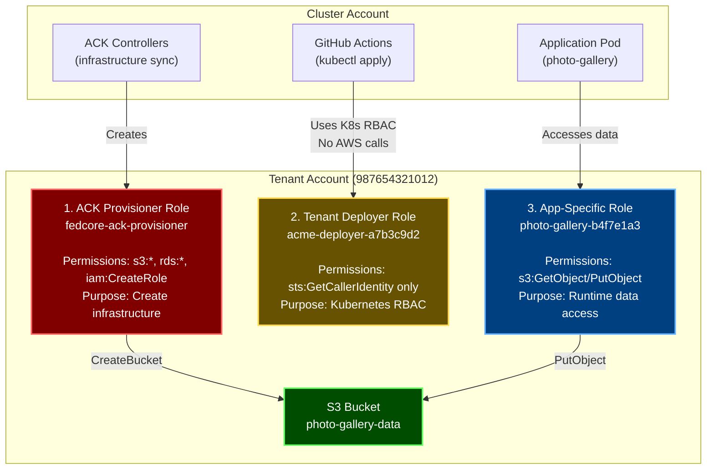

# IAM Role Architecture - Three-Tier Model

## Overview

fedCORE uses a **three-tier IAM architecture** that strictly separates infrastructure creation, CI/CD operations, and application runtime access. Each tier has exactly the permissions it needs and nothing more.

**Last Updated**: 2026-02-18

---

## The Three Roles



---

## Role 1: ACK Provisioner

**Created by**: LZA or Tenant RGD
**Lives in**: Tenant AWS account
**Used by**: ACK controllers (S3, DynamoDB, RDS, IAM, etc.)
**Purpose**: **Create and manage AWS infrastructure**

### What It Does

ACK controllers watch Kubernetes resources and create corresponding AWS resources:

```yaml
# Kubernetes manifest applied
apiVersion: s3.services.k8s.aws/v1alpha1
kind: Bucket
metadata:
  name: photo-gallery-data
  namespace: acme-frontend

# ACK S3 controller automatically:
# 1. Detects new Bucket resource
# 2. Assumes fedcore-ack-provisioner role
# 3. Calls AWS CreateBucket()
# 4. Updates .status with bucket ARN
```

### Permissions

```json
{
  "Version": "2012-10-17",
  "Statement": [{
    "Effect": "Allow",
    "Action": [
      "s3:*",
      "rds:*",
      "dynamodb:*",
      "elasticache:*",
      "sqs:*",
      "sns:*",
      "iam:CreateRole",
      "iam:PutRolePolicy",
      "iam:AttachRolePolicy",
      "iam:GetRole",
      "iam:CreatePolicy"
    ],
    "Resource": "*"
  }]
}
```

**Broad permissions** - needs to create any infrastructure the platform supports.

**File**: [platform/rgds/tenant/overlays/aws/overlay.yaml:77-111](../platform/rgds/tenant/overlays/aws/overlay.yaml#L77-L111)

---

## Role 2: Tenant Deployer (CI/CD)

**Created by**: Tenant RGD
**Lives in**: Tenant AWS account
**Used by**: GitHub Actions, Jenkins, CI/CD pipelines
**Purpose**: **Kubernetes operations only** (uses K8s RBAC, not AWS IAM)

### What It Does

CI/CD pipelines use this ServiceAccount to deploy Kubernetes manifests:

```bash
# GitHub Actions workflow
- name: Deploy
  run: kubectl apply -f manifests/

# Validation
- name: Verify
  run: |
    kubectl wait --for=condition=Ready webapp/photo-gallery
    kubectl get bucket photo-gallery-data -o jsonpath='{.status.bucketName}'
```

### Critical Insight: Zero AWS Permissions

**The deployer role has ZERO AWS permissions** (except `sts:GetCallerIdentity` for debugging).

**Why?**

1. CI/CD only runs `kubectl apply` → Uses **Kubernetes RBAC**
2. ACK controllers create AWS resources → Use **ACK provisioner role**
3. Apps access AWS → Use **app-specific roles**

**GitHub Actions never calls AWS APIs directly.**

### Validation Without AWS Access

Check Kubernetes status instead of calling AWS:

```bash
# ✅ GOOD: Use kubectl (no AWS permissions needed)
kubectl get bucket photo-gallery-data -o jsonpath='{.status.bucketName}'
# Output: photo-gallery-data-fedcore-prod-use1

kubectl get bucket photo-gallery-data -o jsonpath='{.status.conditions[?(@.type=="ACK.ResourceSynced")].status}'
# Output: True

# ❌ UNNECESSARY: Call AWS directly
aws s3api head-bucket --bucket photo-gallery-data
# Requires AWS permissions; provides same info as kubectl
```

ACK populates `.status` fields, so everything is available via `kubectl`.

### Permissions

```json
{
  "Version": "2012-10-17",
  "Statement": [{
    "Sid": "AllowGetCallerIdentity",
    "Effect": "Allow",
    "Action": ["sts:GetCallerIdentity"],
    "Resource": "*"
  }]
}
```

**Only `sts:GetCallerIdentity`** for debugging (see which role you have).

**File**: [platform/rgds/tenant/overlays/aws/overlay.yaml:166-233](../platform/rgds/tenant/overlays/aws/overlay.yaml#L166-L233)

### When Would CI/CD Need AWS Permissions?

Only if you run **custom Jobs in the CI/CD namespace** that directly call AWS:

```yaml
apiVersion: batch/v1
kind: Job
metadata:
  name: custom-migration
  namespace: acme-cicd
spec:
  template:
    spec:
      serviceAccountName: acme-deployer
      containers:
        - name: migrate
          command: ["aws", "s3", "sync", "old-bucket/", "new-bucket/"]
```

**For typical CI/CD, this never happens.** If needed, create a separate ServiceAccount with specific permissions.

---

## Role 3: App-Specific Roles

**Created by**: Application RGDs (WebApp, Database, API)
**Lives in**: Tenant AWS account
**Used by**: Application pods
**Purpose**: **Runtime access to AWS resources**

### What It Does

Each application gets its own IAM role with **only what it needs**:

```yaml
apiVersion: v1
kind: Pod
metadata:
  name: photo-gallery-xyz
  namespace: acme-frontend
spec:
  serviceAccountName: photo-gallery  # ← App-specific SA
  containers:
    - name: app
      image: photo-gallery:v1.0
      # AWS SDK automatically:
      # 1. Gets Pod Identity credentials (cluster role)
      # 2. Assumes photo-gallery-b4f7e1a3 role (tenant account)
      # 3. Calls s3:PutObject()
```

### Example: WebApp with S3

The WebApp RGD creates:
- Cluster role (Pod Identity trust)
- Tenant role (actual S3 permissions)
- ServiceAccount (points to cluster role)
- Deployment (uses ServiceAccount)

```yaml
# Tenant role permissions (created by WebApp RGD)
policies:
  - policyARN: arn:aws:iam::987654321012:policy/photo-gallery-s3-access

# Policy content
{
  "Version": "2012-10-17",
  "Statement": [{
    "Effect": "Allow",
    "Action": [
      "s3:GetObject",
      "s3:PutObject",
      "s3:DeleteObject",
      "s3:ListBucket"
    ],
    "Resource": [
      "arn:aws:s3:::photo-gallery-data-*",
      "arn:aws:s3:::photo-gallery-data-*/*"
    ]
  }]
}
```

**Narrow permissions** - only this app's S3 bucket, nothing else.

**File**: [platform/rgds/webapps/overlays/aws/overlay.yaml:145-213](../platform/rgds/webapps/overlays/aws/overlay.yaml#L145-L213)

### Benefits

| Benefit | Impact |
|---------|--------|
| **Blast Radius** | Compromised photo-gallery can't access database or API resources |
| **Least Privilege** | Each app gets only what it needs |
| **Audit Trail** | CloudTrail shows which app accessed which resource |
| **Independent Evolution** | Update one app's permissions without affecting others |

---

## Comparison Table

| Aspect | ACK Provisioner | Tenant Deployer | App-Specific Role |
|--------|----------------|----------------|-------------------|
| **Created by** | LZA or Tenant RGD | Tenant RGD | WebApp/Database/API RGD |
| **Lives in** | Tenant account | Tenant account | Tenant account |
| **Permissions** | Broad (infrastructure) | Zero (K8s RBAC only) | Narrow (app-specific) |
| **Can create S3?** | ✅ Yes | ❌ No | ❌ No |
| **Can read S3 data?** | ✅ Yes (shouldn't) | ❌ No | ✅ Yes (primary purpose) |
| **Can write S3 data?** | ✅ Yes (shouldn't) | ❌ No | ✅ Yes |
| **Can create IAM?** | ✅ Yes (with boundary) | ❌ No | ❌ No |
| **Used by** | ACK controllers | GitHub Actions | Application pods |
| **When** | Infrastructure sync | Manifest deployment | Application runtime |
| **AWS API Access** | Direct | None | Direct |
| **Permission Boundary** | ❌ No | ✅ Yes | ✅ Yes |

---

## Complete Deployment Flow

Trace what happens when deploying a photo gallery app:

### Step 1: CI/CD Deploys Manifest

```bash
# GitHub Actions
kubectl apply -f - <<EOF
apiVersion: example.org/v1
kind: WebApp
metadata:
  name: photo-gallery
  namespace: acme-frontend
spec:
  image: photo-gallery:v1.0
  storage:
    enabled: true
EOF
```

**Role**: Tenant Deployer (K8s RBAC)
**Action**: Creates WebApp Kubernetes resource

### Step 2: Kro Processes RGD

Kro generates:
- S3 Bucket manifest
- IAM Policy manifest
- Cluster IAM Role manifest
- Tenant IAM Role manifest
- ServiceAccount manifest
- Deployment manifest

**Role**: None (Kro operates within Kubernetes)

### Step 3: ACK Creates S3 Bucket

```yaml
# Generated by Kro
apiVersion: s3.services.k8s.aws/v1alpha1
kind: Bucket
metadata:
  name: photo-gallery-data
```

**Role**: ACK Provisioner (`fedcore-ack-provisioner`)
**Action**: Calls AWS `CreateBucket()`

### Step 4: ACK Creates IAM Roles

```yaml
# Generated by Kro
apiVersion: iam.services.k8s.aws/v1alpha1
kind: Role
metadata:
  name: photo-gallery-tenant
spec:
  name: photo-gallery-b4f7e1a3
```

**Role**: ACK Provisioner (`fedcore-ack-provisioner`)
**Action**: Calls AWS `CreateRole()`, `AttachRolePolicy()`

### Step 5: Application Starts

```yaml
# Generated by Kro
apiVersion: v1
kind: Pod
spec:
  serviceAccountName: photo-gallery  # ← App-specific
  containers:
    - name: app
      env:
        - name: S3_BUCKET_NAME
          value: photo-gallery-data-fedcore-prod-use1
```

**Role**: App-Specific (`photo-gallery-b4f7e1a3`)
**Action**: App calls AWS `s3:PutObject()` to upload photos

### Step 6: CI/CD Validates

```bash
# GitHub Actions validates via kubectl
kubectl get bucket photo-gallery-data -o jsonpath='{.status.bucketName}'
# ✓ Output: photo-gallery-data-fedcore-prod-use1

kubectl get webapp photo-gallery -o jsonpath='{.status.conditions[?(@.type=="Ready")].status}'
# ✓ Output: True
```

**Role**: Tenant Deployer (K8s RBAC only)
**Action**: Reads Kubernetes status, no AWS API calls

---

## Security Benefits

### 1. Separation of Concerns

```
┌──────────────────────────────────────────────┐
│ Layer 1: CI/CD → Kubernetes RBAC            │
│ Layer 2: Infrastructure → ACK Provisioner    │
│ Layer 3: Runtime → App-Specific Roles       │
└──────────────────────────────────────────────┘
```

No overlap. No shared credentials. Perfect isolation.

### 2. Blast Radius Containment

If photo-gallery is compromised:

- ❌ **Cannot** access API database
- ❌ **Cannot** access admin panel S3
- ❌ **Cannot** create new resources
- ✅ **Can only** access photo-gallery S3 bucket

### 3. Clear Audit Trail

CloudTrail shows exactly which component did what:

```json
// Infrastructure creation
{
  "userIdentity": {
    "arn": "arn:aws:sts::987654321012:assumed-role/fedcore-ack-provisioner/..."
  },
  "eventName": "CreateBucket"
}

// Application access (CI/CD never appears here - uses kubectl only)
{
  "userIdentity": {
    "arn": "arn:aws:sts::987654321012:assumed-role/photo-gallery-b4f7e1a3/..."
  },
  "eventName": "PutObject"
}
```

### 4. Defense in Depth

```
Kubernetes RBAC              ← Who can deploy?
    ↓
Capsule Multi-Tenancy        ← Namespace isolation
    ↓
Kyverno Admission Control    ← Manifest validation
    ↓
IAM Permission Boundaries    ← Privilege escalation prevention
    ↓
App-Specific IAM Roles       ← Least privilege per app
    ↓
AWS Resource Policies        ← Bucket/table-level controls
```

---

## When to Use Each Role

### ACK Provisioner

✅ **Use for**:
- ACK controllers creating AWS resources
- Infrastructure synchronization

❌ **Never use for**:
- Application code
- CI/CD pipelines
- Manual operations

### Tenant Deployer

✅ **Use for**:
- `kubectl apply` in CI/CD
- Reading Kubernetes status
- Debugging deployments

❌ **Don't use for**:
- Direct AWS API calls
- Application runtime
- Creating AWS resources

### App-Specific Roles

✅ **Use for**:
- Application runtime
- Reading/writing S3 data
- Querying DynamoDB
- Any AWS operation in app code

❌ **Don't use for**:
- CI/CD pipelines
- Creating infrastructure
- Cross-app access

---

## Related Documentation

**IAM & Authentication:**
- [Pod Identity Full Guide](POD_IDENTITY_FULL.md) - EKS Pod Identity implementation
- [LZA Tenant IAM Specification](LZA_TENANT_IAM_SPECIFICATION.md) - LZA IAM resource requirements
- [CI/CD Role Zero Permissions](CICD_ROLE_ZERO_PERMISSIONS.md) - Why CI/CD doesn't need AWS access

**Multi-Account Architecture:**
- [Multi-Account Architecture](MULTI_ACCOUNT_ARCHITECTURE.md) - Design principles and account structure
- [Multi-Account Implementation](MULTI_ACCOUNT_IMPLEMENTATION.md) - Technical implementation details
- [Multi-Account Operations](MULTI_ACCOUNT_OPERATIONS.md) - Operational procedures

**Security:**
- [Security Overview](SECURITY_OVERVIEW.md) - Overall security architecture
- [Kyverno Policies](KYVERNO_POLICIES.md) - Admission control policies

**Reference:**
- [Glossary](GLOSSARY.md) - IAM terminology reference
- [Troubleshooting](TROUBLESHOOTING.md) - IAM and authentication issues

---

## Navigation

[← Previous: Runtime Security & Logging](RUNTIME_SECURITY_AND_LOGGING.md) | [Next: Multi-Account Architecture →](MULTI_ACCOUNT_ARCHITECTURE.md)

**Handbook Progress:** Page 27 of 35 | **Level 6:** IAM & Multi-Account Architecture

[📚 Back to Handbook](HANDBOOK_INTRO.md) | [📖 Glossary](GLOSSARY.md) | [🔧 Troubleshooting](TROUBLESHOOTING.md)

---

**Last Updated**: 2026-02-18
**Owner**: Platform Security Team
**Review Frequency**: Quarterly
