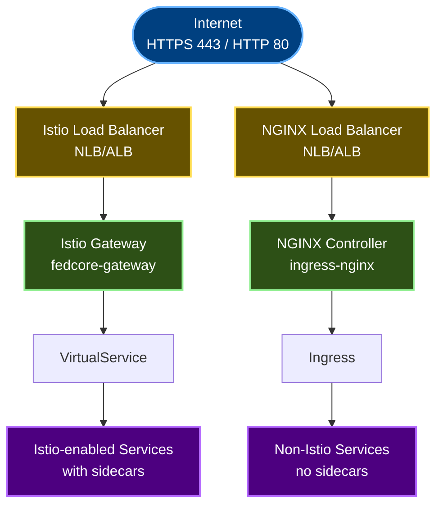
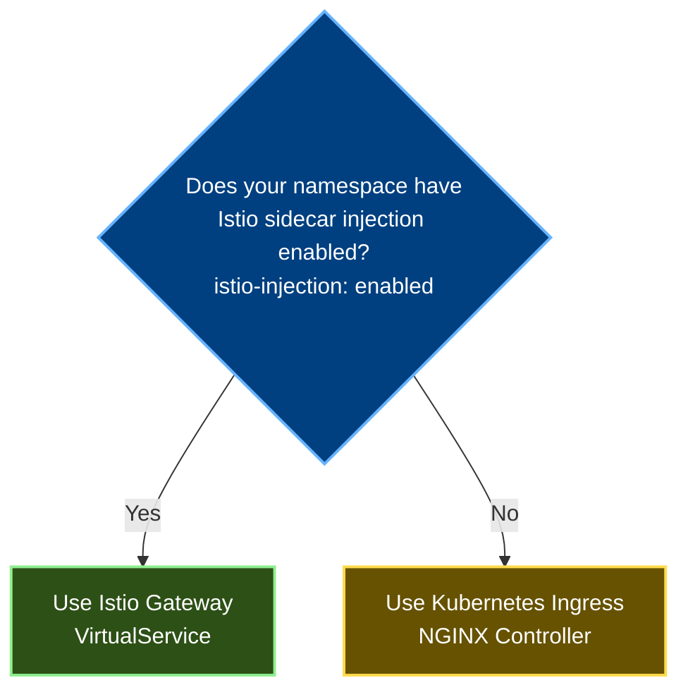

# Ingress Management in fedcore

This guide explains how to expose applications to external traffic in fedcore using either Istio or Kubernetes Ingress.

## Overview

fedcore supports **two ingress methods** depending on whether tenants use Istio service mesh:

### Option 1: Istio Gateway + VirtualService (Recommended)

For Istio-enabled namespaces (`istio-injection: enabled`):

- ✅ Deep integration with Istio service mesh and mTLS
- ✅ Advanced traffic management (retries, timeouts, circuit breaking)
- ✅ Layer 7 routing with full HTTP/gRPC support
- ✅ Multi-tenant isolation with Kyverno policy enforcement
- ✅ Observability with request tracing and metrics

### Option 2: Kubernetes Ingress (Legacy/Non-Istio)

For non-Istio namespaces or legacy applications:

- ✅ Traditional Kubernetes Ingress with NGINX controller
- ✅ Simpler setup without service mesh overhead
- ✅ Compatible with legacy applications
- ✅ Good for gradual Istio migration
- ⚠️ No automatic mTLS, circuit breaking, or distributed tracing

## Architecture



**Key Points**:
- Both ingress methods coexist in the same cluster
- Istio-enabled namespaces use Istio Gateway (preferred)
- Non-Istio namespaces use NGINX Ingress (legacy/simple apps)

## Two Gateway Strategies

### Strategy 1: Shared Gateway (Recommended)

**When to use**: Default for all tenants

**Benefits**:
- Cost-effective (single load balancer shared)
- Simple to use
- Centralized TLS certificate management
- Strong multi-tenant isolation via Kyverno

**Example**:
```yaml
apiVersion: networking.istio.io/v1beta1
kind: VirtualService
metadata:
  name: my-app
  namespace: acme-frontend
spec:
  hosts:
  - "my-app.prod.us-east-1.fedcore.io"
  gateways:
  - istio-system/fedcore-gateway  # Shared gateway
  http:
  - match:
    - uri:
        prefix: "/"
    route:
    - destination:
        host: my-app.acme-frontend.svc.cluster.local
        port:
          number: 8080
```

### Strategy 2: Dedicated Gateway (Per-Tenant)

**When to use**: Special cases requiring isolation

**Use cases**:
- Regulatory compliance requiring physical traffic separation
- Billing chargeback for load balancer costs
- Custom TLS certificates (client certs, specific CA)
- Very different traffic patterns requiring independent scaling

**Example**:
```yaml
# Step 1: Create dedicated gateway
apiVersion: gateway.fedcore.io/v1alpha1
kind: TenantGateway
metadata:
  name: acme-gateway
  namespace: acme-cicd
spec:
  tenantName: acme
  gatewayName: acme-gateway
  namespace: acme-ingress
  tlsSecretName: acme-tls-cert
  hosts:
  - "*.acme.prod.us-east-1.fedcore.io"

---
# Step 2: Reference in VirtualService
apiVersion: networking.istio.io/v1beta1
kind: VirtualService
metadata:
  name: my-app
  namespace: acme-frontend
spec:
  hosts:
  - "my-app.acme.prod.us-east-1.fedcore.io"
  gateways:
  - acme-ingress/acme-gateway  # Dedicated gateway
  http:
  - route:
    - destination:
        host: my-app.acme-frontend.svc.cluster.local
        port:
          number: 8080
```

## Choosing the Right Ingress Method

### Decision Tree



### Comparison Matrix

| Feature | Istio Gateway | Kubernetes Ingress |
|---------|---------------|-------------------|
| **mTLS** | ✅ Automatic | ❌ Manual only |
| **Circuit Breaking** | ✅ Built-in | ❌ Not available |
| **Distributed Tracing** | ✅ Automatic | ❌ Limited |
| **Traffic Splitting** | ✅ Advanced | ⚠️ Basic |
| **Retries/Timeouts** | ✅ Fine-grained | ⚠️ Basic |
| **Setup Complexity** | ⚠️ Higher | ✅ Lower |
| **Resource Overhead** | ⚠️ Higher (sidecars) | ✅ Lower |
| **Legacy App Support** | ⚠️ May need changes | ✅ Works as-is |
| **Migration Path** | N/A | ✅ Easy to migrate to Istio |

### Recommendations

**Use Istio Gateway when**:
- ✅ Building new microservices
- ✅ Need service-to-service mTLS
- ✅ Require advanced traffic management
- ✅ Want distributed tracing and observability
- ✅ Have Istio-compatible applications

**Use Kubernetes Ingress when**:
- ✅ Running legacy applications
- ✅ Apps incompatible with Istio sidecars
- ✅ Need simpler setup without service mesh
- ✅ Gradually migrating to Istio
- ✅ Minimal resource overhead required

## Quick Start

### Option A: Using WebApp RGD (Easiest)

#### For Istio-enabled Namespaces

```yaml
apiVersion: example.org/v1
kind: WebApp
metadata:
  name: customer-portal
  namespace: acme-frontend  # Must have istio-injection: enabled
spec:
  appName: customer-portal
  namespace: acme-frontend
  image: ghcr.io/acme/customer-portal:v1.0.0
  replicas: 3

  # Enable Istio ingress
  ingress:
    enabled: true
    type: "istio"  # Use Istio Gateway + VirtualService
    hostname: "portal.acme.prod.us-east-1.fedcore.io"
    path: "/"
    gateway: "istio-system/fedcore-gateway"  # Shared gateway
```

This automatically creates:
- ✅ Deployment
- ✅ Service
- ✅ VirtualService with proper gateway reference

#### For Non-Istio Namespaces

```yaml
apiVersion: example.org/v1
kind: WebApp
metadata:
  name: legacy-app
  namespace: acme-legacy  # No istio-injection label
spec:
  appName: legacy-app
  namespace: acme-legacy
  image: ghcr.io/acme/legacy-app:v1.0.0
  replicas: 3

  # Enable Kubernetes ingress
  ingress:
    enabled: true
    type: "kubernetes"  # Use Kubernetes Ingress
    hostname: "legacy.acme.prod.us-east-1.fedcore.io"
    path: "/"
    ingressClassName: "nginx"
    tlsSecretName: "legacy-app-tls"  # Must create manually
```

This automatically creates:
- ✅ Deployment
- ✅ Service
- ✅ Ingress with NGINX controller

### Option B: Manual Configuration

#### For Istio (VirtualService):

```yaml
# 1. Ensure you have a Service
apiVersion: v1
kind: Service
metadata:
  name: my-app
  namespace: acme-frontend
spec:
  selector:
    app: my-app
  ports:
  - port: 80
    targetPort: 8080

---
# 2. Create VirtualService
apiVersion: networking.istio.io/v1beta1
kind: VirtualService
metadata:
  name: my-app
  namespace: acme-frontend
spec:
  hosts:
  - "my-app.prod.us-east-1.fedcore.io"
  gateways:
  - istio-system/fedcore-gateway
  http:
  - route:
    - destination:
        host: my-app.acme-frontend.svc.cluster.local
        port:
          number: 80
```

## TLS/HTTPS Configuration

### Shared Gateway Certificates

The platform team manages TLS certificates for the shared gateway:

```bash
# Platform team creates wildcard certificate
kubectl create secret tls fedcore-tls-cert \
  --cert=wildcard.prod.us-east-1.fedcore.io.crt \
  --key=wildcard.prod.us-east-1.fedcore.io.key \
  -n istio-system
```

**Tenant action**: None required. Just use HTTPS hostnames.

### Dedicated Gateway Certificates

Tenants manage certificates for dedicated gateways:

```bash
# 1. Generate certificate for your domain
openssl req -new -newkey rsa:2048 -nodes \
  -keyout acme.key -out acme.csr \
  -subj "/CN=*.acme.prod.us-east-1.fedcore.io"

# 2. Get certificate signed by CA

# 3. Create secret in gateway namespace
kubectl create secret tls acme-tls-cert \
  --cert=acme.crt \
  --key=acme.key \
  -n acme-ingress

# 4. Reference in TenantGateway
apiVersion: gateway.fedcore.io/v1alpha1
kind: TenantGateway
spec:
  tlsSecretName: acme-tls-cert
```

## Advanced Traffic Management

### Path-Based Routing

```yaml
apiVersion: networking.istio.io/v1beta1
kind: VirtualService
metadata:
  name: api-routing
  namespace: acme-backend
spec:
  hosts:
  - "api.acme.prod.us-east-1.fedcore.io"
  gateways:
  - istio-system/fedcore-gateway
  http:
  # Route /v2 to new API version
  - match:
    - uri:
        prefix: "/v2"
    route:
    - destination:
        host: api-v2.acme-backend.svc.cluster.local
        port:
          number: 8080
  # Route /v1 to legacy API
  - match:
    - uri:
        prefix: "/v1"
    route:
    - destination:
        host: api-v1.acme-backend.svc.cluster.local
        port:
          number: 8080
  # Default to v2
  - route:
    - destination:
        host: api-v2.acme-backend.svc.cluster.local
        port:
          number: 8080
```

### Header-Based Routing

```yaml
apiVersion: networking.istio.io/v1beta1
kind: VirtualService
metadata:
  name: canary-routing
  namespace: acme-frontend
spec:
  hosts:
  - "app.acme.prod.us-east-1.fedcore.io"
  gateways:
  - istio-system/fedcore-gateway
  http:
  # Route beta users to canary
  - match:
    - headers:
        X-User-Group:
          exact: "beta"
    route:
    - destination:
        host: app-canary.acme-frontend.svc.cluster.local
        port:
          number: 8080
  # Route everyone else to stable
  - route:
    - destination:
        host: app-stable.acme-frontend.svc.cluster.local
        port:
          number: 8080
```

### Traffic Splitting (Canary Deployment)

```yaml
apiVersion: networking.istio.io/v1beta1
kind: VirtualService
metadata:
  name: canary-split
  namespace: acme-frontend
spec:
  hosts:
  - "app.acme.prod.us-east-1.fedcore.io"
  gateways:
  - istio-system/fedcore-gateway
  http:
  - route:
    # 90% to stable
    - destination:
        host: app-stable.acme-frontend.svc.cluster.local
        port:
          number: 8080
      weight: 90
    # 10% to canary
    - destination:
        host: app-canary.acme-frontend.svc.cluster.local
        port:
          number: 8080
      weight: 10
```

### Retries and Timeouts

```yaml
apiVersion: networking.istio.io/v1beta1
kind: VirtualService
metadata:
  name: resilient-app
  namespace: acme-backend
spec:
  hosts:
  - "api.acme.prod.us-east-1.fedcore.io"
  gateways:
  - istio-system/fedcore-gateway
  http:
  - route:
    - destination:
        host: api.acme-backend.svc.cluster.local
        port:
          number: 8080
    # Timeout after 10 seconds
    timeout: 10s
    # Retry failed requests
    retries:
      attempts: 3
      perTryTimeout: 3s
      retryOn: "5xx,reset,connect-failure,refused-stream"
```

## DNS Configuration

### AWS Route53

```bash
# Get load balancer DNS name
LB_DNS=$(kubectl get svc -n istio-system istio-ingressgateway -o jsonpath='{.status.loadBalancer.ingress[0].hostname}')

# Create CNAME record (example using AWS CLI)
aws route53 change-resource-record-sets \
  --hosted-zone-id Z1234567890ABC \
  --change-batch '{
    "Changes": [{
      "Action": "CREATE",
      "ResourceRecordSet": {
        "Name": "my-app.prod.us-east-1.fedcore.io",
        "Type": "CNAME",
        "TTL": 300,
        "ResourceRecords": [{"Value": "'$LB_DNS'"}]
      }
    }]
  }'
```

### Azure DNS

```bash
# Get load balancer IP
LB_IP=$(kubectl get svc -n istio-system istio-ingressgateway -o jsonpath='{.status.loadBalancer.ingress[0].ip}')

# Create A record (example using Azure CLI)
az network dns record-set a add-record \
  --resource-group my-dns-rg \
  --zone-name prod.us-east-1.fedcore.io \
  --record-set-name my-app \
  --ipv4-address $LB_IP
```

## Governance and Security

### Kyverno Policies

The platform automatically enforces:

1. **Gateway References**: VirtualServices can only reference:
   - Shared gateway: `istio-system/fedcore-gateway`
   - Tenant-owned gateways: `<tenant>-ingress/*`

2. **Hostname Validation**: Hostnames must match cluster ingress domain

3. **Gateway Protection**: Tenants cannot modify `istio-system/fedcore-gateway`

4. **Resource Limits**: Dedicated gateways have CPU/memory limits

### Example Policy Violation

```yaml
# ❌ This will be rejected
apiVersion: networking.istio.io/v1beta1
kind: VirtualService
metadata:
  name: invalid
  namespace: acme-frontend
spec:
  hosts:
  - "evil.com"  # Wrong domain!
  gateways:
  - other-tenant-ingress/gateway  # Not owned!
```

**Error**:
```
VirtualService must reference either 'istio-system/fedcore-gateway' (shared)
or a gateway in the same namespace or tenant's gateway namespace.
```

## Monitoring and Troubleshooting

### Check VirtualService Status

```bash
# List VirtualServices in namespace
kubectl get virtualservice -n acme-frontend

# Describe VirtualService
kubectl describe virtualservice my-app -n acme-frontend

# Check configuration in Istio
istioctl analyze -n acme-frontend
```

### View Gateway Configuration

```bash
# Check shared gateway
kubectl get gateway -n istio-system fedcore-gateway -o yaml

# Check tenant gateway
kubectl get gateway -n acme-ingress acme-gateway -o yaml
```

### Test Connectivity

```bash
# Get gateway external IP
GATEWAY_IP=$(kubectl get svc -n istio-system istio-ingressgateway -o jsonpath='{.status.loadBalancer.ingress[0].hostname}')

# Test with curl
curl -H "Host: my-app.prod.us-east-1.fedcore.io" http://$GATEWAY_IP/

# Test HTTPS
curl -H "Host: my-app.prod.us-east-1.fedcore.io" https://$GATEWAY_IP/ -k
```

### Common Issues

#### 404 Not Found
**Cause**: VirtualService not configured correctly

**Check**:
```bash
# Verify hostname matches
kubectl get virtualservice my-app -n acme-frontend -o yaml | grep hosts

# Verify gateway reference
kubectl get virtualservice my-app -n acme-frontend -o yaml | grep gateways

# Check if Service exists
kubectl get svc my-app -n acme-frontend
```

#### 503 Service Unavailable
**Cause**: Backend service not healthy

**Check**:
```bash
# Check pod status
kubectl get pods -n acme-frontend -l app=my-app

# Check service endpoints
kubectl get endpoints my-app -n acme-frontend

# View Envoy logs
kubectl logs -n istio-system -l istio=ingressgateway -c istio-proxy
```

#### TLS Certificate Errors
**Cause**: Certificate issues

**Check**:
```bash
# Verify secret exists
kubectl get secret fedcore-tls-cert -n istio-system

# Check certificate expiry
kubectl get secret fedcore-tls-cert -n istio-system -o jsonpath='{.data.tls\.crt}' | base64 -d | openssl x509 -text -noout | grep "Not After"

# Test TLS handshake
openssl s_client -connect $GATEWAY_IP:443 -servername my-app.prod.us-east-1.fedcore.io
```

## Cost Comparison

### Shared Gateway (Default)
- **Infrastructure**: ~$20-30/month total
- **Per-application**: $0
- **Recommended for**: All standard applications

### Dedicated Gateway
- **Infrastructure**: ~$25-35/month per tenant
- **Per-application**: Shared among tenant apps
- **Recommended for**: High-security or compliance-driven tenants

## Migration Guides

### From Legacy App to Istio

Migrate a non-Istio application to use Istio service mesh:

#### Step 1: Enable Istio Injection

```bash
kubectl label namespace acme-legacy istio-injection=enabled
```

#### Step 2: Restart Pods

```bash
# Restart deployments to inject sidecars
kubectl rollout restart deployment -n acme-legacy

# Verify sidecars are injected (should see 2/2 containers)
kubectl get pods -n acme-legacy
```

#### Step 3: Create VirtualService

```yaml
apiVersion: networking.istio.io/v1beta1
kind: VirtualService
metadata:
  name: my-app
  namespace: acme-legacy
spec:
  hosts:
  - "my-app.prod.us-east-1.fedcore.io"
  gateways:
  - istio-system/fedcore-gateway
  http:
  - route:
    - destination:
        host: my-app.acme-legacy.svc.cluster.local
        port:
          number: 80
```

#### Step 4: Test Traffic

Verify traffic works through Istio Gateway before proceeding.

#### Step 5: Delete Old Ingress

```bash
kubectl delete ingress my-app -n acme-legacy
```

#### Step 6: Update DNS (if needed)

Point DNS to Istio Gateway load balancer.

### From Kubernetes Ingress to Istio VirtualService (Quick Reference)

**Before (Ingress)**:
```yaml
apiVersion: networking.k8s.io/v1
kind: Ingress
metadata:
  name: my-app
  namespace: acme-frontend
spec:
  rules:
  - host: my-app.prod.us-east-1.fedcore.io
    http:
      paths:
      - path: /
        pathType: Prefix
        backend:
          service:
            name: my-app
            port:
              number: 80
```

**After (VirtualService)**:
```yaml
apiVersion: networking.istio.io/v1beta1
kind: VirtualService
metadata:
  name: my-app
  namespace: acme-frontend
spec:
  hosts:
  - "my-app.prod.us-east-1.fedcore.io"
  gateways:
  - istio-system/fedcore-gateway
  http:
  - match:
    - uri:
        prefix: "/"
    route:
    - destination:
        host: my-app.acme-frontend.svc.cluster.local
        port:
          number: 80
```

## Best Practices

1. **Use shared gateway by default** - Most cost-effective and simple
2. **Enable Istio sidecar injection** - Required for VirtualServices to work
3. **Use FQDN in destinations** - Always use `.svc.cluster.local` suffix
4. **Configure timeouts** - Prevent hanging requests
5. **Enable retries** - Improve reliability for transient failures
6. **Monitor metrics** - Track request rates, latency, errors
7. **Test before production** - Validate routing in dev/staging first
8. **Document hostnames** - Keep inventory of all exposed services

## Examples

See:
- [WebApp with Ingress](../platform/rgds/webapps/examples/webapp-with-ingress.yaml)
- [WebApp with Dedicated Gateway](../platform/rgds/webapps/examples/webapp-with-dedicated-gateway.yaml)
- [Basic Tenant Gateway](../platform/rgds/gateway/examples/basic-gateway.yaml)
- [High-Traffic Gateway](../platform/rgds/gateway/examples/high-traffic-gateway.yaml)

## Related Documentation

- [Istio Component README](../platform/components/istio/README.md)
- [Gateway RGD README](../platform/rgds/gateway/README.md)
- [WebApp RGD README](../platform/rgds/webapps/README.md)
- [Kyverno Gateway Policies](../platform/components/kyverno-policies/base/istio-gateway-policies.yaml)
- [Tenant User Guide](TENANT_USER_GUIDE.md)

---

**Questions?** Contact the platform team or open an issue.

---

## Navigation

[← Previous: Pod Identity Full Guide](POD_IDENTITY_FULL.md) | [Next: Helm Charts →](HELM_CHARTS.md)

**Handbook Progress:** Page 33 of 35 | **Level 7:** Advanced Features

[📚 Back to Handbook](HANDBOOK_INTRO.md) | [📖 Glossary](GLOSSARY.md) | [🔧 Troubleshooting](TROUBLESHOOTING.md)
