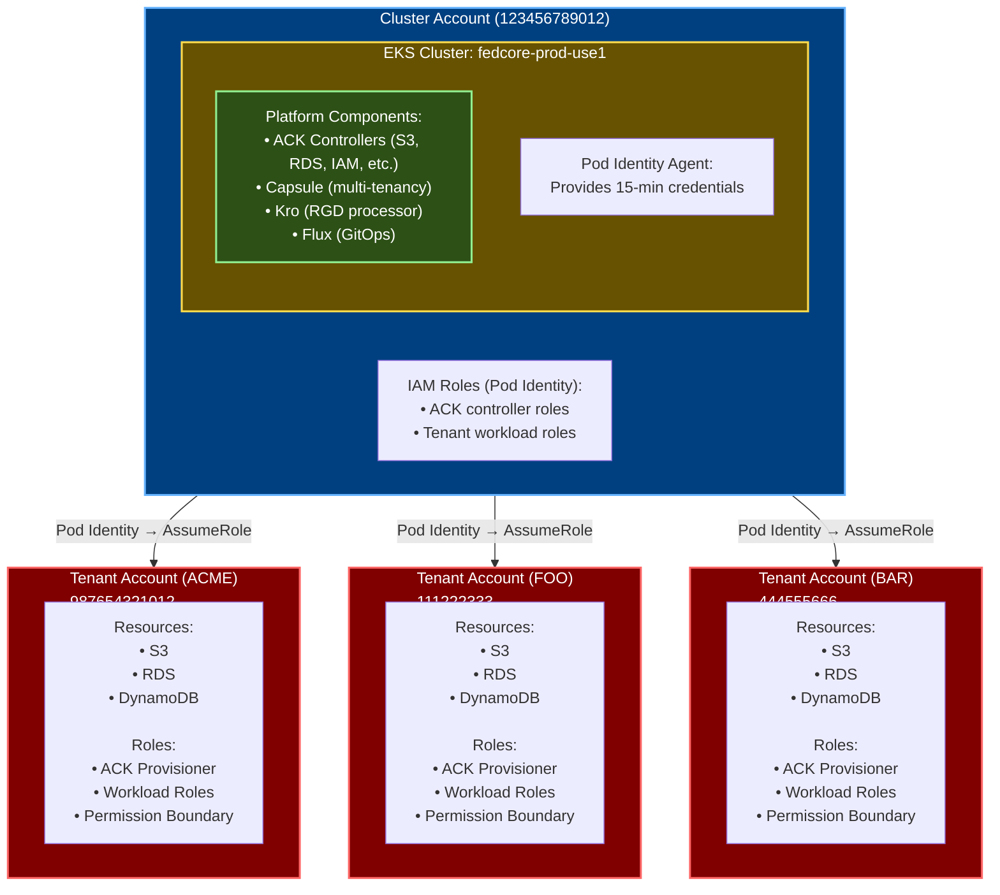
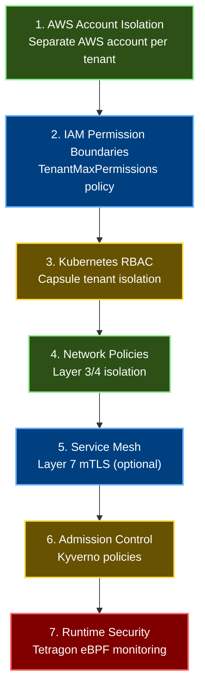

# Multi-Account Architecture

## Overview

This document describes the fedCORE platform's multi-account tenant architecture where each tenant receives a dedicated AWS account provisioned via AWS Landing Zone Accelerator (LZA). It covers the architectural design, principles, account structure, networking considerations, and cost allocation.

**Important**: All infrastructure changes are deployed through GitOps (GitHub Actions + Flux). Changes are committed to git, built into OCI artifacts by CI/CD, and deployed by Flux - not applied directly with kubectl.

## Architecture Principles

1. **Account Isolation**: Each tenant gets a dedicated AWS account for complete resource and billing isolation
2. **Centralized Control Plane**: EKS clusters run in a central "cluster account"
3. **Cross-Account Provisioning**: ACK controllers assume roles in tenant accounts to provision resources
4. **Metadata-Driven Discovery**: IAMRoleSelector CRDs + Kyverno labels route ACK resources to correct tenant accounts
5. **Flexible Networking**: Design accommodates future VPC peering/Transit Gateway/PrivateLink decisions

## Account Structure



## Responsibilities Split

### Landing Zone Accelerator (LZA) - Automated

LZA handles the foundational AWS account setup:

- ✅ Create AWS account via Organizations
- ✅ Place account in correct Organizational Unit
- ✅ Apply Service Control Policies (SCPs)
- ✅ Enable CloudTrail, AWS Config, GuardDuty
- ✅ Configure VPC foundation (pending network team decision)
- ✅ Create `FedCoreBootstrapRole` (admin access for bootstrap)

**LZA provides:** Account ID, account name, and bootstrap role ARN

### fedCORE Platform - Automatic via TenantOnboarding

The platform handles all remaining setup automatically through a single TenantOnboarding CR:

**Phase 1 - Bootstrap** (via `FedCoreBootstrapRole`):
- ✅ Deploy permission boundary policy
- ✅ Create ACK provisioner role (with restricted permissions)

**Phase 2 - Tenant Provisioning** (via `fedcore-ack-provisioner`):
- ✅ Create Capsule Tenant (Kubernetes namespace isolation)
- ✅ Create IAMRoleSelector CRDs (cluster-scoped) for cross-account routing
- ✅ Create cluster account workload roles (Pod Identity)
- ✅ Create tenant account workload roles (actual permissions)
- ✅ Create CI/CD namespace and ServiceAccount
- ✅ Configure RBAC for tenant owners

**Key Insight**: Bootstrap uses the powerful FedCoreBootstrapRole temporarily (2-3 minutes), then switches to the less-privileged fedcore-ack-provisioner role for ongoing operations. Cross-account routing is handled by IAMRoleSelector CRDs rather than per-resource annotations.

**Authentication**: All pods use EKS Pod Identity for AWS authentication - no OIDC providers needed.

## Tenant Account ID Storage

Store tenant AWS account ID as annotation on Capsule Tenant:

```yaml
apiVersion: capsule.clastix.io/v1beta2
kind: Tenant
metadata:
  name: acme
  labels:
    platform.fedcore.io/tenant: acme
    platform.fedcore.io/cluster: fedcore-prod-use1
  annotations:
    # NEW: Store tenant's AWS account ID for cross-RGD discovery
    platform.fedcore.io/aws-account-id: "987654321012"
    platform.fedcore.io/aws-region: "us-east-1"
    platform.fedcore.io/billing-contact: "finance@acme-corp.com"
spec:
  owners: [...]
```

**Why Annotations?**
- Discoverable by other RGDs via Kubernetes API
- Not limited by label length restrictions (63 chars)
- Follows Kubernetes metadata conventions
- Easy to query: `kubectl get tenant acme -o jsonpath='{.metadata.annotations.platform\.fedcore\.io/aws-account-id}'`

## Networking Considerations (Future)

The design supports multiple networking patterns:

### Option A: VPC Peering
```
Cluster VPC (10.0.0.0/16)
    |
    ├─ VPC Peering ─> Tenant A VPC (10.1.0.0/16)
    ├─ VPC Peering ─> Tenant B VPC (10.2.0.0/16)
    └─ VPC Peering ─> Tenant C VPC (10.3.0.0/16)
```

### Option B: Transit Gateway
```
Cluster VPC (10.0.0.0/16)
    |
    └─ Transit Gateway
        ├─ Tenant A VPC (10.1.0.0/16)
        ├─ Tenant B VPC (10.2.0.0/16)
        └─ Tenant C VPC (10.3.0.0/16)
```

### Option C: Public Endpoints + IAM Auth
```
Cluster VPC (10.0.0.0/16)
    │
    └─> Internet Gateway
         │
         ├─> S3 Public Endpoint (IAM auth)
         ├─> RDS Public Endpoint (IAM auth)
         └─> DynamoDB Public Endpoint (IAM auth)
```

### Option D: AWS PrivateLink
```
Cluster VPC (10.0.0.0/16)
    │
    ├─> VPC Endpoint (Tenant A S3)
    ├─> VPC Endpoint (Tenant B RDS)
    └─> VPC Endpoint (Tenant C DynamoDB)
```

**Current Status**: Network architecture TBD, pending discussion with networking team.

## Cost Allocation

### Automatic Tagging

All resources created in tenant accounts are tagged:

```yaml
tags:
  platform.fedcore.io/tenant: acme
  platform.fedcore.io/cluster: fedcore-prod-use1
  platform.fedcore.io/cost-center: engineering
  platform.fedcore.io/billing-contact: finance@acme-corp.com
  platform.fedcore.io/environment: production
```

### Billing Benefits

- Separate AWS bills per tenant account
- Cost Explorer per tenant
- Budget alerts per tenant
- Showback/chargeback ready

### Cost Tracking in Kubernetes

All Kubernetes resources are automatically labeled for cost tracking:

```yaml
metadata:
  labels:
    platform.fedcore.io/tenant: acme
    platform.fedcore.io/cluster: fedcore-prod-use1
    platform.fedcore.io/cost-center: engineering
```

**Kyverno automatically adds these labels** to all resources created in tenant namespaces.

### Cost Reporting

**AWS Cost Explorer Query:**
```
Filters:
- Tag: platform.fedcore.io/tenant = acme
- Tag: platform.fedcore.io/cluster = fedcore-prod-use1

Group By: Service, Region
```

**Kubernetes Cost Allocation:**
- Use Kubecost or similar tools
- Filter by tenant label
- Aggregate across all tenant namespaces

## Security Architecture

### Defense-in-Depth Layers



### Key Security Features

1. **Account Isolation** - Tenants cannot access other tenants' AWS resources at the account level
2. **Permission Boundaries** - Prevent privilege escalation even with IAM permissions
3. **IAM Trust Policy Scoping** - Confused deputy prevention via principal scoping in IAM trust policies (IAMRoleSelector does not support external-id; Pod Identity workload role chaining still uses external-id)
4. **Pod Identity** - Time-limited credentials (15 minutes), no long-lived access keys
5. **Two-Tier Roles** - Cluster roles with limited permissions, tenant roles with actual access
6. **Audit Trail** - All actions logged in CloudTrail per tenant account

## Compliance and Governance

### Compliance Benefits

| Framework | Implementation | Evidence |
|-----------|----------------|----------|
| **SOC 2** | Separate accounts provide audit trail isolation | CloudTrail logs per account |
| **PCI-DSS** | Network and account segregation | Account boundaries + NetworkPolicies |
| **HIPAA** | Data isolation and encryption | Account isolation + encryption at rest/transit |
| **ISO 27001** | Access control and monitoring | IAM policies + CloudTrail + Tetragon |

### Governance Policies

**Service Control Policies (SCPs):**
- Prevent account deletion
- Enforce encryption
- Restrict regions
- Block public S3 buckets
- Require MFA for sensitive operations

**AWS Config Rules:**
- Monitor IAM policy changes
- Detect unencrypted resources
- Track permission boundary compliance
- Alert on non-compliant resources

## Scalability Considerations

### Current Limits

| Resource | Limit | Notes |
|----------|-------|-------|
| AWS Accounts per Organization | 10,000 | Soft limit, can be increased |
| Capsule Tenants per Cluster | 1,000 | Platform tested limit |
| Namespaces per Tenant | Configurable | Set in TenantOnboarding |
| ACK Controllers | 1 per service | S3, RDS, IAM, etc. |

### Future Scalability

**Horizontal Scaling:**
- Add more EKS clusters as needed
- Tenants can span multiple clusters
- ACK controllers scale independently

**Account Provisioning:**
- LZA can provision accounts in batches
- Average provisioning time: 10-15 minutes per account
- Can be parallelized for bulk onboarding

## Disaster Recovery

### Backup and Restore

**Tenant Account Data:**
- S3 buckets: Cross-region replication enabled
- RDS databases: Automated backups + snapshots
- DynamoDB: Point-in-time recovery enabled
- Secrets: Replicated to secondary region

**Kubernetes Resources:**
- All tenant definitions in git (GitOps)
- Capsule Tenant CRs backed up to S3
- Velero backups of all namespaces
- Disaster recovery to alternate cluster

### Recovery Procedures

1. **Account Recovery:**
   - Re-run TenantOnboarding CR in new cluster
   - ACK recreates IAM roles from git
   - Data remains in tenant account (untouched)

2. **Cluster Recovery:**
   - Deploy platform components to new cluster
   - Apply all TenantOnboarding CRs from git
   - Tenant workloads reconnect to existing data

3. **Data Recovery:**
   - Restore S3 from replication or backup
   - Restore RDS from snapshot
   - Restore DynamoDB from backup

## Migration Strategies

### From Single Account to Multi-Account

1. **Create tenant accounts** via LZA
2. **Update TenantOnboarding CRs** with account IDs
3. **New resources** automatically provisioned in tenant accounts
4. **Migrate existing data** to new accounts
5. **Update application connection strings**
6. **Delete old resources** from cluster account

### From IRSA to Pod Identity

1. **Create Pod Identity associations** via TenantOnboarding
2. **Test new authentication** in dev/staging
3. **Update ServiceAccount annotations**
4. **Restart pods** to use Pod Identity
5. **Delete OIDC provider** (when all pods migrated)

## Related Documentation

- [Multi-Account Implementation](MULTI_ACCOUNT_IMPLEMENTATION.md) - Technical implementation details
- [Multi-Account Operations](MULTI_ACCOUNT_OPERATIONS.md) - Onboarding and operational procedures
- [Tenant Admin Guide](TENANT_ADMIN_GUIDE.md) - Creating and managing tenants
- [Security Overview](SECURITY_OVERVIEW.md) - Security architecture

---

## Navigation

[← Previous: IAM Architecture](IAM_ARCHITECTURE.md) | [Next: Multi-Account Implementation →](MULTI_ACCOUNT_IMPLEMENTATION.md)

**Handbook Progress:** Page 28 of 35 | **Level 6:** IAM & Multi-Account Architecture

[📚 Back to Handbook](HANDBOOK_INTRO.md) | [📖 Glossary](GLOSSARY.md) | [🔧 Troubleshooting](TROUBLESHOOTING.md)
