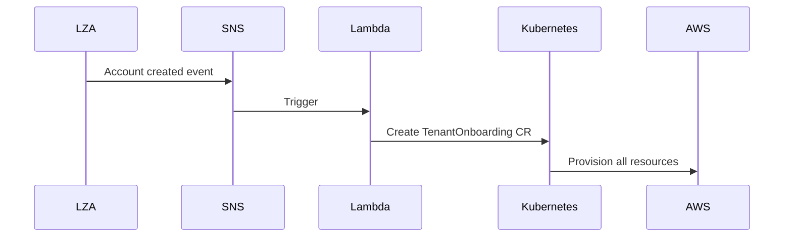

# Multi-Account Operations

## Overview

This document provides operational procedures for the fedCORE multi-account architecture, including tenant onboarding, offboarding, GitOps workflows, troubleshooting, and migration strategies.

**Prerequisites**: Understanding of [Multi-Account Architecture](MULTI_ACCOUNT_ARCHITECTURE.md) and [Multi-Account Implementation](MULTI_ACCOUNT_IMPLEMENTATION.md)

## Onboarding a Tenant with LZA

### One-Time Setup: Enable ACK Cross-Account Access

**Before onboarding any tenants**, complete these setup steps:

**1. Grant ACK IAM controller permission to assume `FedCoreBootstrapRole` in tenant accounts:**

```bash
# Add policy to ACK IAM controller role in cluster account
aws iam put-role-policy \
  --role-name ack-iam-controller \
  --policy-name AllowBootstrapRoleAccess \
  --policy-document '{
    "Version": "2012-10-17",
    "Statement": [{
      "Effect": "Allow",
      "Action": "sts:AssumeRole",
      "Resource": "arn:aws:iam::*:role/FedCoreBootstrapRole"
    }]
  }'
```

**2. Enable IAMRoleSelector feature gate on all ACK controllers and disable CARM:**

Ensure each ACK controller deployment has:
- `--feature-gates=IAMRoleSelector=true`
- CARM disabled (no CARM ConfigMap or `--enable-carm=false`)

**3. Deploy the `ack-tenant-metadata` Kyverno policy:**

This policy adds `platform.fedcore.io/ack-target` and `platform.fedcore.io/resource-type` labels to ACK resources in tenant namespaces. These labels are matched by IAMRoleSelector CRDs for cross-account routing.

**Verify it works:**
```bash
aws sts assume-role \
  --role-arn arn:aws:iam::987654321012:role/FedCoreBootstrapRole \
  --role-session-name test
```

### Step-by-Step: Onboard a Tenant

#### Step 1: Receive Account from LZA

When LZA creates a tenant account, you'll receive:

- **Account ID**: 12-digit AWS account ID (e.g., `987654321012`)
- **Tenant Name**: Lowercase identifier (e.g., `acme`)
- **Account Name**: Human-readable name (e.g., `acme-production`)

**Example LZA Output:**
```json
{
  "AccountId": "987654321012",
  "AccountName": "acme-production",
  "Email": "aws-acme@example.com",
  "Status": "ACTIVE"
}
```

#### Step 2: Create TenantOnboarding CR

Create the tenant onboarding file in your cluster's tenants directory.

**Minimal example:**

```yaml
apiVersion: platform.fedcore.io/v1alpha1
kind: TenantOnboarding
metadata:
  name: acme
spec:
  tenantName: acme
  aws:
    accountId: "987654321012"
  owners:
    - kind: User
      name: john@acme-corp.com
```

**Complete examples in repository:**
- [AWS tenant example](../platform/clusters/aws-example-use1-dev-app/tenants/acme-onboarding.yaml)
- [On-prem tenant example](../platform/clusters/onprem-dc2-dev-app/tenants/acme-onboarding.yaml)

**Full field reference:** [TenantOnboarding RGD schema](../platform/rgds/tenant/base/tenant-rgd.yaml)

Save to: `platform/clusters/fedcore-prod-use1/tenants/acme-onboarding.yaml`

#### Step 3: Commit and Deploy via GitOps

```bash
# Commit the tenant CR to version control
git add platform/clusters/fedcore-prod-use1/tenants/acme-onboarding.yaml
git commit -m "Onboard tenant: acme with AWS account 987654321012"
git push origin main

# GitHub Actions will automatically:
# 1. Validate the configuration (yamllint)
# 2. Build infrastructure artifact for fedcore-prod-use1
# 3. Push artifact to Nexus OCI registry
# 4. Flux detects new artifact and reconciles

# Monitor Flux reconciliation
flux get ocirepositories -n flux-system
flux get kustomizations -n flux-system

# Watch the onboarding process
kubectl get tenantonboarding acme -w
```

**For complete GitOps pipeline details**, see [DEPLOYMENT.md - Deployment Flow](DEPLOYMENT.md#deployment-flow)

#### Step 4: Verify Tenant Creation

```bash
# Verify Capsule Tenant
kubectl get tenant acme

# Verify account ID annotation
kubectl get tenant acme \
  -o jsonpath='{.metadata.annotations.platform\.fedcore\.io/aws-account-id}'
# Expected: 987654321012

# Verify CI/CD namespace
kubectl get namespace acme-cicd

# Verify deployer ServiceAccount
kubectl get serviceaccount acme-deployer -n acme-cicd -o yaml
# Should have eks.amazonaws.com/role-arn annotation

# Verify bootstrap resources in AWS (from tenant account)
export AWS_PROFILE=tenant-acme
aws iam list-open-id-connect-providers
aws iam get-policy --policy-arn arn:aws:iam::987654321012:policy/TenantMaxPermissions
aws iam get-role --role-name fedcore-ack-provisioner
```

### What Gets Created Automatically

When Kro processes the TenantOnboarding CR, it automatically creates:

**In Cluster AWS Account:**
1. **Cluster Deployer Role**: Pod Identity role for CI/CD ServiceAccount

**In Tenant AWS Account (Phase 1 - Bootstrap):**
2. **Permission Boundary Policy**: `TenantMaxPermissions` - prevents privilege escalation
3. **ACK Provisioner Role**: `fedcore-ack-provisioner` - allows ACK to provision resources

**In Tenant AWS Account (Phase 2 - Tenant):**
4. **Tenant Deployer Role**: Actual permissions role trusted by cluster role

**In Kubernetes:**
5. **Capsule Tenant**: Namespace isolation with quotas
6. **IAMRoleSelector CRDs**: `<tenant>-bootstrap` (routes to FedCoreBootstrapRole) and `<tenant>` (routes to fedcore-ack-provisioner)
7. **CI/CD Namespace**: `<tenant>-cicd`
8. **ServiceAccount**: `<tenant>-deployer` with Pod Identity annotation
9. **RBAC**: ClusterRole and bindings for tenant owners and deployments
10. **Pod Identity Association**: Links ServiceAccount to cluster IAM role

## GitOps Workflow for All Changes

All tenant changes happen through git commits, not direct kubectl commands:

```bash
# Standard workflow
git add platform/clusters/fedcore-prod-use1/tenants/acme-onboarding.yaml
git commit -m "Onboard tenant: acme with AWS account 987654321012"
git push origin main

# Monitor deployment (automatic via GitOps)
flux get ocirepositories -n flux-system
kubectl get tenantonboarding acme -w
```

**For complete GitOps pipeline details**, see [DEPLOYMENT.md - Deployment Flow](DEPLOYMENT.md#deployment-flow)

## Tenant Offboarding (Rollback)

To remove a tenant, delete the CR from git (do NOT use kubectl delete directly):

```bash
# Remove tenant CR from git
git rm platform/clusters/fedcore-prod-use1/tenants/acme-onboarding.yaml
git commit -m "Offboard tenant: acme"
git push origin main

# GitHub Actions will automatically:
# 1. Build new infrastructure artifact without acme-onboarding.yaml
# 2. Push updated artifact to Nexus OCI registry
# 3. Flux detects artifact change and reconciles
# 4. Flux removes the TenantOnboarding CR (cascades to all resources)

# Verify K8s resources removed
kubectl get tenant acme
# Should return: Error from server (NotFound)

# Verify AWS resources removed (from tenant account)
aws iam list-open-id-connect-providers --profile tenant-acme
aws iam get-policy --policy-arn arn:aws:iam::987654321012:policy/TenantMaxPermissions --profile tenant-acme
# Should return: NoSuchEntity errors
```

**IMPORTANT**: Always remove tenants via git to ensure:
- Change is tracked in version control
- Artifact is rebuilt without the tenant
- Flux reconciles properly
- Audit trail is maintained

## Deployment Workflow

### Tenant Onboarding Process

**High-level flow**:
1. LZA creates AWS account → Receive Account ID (987654321012)
2. Platform team creates TenantOnboarding CR with account ID
3. Commit to git and push
4. GitOps pipeline deploys automatically (see [DEPLOYMENT.md](DEPLOYMENT.md))
5. Kro processes RGD and creates all cross-account resources
6. Tenant can deploy workloads that automatically route to their account

**For detailed GitOps workflow**, see [DEPLOYMENT.md - Deployment Flow](DEPLOYMENT.md#deployment-flow)

### Example: Tenant Creates a WebApp

```bash
# Tenant creates a WebApp CR
apiVersion: example.org/v1
kind: WebApp
metadata:
  name: my-app
  namespace: acme-frontend  # Tenant's namespace
spec:
  image: nexus.fedcore.io/tenant-acme/webapp:1.0.0
  replicas: 3
  storage:
    enabled: true
    size: 100Gi
```

**What happens automatically**:
1. RGD creates S3 Bucket in tenant namespace
2. Kyverno `ack-tenant-metadata` policy adds `platform.fedcore.io/ack-target: acme` and `platform.fedcore.io/resource-type: provisioner` labels
3. IAMRoleSelector `acme` matches those labels and routes to `fedcore-ack-provisioner` in tenant account (987654321012)
4. ACK assumes role in tenant account via IAMRoleSelector
5. ACK creates S3 bucket in tenant's AWS account

**Deployment methods**:
- GitOps: Commit to git → CI/CD deploys (see [DEPLOYMENT.md](DEPLOYMENT.md))
- CI/CD Pipeline: Use `acme-deployer` ServiceAccount in `acme-cicd` namespace

## Troubleshooting

### General Deployment Issues

**For GitOps pipeline issues** (build failures, Flux not syncing):
- See [DEPLOYMENT.md - Troubleshooting](DEPLOYMENT.md#troubleshooting)

### Multi-Account Specific Issues

#### ACK Cannot Assume FedCoreBootstrapRole

**Symptoms:**
```
AccessDenied: User: arn:aws:sts::123456789012:assumed-role/ack-iam-controller/...
is not authorized to perform: sts:AssumeRole
```

**Fix:** Add the assume role policy to your ACK IAM controller role (see [One-Time Setup](#one-time-setup-enable-ack-cross-account-access)).

#### TenantOnboarding CR Stuck

**Check CI/CD pipeline first:**
```bash
# Check GitHub Actions workflow status
# Navigate to: https://github.com/<org>/<repo>/actions

# Check Flux reconciliation
flux get ocirepositories -n flux-system
flux get kustomizations -n flux-system

# Check if CR was applied
kubectl get tenantonboarding acme
```

**Check operator logs:**
```bash
# Kro operator logs (processes RGD)
kubectl logs -n kro-system -l app=kro-controller --tail=100

# ACK IAM controller logs (creates AWS resources)
kubectl logs -n ack-system -l k8s-app=ack-iam-controller --tail=100

# Describe the CR for detailed status
kubectl describe tenantonboarding acme
```

**Common Issues:**
1. **Build failure**: Check GitHub Actions logs for yamllint or build errors
2. **Flux not syncing**: Check OCI repository authentication to Nexus
3. **FedCoreBootstrapRole doesn't exist**: Verify LZA created the tenant account with bootstrap role
4. **ACK can't assume role**: Check one-time setup (see above)
5. **Pod Identity not working**: Verify Pod Identity Agent is running and associations exist

#### Resources Not Created in Tenant Account

**Verify IAMRoleSelectors exist for the tenant:**
```bash
# List all IAMRoleSelectors
kubectl get iamroleselectors

# Check provisioner selector
kubectl get iamroleselector acme

# Check bootstrap selector
kubectl get iamroleselector acme-bootstrap
```

**Verify Kyverno labels on the ACK resource:**
```bash
kubectl get bucket <bucket-name> -n acme-frontend -o yaml | grep -A3 'platform.fedcore.io'
```

**Expected labels:**
```yaml
labels:
  platform.fedcore.io/ack-target: acme
  platform.fedcore.io/resource-type: provisioner
```

If labels are missing, check that the `ack-tenant-metadata` Kyverno policy is deployed and active:
```bash
kubectl get clusterpolicy ack-tenant-metadata
```

#### ACK Cannot Assume Role in Tenant Account (Post-Bootstrap)

**Symptoms:**
```
Error: AccessDenied: User: arn:aws:sts::123456789012:assumed-role/ack-controller/...
is not authorized to perform: sts:AssumeRole on resource:
arn:aws:iam::987654321012:role/fedcore-ack-provisioner
```

**Check:**
1. ACK controller role has `sts:AssumeRole` permission
2. Tenant account role trust policy allows the cluster account ACK controller principal
3. IAMRoleSelector exists and points to correct role ARN

```bash
# Verify IAMRoleSelector configuration
kubectl get iamroleselector acme -o yaml

# Verify ACK controller can assume role
aws sts assume-role \
  --role-arn arn:aws:iam::987654321012:role/fedcore-ack-provisioner \
  --role-session-name test
```

### Pod Identity Not Working

**Symptoms:**
```
Pod has no AWS credentials - missing AWS_CONTAINER_* environment variables
```

**Check:**
1. Pod Identity Agent running
2. Pod Identity Association exists
3. ServiceAccount has role-arn annotation

```bash
# Check Pod Identity Agent
kubectl get daemonset -n kube-system eks-pod-identity-agent

# List Pod Identity Associations
aws eks list-pod-identity-associations --cluster-name fedcore-prod-use1

# Check ServiceAccount
kubectl get sa -n acme-cicd acme-deployer -o yaml | grep eks.amazonaws.com/role-arn
```

### Resource Created in Wrong Account

**Symptoms:** S3 bucket appears in cluster account instead of tenant account

**Check:**
1. IAMRoleSelector exists for the tenant: `kubectl get iamroleselector acme`
2. ACK resource has correct Kyverno-injected labels (`platform.fedcore.io/ack-target`, `platform.fedcore.io/resource-type`)
3. Resource does not have `platform.fedcore.io/cluster-account: "true"` annotation (which opts out of cross-account routing)

```bash
# List all IAMRoleSelectors to see configured tenants
kubectl get iamroleselectors

# Verify the specific tenant selector
kubectl get iamroleselector acme -o yaml

# Check labels on the ACK resource
kubectl get bucket <name> -n <namespace> -o yaml | grep -A3 'platform.fedcore.io'
```

## Migration Path (If Needed)

If you have existing tenants in the cluster account:

1. **Create tenant AWS account** via LZA (receive account ID)
2. **Create TenantOnboarding CR** with new account ID
   ```bash
   # Add new tenant CR to git
   git add platform/clusters/<cluster>/tenants/acme-onboarding.yaml
   git commit -m "Onboard tenant acme with dedicated account"
   git push origin main
   ```
3. **Update Capsule annotation** with account ID (automatically done by TenantOnboarding RGD)
4. **New resources** automatically go to tenant account (RGDs will discover account ID)
5. **Migrate existing resources**:
   - Backup data from cluster account resources
   - Create new resources in tenant account via GitOps (RGDs auto-route to tenant account)
   - Restore data
   - Remove old resources from git (commit deletion to trigger cleanup)

## Best Practices

### 1. Always Use GitOps

**DO THIS:**
```bash
git add platform/clusters/fedcore-prod-use1/tenants/acme-onboarding.yaml
git commit -m "Onboard tenant: acme"
git push origin main
```

**DON'T DO THIS:**
```bash
# ❌ Never apply directly
kubectl apply -f tenants/acme-onboarding.yaml
```

### 2. Use Descriptive Commit Messages

```bash
# Good
git commit -m "Onboard tenant acme with AWS account 987654321012"
git commit -m "Update acme tenant quota: cpu from 50 to 100 cores"
git commit -m "Offboard tenant foo - contract ended"

# Bad
git commit -m "update tenant"
git commit -m "fix"
```

### 3. Monitor GitOps Pipeline

```bash
# GitHub Actions
# https://github.com/<org>/<repo>/actions

# Flux
flux get ocirepositories -n flux-system
flux get kustomizations -n flux-system

# Kro
kubectl get tenantonboardings
```

### 4. Regular Health Checks

```bash
# Weekly: Verify all tenants have correct account IDs
kubectl get tenants -o jsonpath='{range .items[*]}{.metadata.name}{"\t"}{.metadata.annotations.platform\.fedcore\.io/aws-account-id}{"\n"}{end}'

# Monthly: Audit CloudTrail for unexpected assume-role calls
aws cloudtrail lookup-events \
  --lookup-attributes AttributeKey=EventName,AttributeValue=AssumeRole \
  --start-time $(date -u -d '30 days ago' +%Y-%m-%dT%H:%M:%S) \
  --profile tenant-acme
```

## Future Enhancements

### Automated LZA Integration

**Option 1: LZA Webhook → Lambda → Kubernetes**



**Option 2: Custom Kubernetes Operator**

Create an operator that:
1. Watches for new LZA accounts (via AWS Organizations API)
2. Automatically creates TenantOnboarding CR

### Platform Enhancements

1. **Network Automation**: Auto-setup VPC peering/Transit Gateway when account is created
2. **Cost Reporting Dashboard**: Aggregate cost data across tenant accounts with drill-down
3. **Quota Management**: Enforce AWS service quotas per tenant programmatically
4. **Compliance Scanning**: Automated Config Rules per tenant account
5. **GitOps Webhooks**: Trigger deployments immediately on git push (vs polling)
6. **Self-Service Portal**: UI for tenants to request account provisioning and view their resources

## References

### Internal Documentation

- [Tenant Onboarding RGD - AWS Overlay](../platform/rgds/tenant/overlays/aws/overlay.yaml) - Implementation details
- [Tenant Admin Guide](TENANT_ADMIN_GUIDE.md) - General tenant operations
- [Deployment Guide](DEPLOYMENT.md) - GitOps pipeline details
- [Multi-Account Architecture](MULTI_ACCOUNT_ARCHITECTURE.md) - Architecture design
- [Multi-Account Implementation](MULTI_ACCOUNT_IMPLEMENTATION.md) - Technical details

### AWS Documentation

- [EKS Pod Identity Documentation](https://docs.aws.amazon.com/eks/latest/userguide/pod-identities.html)
- [Pod Identity vs IRSA](https://aws.amazon.com/blogs/containers/amazon-eks-pod-identity-a-new-way-for-applications-on-eks-to-obtain-iam-credentials/)
- [ACK Cross-Account Resource Management](https://aws-controllers-k8s.github.io/community/docs/tutorials/cross-account-resource-management/)
- [Landing Zone Accelerator Documentation](https://docs.aws.amazon.com/solutions/latest/landing-zone-accelerator-on-aws/welcome.html)
- [IAM Permission Boundaries](https://docs.aws.amazon.com/IAM/latest/UserGuide/access_policies_boundaries.html)
- [AWS Organizations](https://docs.aws.amazon.com/organizations/latest/userguide/orgs_introduction.html)

---

## Navigation

[← Previous: Multi-Account Implementation](MULTI_ACCOUNT_IMPLEMENTATION.md) | [Next: LZA Tenant IAM Specification →](LZA_TENANT_IAM_SPECIFICATION.md)

**Handbook Progress:** Page 30 of 35 | **Level 6:** IAM & Multi-Account Architecture

[📚 Back to Handbook](HANDBOOK_INTRO.md) | [📖 Glossary](GLOSSARY.md) | [🔧 Troubleshooting](TROUBLESHOOTING.md)
