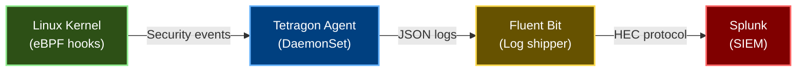
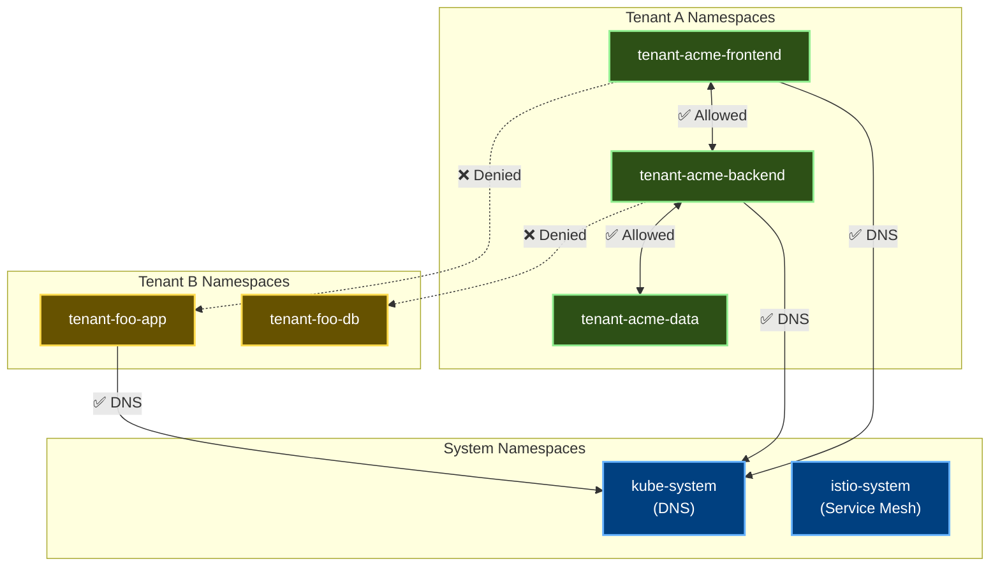
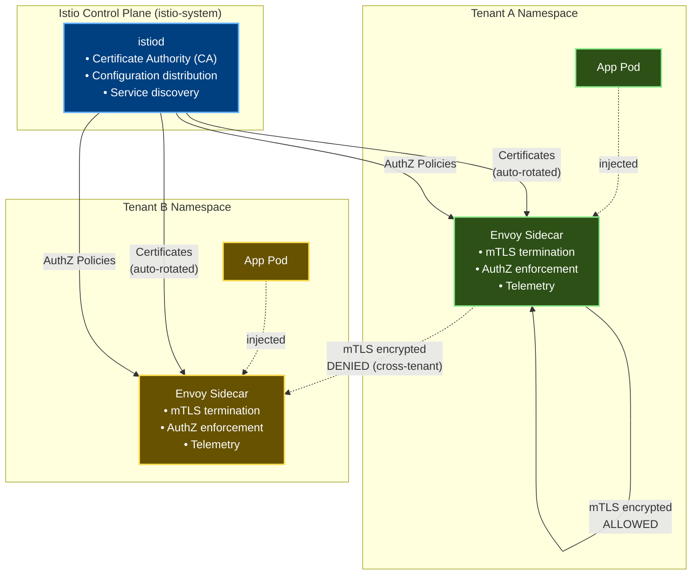

# Runtime Security

## Overview

This document covers runtime security monitoring and enforcement in the fedCORE platform, including:
- **Tetragon eBPF Runtime Security** - Kernel-level process, file, and network monitoring
- **Network Security** - NetworkPolicy isolation and segmentation
- **Istio Service Mesh** - Mutual TLS (mTLS) encryption and Layer 7 authorization

Together, these components provide defense-in-depth security from admission control through runtime execution.

## Tetragon eBPF Runtime Security

### Overview

Tetragon provides real-time security monitoring and enforcement at the kernel level using eBPF (extended Berkeley Packet Filter). It monitors process execution, file access, network connections, and capability changes without requiring application modification or sidecar containers.

### Key Capabilities

| Capability | Description | Enforcement Mode |
|------------|-------------|------------------|
| **Process Monitoring** | Tracks all process executions, including shells and network tools | Audit |
| **File Access Monitoring** | Monitors sensitive file access (kernel files, secrets) | Audit |
| **Network Monitoring** | Tracks network connections and DNS queries | Audit |
| **Capability Tracking** | Detects capability additions (CAP_SYS_ADMIN, etc.) | Audit |
| **Cryptocurrency Mining Prevention** | Detects and kills mining processes | **Enforce** (SIGKILL) |
| **Container Escape Detection** | Monitors kernel file access attempts | Audit + Alert |
| **Tenant Boundary Violation** | Detects unauthorized namespace/ServiceAccount access | Audit + Alert |

### Tetragon Security Policies

| Policy | Description | Action | Alert Severity | Policy Location |
|--------|-------------|--------|----------------|-----------------|
| **Tenant Boundary Violation Detection** | Monitors unauthorized ServiceAccount token access and cross-tenant namespace attempts | Audit - Log only | **HIGH** - Alert in Splunk | [tetragon.yaml:140-168](../platform/components/tetragon/base/tetragon.yaml#L140-L168) |
| **Privilege Escalation Detection** | Tracks capability changes (CAP_SYS_ADMIN, CAP_SYS_MODULE, etc.) | Audit - Log only | **HIGH** - Security investigation | [tetragon.yaml:170-201](../platform/components/tetragon/base/tetragon.yaml#L170-L201) |
| **Suspicious Process Execution** | Detects shells and network tools (nc, wget, curl, ssh) in tenant namespaces | Audit - Log only | **MEDIUM** - Logged and reviewed | [tetragon.yaml:203-242](../platform/components/tetragon/base/tetragon.yaml#L203-L242) |
| **Cryptocurrency Mining Prevention** | Detects mining binaries (xmrig, minerd, cpuminer, ethminer) | **⚠️ ENFORCED** - Kills processes (SIGKILL) | **CRITICAL** - Pages security team | [tetragon.yaml:244-271](../platform/components/tetragon/base/tetragon.yaml#L244-L271) |
| **Container Escape Detection** | Monitors kernel file access attempts (/proc/sys/kernel/, /sys/kernel/, /dev/kmem, /dev/mem) | Audit - Log only | **CRITICAL** - Immediate isolation | [tetragon.yaml:273-307](../platform/components/tetragon/base/tetragon.yaml#L273-L307) |

### Event Flow to Splunk



### Example Security Events

**Suspicious Shell Execution:**
```json
{
  "process_name": "/bin/bash",
  "namespace": "tenant-acme-prod",
  "pod": "webapp-7d5f8c9b-xj2k4",
  "policy": "suspicious-process-execution",
  "action": "audit",
  "severity": "medium",
  "timestamp": "2026-02-27T10:15:30Z"
}
```

**Cryptocurrency Mining Detected:**
```json
{
  "process_name": "/usr/local/bin/xmrig",
  "namespace": "tenant-acme-prod",
  "pod": "compromised-pod-abc123",
  "policy": "crypto-mining-detection",
  "action": "kill",
  "signal": "SIGKILL",
  "severity": "critical",
  "timestamp": "2026-02-27T10:16:45Z"
}
```

### Monitoring Tetragon

```bash
# Check Tetragon DaemonSet status
kubectl get daemonset -n kube-system tetragon

# View TracingPolicies
kubectl get tracingpolicy -n kube-system

# View recent Tetragon events
kubectl logs -n kube-system daemonset/tetragon --tail=50

# View Tetragon metrics
kubectl port-forward -n kube-system svc/tetragon-metrics 9090:9090
curl http://localhost:9090/metrics | grep tetragon
```

### Performance Characteristics

**Resource Overhead:**
- CPU: ~50m per node (minimal eBPF overhead)
- Memory: ~128Mi per node
- Network: ~1000 events/sec/node to Splunk

**Event Rate Limits:**
- Process events: Sampled at 100/sec per container
- File access: Sampled at 50/sec per container
- Network events: Sampled at 200/sec per container

## Network Security

### Default Network Isolation

Every tenant namespace has these NetworkPolicies automatically created by Capsule:

1. **Default Deny All Ingress** - No traffic allowed in by default
2. **Allow Same Tenant** - Pods can talk to other pods in the same tenant
3. **Allow DNS** - DNS resolution always works
4. **Allow Internet Egress** - (if enabled for tenant)

**Policy Locations:**
- [tenant-rgd.yaml:181-184](../platform/rgds/tenant/base/tenant-rgd.yaml#L181-L184) - Default Deny
- [tenant-rgd.yaml:188-195](../platform/rgds/tenant/base/tenant-rgd.yaml#L188-L195) - Same-Tenant
- [tenant-rgd.yaml:199-214](../platform/rgds/tenant/base/tenant-rgd.yaml#L199-L214) - DNS Access
- [tenant-rgd.yaml:220-231](../platform/rgds/tenant/base/tenant-rgd.yaml#L220-L231) - Internet Egress

### Network Isolation Model



### Cross-Tenant Prevention

Kyverno validates that tenants cannot create NetworkPolicies that would bypass isolation:

- ❌ Cannot allow traffic from other tenant namespaces
- ❌ Cannot allow traffic from system namespaces (except DNS)
- ❌ Cannot bypass default deny-all rules

**Policy:** [tenant-network-policies.yaml](../platform/components/kyverno-policies/base/tenant-network-policies.yaml)

### Custom NetworkPolicies

Tenants can create additional NetworkPolicies for fine-grained control within their tenant:

**Example: Allow Ingress Controller Traffic**
```yaml
apiVersion: networking.k8s.io/v1
kind: NetworkPolicy
metadata:
  name: allow-ingress-controller
  namespace: tenant-acme-frontend
spec:
  podSelector:
    matchLabels:
      app: webapp
  policyTypes:
    - Ingress
  ingress:
    - from:
        - namespaceSelector:
            matchLabels:
              kubernetes.io/metadata.name: ingress-nginx
```

## Istio mTLS Architecture

### Overview

Istio service mesh provides **service-to-service mutual TLS (mTLS) encryption** for tenants requiring compliance with zero-trust security mandates. When enabled, all communication between services within the mesh is automatically encrypted and authenticated using strong cryptographic identities.

### Key Features

**Automatic Encryption:**
- Zero code changes required - mTLS is transparent to applications
- Automatic certificate issuance and rotation (24-hour lifetime by default)
- Strong cryptographic identities (SPIFFE-compliant workload identities)

**Multi-Tenant Isolation:**
- Layer 7 authorization policies prevent cross-tenant traffic
- Identity-based access control (not IP-based)
- Mesh-wide policies enforced by platform, tenant-specific policies managed by tenants

**Observability:**
- All service-to-service requests logged with identity information
- Request-level metrics (latency, error rate, throughput)
- Distributed tracing support

### Architecture Components



### mTLS Modes

**STRICT Mode (Production Default):**
- Only mTLS connections allowed
- Plaintext connections rejected
- Required for compliance (NIST 800-207 Zero Trust)
- Configured in production environment overlay

**PERMISSIVE Mode (Development):**
- Accepts both mTLS and plaintext connections
- Allows gradual migration to service mesh
- Used for initial rollout and testing

### Tenant Enablement

Tenants opt into Istio service mesh via their TenantOnboarding CR:

```yaml
apiVersion: platform.fedcore.io/v1alpha1
kind: TenantOnboarding
metadata:
  name: acme
spec:
  tenantName: acme
  settings:
    istio:
      enabled: true        # Enable Istio sidecar injection
      strictMTLS: true     # Enforce STRICT mTLS mode
```

**What Happens:**
1. All tenant namespaces get `istio-injection: enabled` label
2. Automatic Envoy sidecar injection for all pods
3. PeerAuthentication policy created (STRICT or PERMISSIVE)
4. AuthorizationPolicy created to allow only intra-tenant traffic
5. Kyverno policies enforce tenant cannot weaken security posture

### Multi-Tenant Isolation

**Layer 3/4 Isolation (NetworkPolicies):**
- Capsule-managed NetworkPolicies block traffic at IP level
- Prevents traffic before it reaches Istio

**Layer 7 Isolation (Istio AuthorizationPolicies):**
- Identity-based authorization using workload certificates
- Allows granular per-service access control
- Example: frontend can call backend, but not database directly

**Combined Defense-in-Depth:**
```
Request Flow:
  Service A → NetworkPolicy (L3/4 check) → Istio AuthZ (L7 check) → mTLS → Service B
```

### Platform-Enforced Policies

**Mesh-Wide Defaults (istio-system namespace):**
1. **Default PeerAuthentication**: PERMISSIVE (dev) or STRICT (prod)
2. **Cross-Tenant Denial**: Mesh-wide AuthorizationPolicy denies cross-tenant traffic
3. **Deny-All Production**: Production enforces explicit ALLOW policies

**Tenant Restrictions (via Kyverno):**
1. Tenant PeerAuthentication must be STRICT mode
2. Tenant AuthorizationPolicies cannot allow cross-tenant traffic
3. Tenant cannot create resources in istio-system namespace
4. Tenant cannot disable TLS via DestinationRule

**See:** [Kyverno Istio Policies](KYVERNO_POLICIES.md#istio-service-mesh-policies)

### Security Monitoring

**Tetragon eBPF Integration:**
- Monitors Envoy proxy processes for anomalous behavior
- Detects attempts to access Istio certificates
- Alerts on unauthorized ServiceAccount token access

**Splunk Logging:**
- All Istio access logs sent to Splunk
- Automatic tenant labeling on requests
- Example log entry:
  ```
  [2026-02-27T10:15:30Z] "GET /api/users HTTP/1.1" 200 - 0 1234 45
  upstream="10.0.2.10:8080" tenant="acme" namespace="tenant-acme-frontend"
  source_principal="cluster.local/ns/tenant-acme-frontend/sa/webapp"
  destination_principal="cluster.local/ns/tenant-acme-backend/sa/api-server"
  ```

### Certificate Management

**Automatic Certificate Lifecycle:**
- Certificates issued by Istio CA (istiod)
- Default lifetime: 24 hours
- Automatic rotation: 8 hours before expiry
- Trust domain: `{cluster_name}.fedcore.local`

**SPIFFE Identities:**
- Format: `spiffe://{cluster_name}.fedcore.local/ns/{namespace}/sa/{serviceaccount}`
- Example: `spiffe://fedcore-prod-use1.fedcore.local/ns/tenant-acme-frontend/sa/webapp`
- Used for identity-based authorization

### Resource Overhead

Each pod with Istio sidecar incurs additional resource consumption:

| Resource | Per-Pod Overhead |
|----------|------------------|
| CPU Request | +50m |
| CPU Limit | +100m |
| Memory Request | +50Mi |
| Memory Limit | +128Mi |
| Startup Time | +2-5 seconds |

**Recommendation:** Update tenant ResourceQuotas to account for sidecar overhead when enabling Istio.

### Performance Characteristics

**Latency Impact:**
- Added latency: 0.5-1.5ms per request (mTLS handshake amortized)
- Throughput: Minimal impact for typical workloads
- Connection pooling reduces handshake overhead

**Scalability:**
- Istiod autoscales based on pod count (2-10 replicas)
- Each Envoy sidecar operates independently
- No single point of failure in data plane

### Integration with Existing Security Stack

| Component | Integration | Benefit |
|-----------|-------------|---------|
| **Capsule NetworkPolicies** | Complementary | Defense-in-depth: L3/4 + L7 isolation |
| **Kyverno Policies** | Enforces Istio policies | Prevents tenants from weakening mTLS |
| **Tetragon eBPF** | Monitors Envoy proxies | Detects sidecar tampering, cert theft |
| **Splunk Logging** | Consumes Envoy logs | Centralized observability with tenant context |

### Troubleshooting

**Common Issues:**

1. **Sidecar Not Injected:**
   ```bash
   # Check namespace label
   kubectl get namespace tenant-acme-frontend -o jsonpath='{.metadata.labels.istio-injection}'
   # Should return: enabled
   ```

2. **mTLS Connection Failures:**
   ```bash
   # Check PeerAuthentication
   kubectl get peerauthentication -A
   # Verify mode is STRICT or PERMISSIVE, not DISABLE
   ```

3. **Cross-Tenant Traffic Blocked:**
   ```bash
   # Check AuthorizationPolicy
   kubectl get authorizationpolicy -n tenant-acme-frontend
   # Verify source.namespaces restricts to same tenant
   ```

4. **Certificate Errors:**
   ```bash
   # Check Istio CA status
   kubectl logs -n istio-system -l app=istiod
   # Look for certificate issuance errors
   ```

### Compliance Benefits

**NIST 800-207 Zero Trust Architecture:**
- ✅ Strong cryptographic identity (SPIFFE)
- ✅ Continuous authentication (mTLS per-request)
- ✅ Least privilege access (AuthorizationPolicies)
- ✅ Micro-segmentation (per-service policies)

**NIST 800-53 Controls:**
- SC-8: Transmission Confidentiality and Integrity (mTLS encryption)
- SC-13: Cryptographic Protection (strong ciphers, auto-rotation)
- AC-4: Information Flow Enforcement (AuthorizationPolicies)
- AU-2: Audit Events (comprehensive request logging)

### Related Documentation

- [Istio Component](../platform/components/istio/README.md) - Installation and configuration
- [Kyverno Istio Policies](KYVERNO_POLICIES.md#istio-service-mesh-policies) - Policy enforcement
- [Tenant Onboarding RGD](../platform/rgds/tenant/README.md) - Enabling Istio per tenant
- [Official Istio Security Documentation](https://istio.io/latest/docs/concepts/security/)

## Container Hardening

Beyond admission control, runtime security includes:

### Seccomp Profiles
- RuntimeDefault profile required by Kyverno
- Blocks dangerous syscalls at kernel level
- Prevents container breakout attempts

### AppArmor (Optional)
- Profile-based mandatory access control
- Can be applied per-container
- Complements seccomp for defense-in-depth

### Read-Only Root Filesystems
- Recommended by Kyverno best practices
- Prevents runtime file modification
- Use emptyDir volumes for writable paths

**Example Secure Container:**
```yaml
securityContext:
  runAsNonRoot: true
  runAsUser: 1000
  readOnlyRootFilesystem: true
  allowPrivilegeEscalation: false
  seccompProfile:
    type: RuntimeDefault
  capabilities:
    drop:
      - ALL
```

## Related Documentation

- [Security Overview](SECURITY_OVERVIEW.md) - High-level security architecture
- [Kyverno Policies](KYVERNO_POLICIES.md) - Admission control policies
- [Security Audit & Alerting](SECURITY_AUDIT_ALERTING.md) - Logging and compliance
- [Tenant User Guide](TENANT_USER_GUIDE.md) - Deploying secure workloads

---

## Navigation

[← Previous: Kyverno Policies](KYVERNO_POLICIES.md) | [Next: Security Audit & Alerting →](SECURITY_AUDIT_ALERTING.md)

**Handbook Progress:** Page 23 of 35 | **Level 5:** Security & Compliance

[📚 Back to Handbook](HANDBOOK_INTRO.md) | [📖 Glossary](GLOSSARY.md) | [🔧 Troubleshooting](TROUBLESHOOTING.md)
