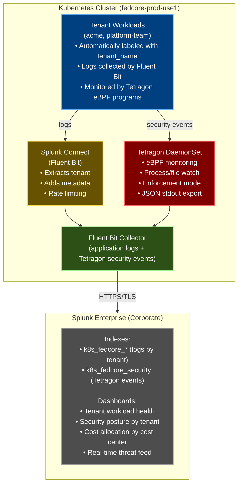

# Runtime Security and Logging with Splunk & Tetragon

This document provides an overview of the runtime security and logging architecture for the fedCORE platform, using **Splunk Connect for Kubernetes** and **Tetragon**.

## Overview

The fedCORE platform now includes two new components for enhanced observability and security:

1. **Splunk Connect for Kubernetes** - Centralized log aggregation to existing Splunk infrastructure
2. **Tetragon** - eBPF-based runtime security monitoring with enforcement capabilities

## Architecture Diagram



## Components Created

### 1. Splunk Connect Component

**Location:** [platform/components/splunk-connect/](../platform/components/splunk-connect/)

**Structure:**
```
platform/components/splunk-connect/
├── base/
│   └── splunk-connect.yaml           # Base Helm configuration
├── overlays/
│   ├── aws/
│   │   └── splunk-hec-config.yaml    # AWS-specific HEC endpoint
│   ├── azure/
│   │   └── splunk-hec-config.yaml    # Azure-specific HEC endpoint
│   └── onprem/
│       └── splunk-hec-config.yaml    # On-prem HEC endpoint
└── README.md                         # Detailed component documentation
```

**Key Features:**
- Official Splunk Connect for Kubernetes Helm chart
- Fluent Bit DaemonSet for log collection (~200MB RAM per node)
- Automatic tenant labeling from Capsule metadata
- Logs, metrics, and Kubernetes object collection
- HEC (HTTP Event Collector) integration with TLS
- Rate limiting to prevent log flooding

**Required Secrets (per cluster):**
- `SPLUNK_HEC_HOST` - Splunk HEC endpoint (e.g., `splunk-hec-aws.example.com`)
- `SPLUNK_HEC_TOKEN` - HEC authentication token (obtain from Splunk admin)

### 2. Tetragon Component

**Location:** [platform/components/tetragon/](../platform/components/tetragon/)

**Structure:**
```
platform/components/tetragon/
├── base/
│   └── tetragon.yaml                 # Tetragon Helm + 5 TracingPolicies
├── overlays/
│   ├── aws/
│   │   └── tetragon-aws.yaml          # AWS-specific policies (Pod Identity)
│   ├── azure/
│   │   └── tetragon-azure.yaml        # Azure-specific policies (Managed Identity)
│   └── onprem/
│       └── tetragon-onprem.yaml       # On-prem specific policies
└── README.md                         # Detailed component documentation
```

**Key Features:**
- eBPF-based runtime security monitoring
- Detection policies for multi-tenant security:
  - Tenant boundary violations
  - Privilege escalation attempts
  - Suspicious process execution (shells, network tools)
  - Cryptocurrency mining (ENFORCEMENT: auto-kills process)
  - Container escape attempts
- Cloud-specific policies (IAM/Managed Identity token access)
- JSON event export to Splunk via stdout
- Low overhead: ~100-200MB RAM per node

**No secrets required** - Uses stdout export collected by Fluent Bit

## Automatic Tenant Labeling

When a tenant is onboarded, the tenant RGD automatically applies labels that enable Splunk routing:

```yaml
# Automatically applied to all tenant namespaces
labels:
  capsule.clastix.io/tenant: "acme"              # Extracted by Fluent Bit → tenant_name field
  platform.fedcore.io/cost-center: "CC12345"     # For cost allocation dashboards
```

**Updated File:** [platform/rgds/tenant/base/tenant-rgd.yaml](../platform/rgds/tenant/base/tenant-rgd.yaml)

All logs from tenant workloads will include:
```json
{
  "tenant_name": "acme",
  "cost_center": "CC12345",
  "cluster_name": "fedcore-prod-use1",
  "namespace": "acme-prod",
  "pod_name": "web-app-xyz",
  "message": "Application log..."
}
```

## Deployment

### Prerequisites

**Splunk HEC Setup:**
- Obtain HEC credentials from Splunk administrator
- Add secrets to GitHub Environments

**See [ENVIRONMENT_SETUP.md - Splunk HEC Configuration](ENVIRONMENT_SETUP.md#splunk-hec-token-management)** for:
- Requesting HEC tokens
- Adding secrets to GitHub Environments
- HEC endpoint configuration per cloud
- Testing connectivity

### Automatic Deployment

Components are automatically included in infrastructure artifacts and deployed via GitOps.

**See [DEPLOYMENT.md](DEPLOYMENT.md)** for complete deployment workflow details.

**Quick verification:**
```bash
# Build infrastructure artifact (includes splunk-connect and tetragon)
fedcore bootstrap --cluster platform/clusters/fedcore-prod-use1 > dist/fedcore-prod-use1.yaml

# Verify components are included
grep -q "splunk-connect" dist/fedcore-prod-use1.yaml && echo "✓ Splunk found"
grep -q "tetragon" dist/fedcore-prod-use1.yaml && echo "✓ Tetragon found"
```

### Manual Deployment (Testing)

For testing in lab environments:

```bash
# 1. Export Splunk secrets
export SPLUNK_HEC_HOST="splunk-hec.internal.example.com"
export SPLUNK_HEC_TOKEN="your-token-here"

# 2. Build artifact
fedcore bootstrap --cluster platform/clusters/fedcore-lab-01 > /tmp/lab-bootstrap.yaml

# 3. Substitute secrets
envsubst < /tmp/lab-artifact.yaml > /tmp/lab-artifact-final.yaml

# 4. Apply to cluster
kubectl apply -f /tmp/lab-artifact-final.yaml

# 5. Verify deployment
kubectl get daemonset -n splunk-system
kubectl get daemonset -n kube-system tetragon
kubectl get tracingpolicy -n kube-system
```

## Verification

### Check Component Status

```bash
# Splunk Connect DaemonSet
kubectl get daemonset -n splunk-system
# Should show fluent-bit running on all nodes

# Tetragon DaemonSet
kubectl get daemonset -n kube-system tetragon
# Should show tetragon running on all nodes

# Tetragon Policies
kubectl get tracingpolicy -n kube-system
# Should show:
# - tenant-boundary-violation
# - privilege-escalation-detection
# - suspicious-process-execution
# - crypto-mining-detection
# - container-escape-detection
# - aws-pod-identity-access (AWS only)
```

### Check Logs

```bash
# Fluent Bit logs (should show successful HEC connections)
kubectl logs -n splunk-system -l app=fluent-bit --tail=50

# Look for:
# [output:splunk:splunk.0] connected to splunk-hec-aws.example.com:8088

# Tetragon logs
kubectl logs -n kube-system -l app.kubernetes.io/name=tetragon --tail=50
```

### Verify in Splunk

```spl
# Check logs are arriving
index=k8s_fedcore_*
| stats count by cluster_name, tenant_name, cloud

# Check security events
index=k8s_fedcore_security sourcetype=tetragon:security
| stats count by policy_name, cluster_name

# Tenant-specific query
index=k8s_fedcore_* tenant_name="acme"
| head 10
```

## Splunk Index Strategy

Two strategies are supported (configured in Splunk, not in the platform):

### Option 1: Single Index with Filtered Queries (Recommended)

```
Index: k8s_fedcore_all

Tenant queries filter by tenant_name field:
index=k8s_fedcore_all tenant_name="acme"
```

**Advantages:**
- Simple administration
- Easy to add new tenants
- Cross-tenant analytics possible

**Splunk RBAC:**
```conf
[role_tenant_acme]
srchFilter = tenant_name="acme"  # Auto-applied to all searches
```

### Option 2: Tenant-Specific Indexes

```
Indexes:
- k8s_fedcore_tenant_acme
- k8s_fedcore_tenant_platform
- k8s_fedcore_security
```

**Advantages:**
- Physical data isolation
- Per-tenant retention policies
- Easier compliance audits

**Disadvantages:**
- Requires Splunk admin to pre-create indexes per tenant
- More complex management

## Security Considerations

### Splunk Integration

1. **HEC Tokens**: Treat as sensitive credentials
   - Never commit to git
   - Rotate quarterly
   - Store in GitHub Environment secrets
   - Separate token per cluster for audit trail

2. **TLS Verification**: Always enabled (`insecureSSL: false`)
   - Validates Splunk HEC certificate
   - Uses system CA bundle

3. **Tenant Isolation**:
   - Enforced via Splunk RBAC
   - Logs tagged with `tenant_name` field
   - Query-time filtering or separate indexes

### Tetragon Security

1. **Privileged DaemonSet**: Required for eBPF
   - Runs in `kube-system` namespace
   - Protected by Kyverno admission policies
   - Cannot be deployed by tenants

2. **Enforcement Mode**: Only for cryptocurrency mining
   - All other policies are detection-only
   - Prevents breaking legitimate workloads

3. **Event Rate Limiting**: 1000 events/second/node
   - Prevents log flooding attacks
   - Prevents Splunk ingestion overload

## Alerting

Create alerts in Splunk for critical security events:

### Critical: Crypto Mining Detected

```spl
index=k8s_fedcore_security sourcetype=tetragon:security
policy_name="crypto-mining-detection"
| stats count by tenant_name, pod_name
```

**Actions:**
- Page security team
- Create incident ticket
- Notify tenant owner

### High: Container Escape Attempt

```spl
index=k8s_fedcore_security sourcetype=tetragon:security
policy_name="container-escape-detection"
| stats count by tenant_name, pod_name
```

**Actions:**
- Page security team
- Isolate affected pod/node

### Medium: Unusual Shell Activity

```spl
index=k8s_fedcore_security sourcetype=tetragon:security
policy_name="suspicious-process-execution"
process_binary IN ("/bin/bash", "/bin/sh")
| stats count by tenant_name, pod_name
| where count > 10
```

**Actions:**
- Email platform team for investigation

## Troubleshooting

### Logs Not Appearing in Splunk

1. **Check Fluent Bit connectivity:**
   ```bash
   kubectl logs -n splunk-system -l app=fluent-bit | grep -i error
   ```

2. **Verify HEC endpoint:**
   ```bash
   curl -k https://splunk-hec-aws.example.com:8088/services/collector/health
   # Expected: {"text":"HEC is healthy","code":200}
   ```

3. **Check secret substitution:**
   ```bash
   # Secrets should NOT contain ${} after deployment
   kubectl get secret -n splunk-system splunk-hec-secret -o yaml
   ```

### Tetragon Events Not in Splunk

1. **Verify Tetragon is running:**
   ```bash
   kubectl get daemonset -n kube-system tetragon
   ```

2. **Check Tetragon logs:**
   ```bash
   kubectl logs -n kube-system -l app.kubernetes.io/name=tetragon
   ```

3. **Verify TracingPolicies are loaded:**
   ```bash
   kubectl get tracingpolicy -n kube-system
   kubectl describe tracingpolicy tenant-boundary-violation
   ```

## Cost Estimation

### Resource Usage Per Cluster

| Component | CPU (per node) | Memory (per node) | Total (50 nodes) |
|-----------|---------------|------------------|------------------|
| Fluent Bit | 100m-500m | 200-500Mi | 10-25 GB RAM |
| Tetragon | 100m-500m | 200-500Mi | 10-25 GB RAM |
| **Total** | 200m-1000m | 400-1000Mi | **20-50 GB RAM** |

### Splunk Ingestion Estimation

Approximate daily log volume per cluster:

- **50 nodes** × 20 pods/node × 100KB/day/pod = ~100 GB/day
- **Tetragon events**: ~1-5 GB/day (depends on workload)
- **Total**: ~100-105 GB/day per production cluster

**Note:** Actual volume depends on application logging verbosity and security event rate.

## Related Documentation

- [Splunk Connect Component README](../platform/components/splunk-connect/README.md) - Detailed Splunk integration
- [Tetragon Component README](../platform/components/tetragon/README.md) - Security policies and event types
- [Environment Setup Guide](ENVIRONMENT_SETUP.md) - GitHub Environment secrets configuration
- [Tenant Management Guide](TENANT_MANAGEMENT.md) - Tenant onboarding and labeling

## Next Steps

1. **Contact Splunk Administrator**:
   - Request HEC tokens for each cluster
   - Discuss index strategy (single vs per-tenant)
   - Set up initial dashboards and alerts

2. **Add Secrets to GitHub Environments**:
   - Follow [ENVIRONMENT_SETUP.md](ENVIRONMENT_SETUP.md)
   - Add `SPLUNK_HEC_HOST` and `SPLUNK_HEC_TOKEN` for each cluster

3. **Deploy to Lab Cluster First**:
   - Test with `fedcore-lab-01` before production
   - Verify logs appear in Splunk
   - Test Tetragon policies with sample workloads

4. **Deploy to Production**:
   - Commit changes to main branch
   - CI/CD automatically builds and deploys
   - Verify in Splunk within 5 minutes

5. **Create Splunk Dashboards**:
   - Tenant workload health
   - Security posture by tenant
   - Cost allocation by cost center
   - Real-time threat feed

6. **Set Up Alerting**:
   - Critical: crypto mining, container escape
   - High: privilege escalation, tenant boundary violations
   - Medium: suspicious shell activity

---

## Navigation

[← Previous: Security Policy Reference](SECURITY_POLICY_REFERENCE.md) | [Next: IAM Architecture →](IAM_ARCHITECTURE.md)

**Handbook Progress:** Page 26 of 35 | **Level 5:** Security & Compliance

[📚 Back to Handbook](HANDBOOK_INTRO.md) | [📖 Glossary](GLOSSARY.md) | [🔧 Troubleshooting](TROUBLESHOOTING.md)
