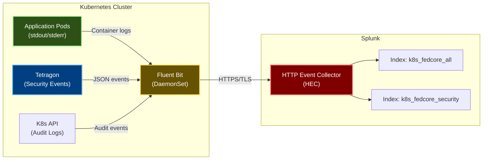

# Security Audit & Alerting

## Overview

This document covers audit logging, security monitoring, compliance reporting, and alerting in the fedCORE platform. It includes both repository-managed log collection configuration and externally-managed alerting rules.

**Key Components:**
- Audit trail and forensics capabilities
- Splunk integration for centralized logging
- External security system integrations (CloudTrail, GuardDuty, Prometheus)
- Security health verification procedures
- Quarterly review processes

## Audit Trail & Forensics

**Note:** This table shows event collection and retention. The policies generating these events are defined in this repository, but retention policies are configured in external systems (Splunk, AWS, etc.).

| Event Type | Collection Method | Retention | Location | Configuration |
|------------|------------------|-----------|----------|---------------|
| Kubernetes API Audit Logs | K8s audit backend | 90 days | Splunk index: k8s_fedcore_all | Splunk (External) |
| Container Application Logs | Fluent Bit DaemonSet | 90 days | Splunk index: k8s_fedcore_all | [splunk-connect.yaml](../platform/components/splunk-connect/base/splunk-connect.yaml) |
| Tetragon Security Events | eBPF tracing JSON export | 90 days | Splunk index: k8s_fedcore_security | [tetragon.yaml](../platform/components/tetragon/base/tetragon.yaml) + Splunk (External) |
| AWS CloudTrail | Per-account CloudTrail | 1 year | S3 bucket per tenant account | AWS (External) |
| Policy Violations | Kyverno admission webhook | 90 days | Splunk + PolicyReports | [kyverno-policies/](../platform/components/kyverno-policies/base/) + Splunk (External) |
| Network Flow Logs | VPC Flow Logs (future) | 30 days | S3 bucket | AWS (External) |
| GitHub Actions Logs | GitHub API | 90 days | GitHub Actions UI | GitHub (External) |
| Prometheus Metrics | Time-series database | 15 days | Prometheus storage | Prometheus Operator (External) |

## Key Configuration Files (Repository-Managed)

**These files are versioned in this repository and deployed via GitOps:**

| Security Component | File Path | Description |
|-------------------|-----------|-------------|
| Tenant Configuration | [platform/rgds/tenant/base/tenant-rgd.yaml](../platform/rgds/tenant/base/tenant-rgd.yaml) | Tenant definition with Capsule config (NetworkPolicies, LimitRanges, Quotas, Istio settings) |
| Capsule Multi-Tenancy | [platform/components/capsule/base/capsule.yaml](../platform/components/capsule/base/capsule.yaml) | Capsule operator configuration |
| Istio Service Mesh | [platform/components/istio/base/istio.yaml](../platform/components/istio/base/istio.yaml) | Istio control plane (istiod), mTLS configuration, mesh-wide policies |
| Istio Tenant Policies | [platform/components/kyverno-policies/base/istio-tenant-policies.yaml](../platform/components/kyverno-policies/base/istio-tenant-policies.yaml) | 8 policies enforcing Istio security (STRICT mTLS, tenant isolation, system protection) |
| Kyverno Security Policies | [platform/components/kyverno-policies/base/tenant-security-baseline.yaml](../platform/components/kyverno-policies/base/tenant-security-baseline.yaml) | 8 critical container security policies |
| Network Policy Validation | [platform/components/kyverno-policies/base/tenant-network-policies.yaml](../platform/components/kyverno-policies/base/tenant-network-policies.yaml) | Validates NetworkPolicies don't bypass isolation |
| Resource Quota Validation | [platform/components/kyverno-policies/base/tenant-resource-limits.yaml](../platform/components/kyverno-policies/base/tenant-resource-limits.yaml) | Resource governance, quota validation, cost labels |
| Image Registry Controls | [platform/components/kyverno-policies/base/tenant-image-registry.yaml](../platform/components/kyverno-policies/base/tenant-image-registry.yaml) | Supply chain security |
| Input Validation | [platform/components/kyverno-policies/base/tenant-onboarding-validation.yaml](../platform/components/kyverno-policies/base/tenant-onboarding-validation.yaml) | Tenant onboarding security |
| AWS Permission Boundary | [platform/components/cloud-permissions/overlays/aws/tenant-permission-boundary.yaml](../platform/components/cloud-permissions/overlays/aws/tenant-permission-boundary.yaml) | IAM restrictions for tenant roles |
| Tetragon Configuration | [platform/components/tetragon/base/tetragon.yaml](../platform/components/tetragon/base/tetragon.yaml) | Runtime security policies |
| Splunk Integration | [platform/components/splunk-connect/base/splunk-connect.yaml](../platform/components/splunk-connect/base/splunk-connect.yaml) | Log collection and forwarding |

## Splunk Integration

### Log Collection Architecture



### Automatic Tenant Labeling

All logs are automatically tagged with tenant metadata for cost tracking and security analysis:

```json
{
  "log": "Application log message...",
  "tenant_name": "acme",
  "cost_center": "engineering",
  "cluster_name": "fedcore-prod-use1",
  "namespace": "tenant-acme-frontend",
  "pod_name": "webapp-7d5f8c9b-xj2k4",
  "container_name": "webapp"
}
```

**Configuration:** [splunk-connect.yaml:89-96](../platform/components/splunk-connect/base/splunk-connect.yaml#L89-L96)

### Splunk Log Types

| Log Type | Splunk Index | Description | Configuration |
|----------|--------------|-------------|---------------|
| **Application Logs** | k8s_fedcore_all | All container stdout/stderr | [splunk-connect.yaml:60-134](../platform/components/splunk-connect/base/splunk-connect.yaml#L60-L134) |
| **Tetragon Security Events** | k8s_fedcore_security | Runtime security alerts and detections | [splunk-connect.yaml:136-156](../platform/components/splunk-connect/base/splunk-connect.yaml#L136-L156) |
| **Kubernetes Objects** | k8s_fedcore_all | Events, pod status, deployments | [splunk-connect.yaml:158-196](../platform/components/splunk-connect/base/splunk-connect.yaml#L158-L196) |

### Common Splunk Queries

**View all logs for a tenant:**
```spl
index=k8s_fedcore_all tenant_name="acme"
| sort -_time
| table _time, namespace, pod_name, log
```

**Find policy violations:**
```spl
index=k8s_fedcore_all kyverno denied
| stats count by tenant_name, policy_name, namespace
| sort -count
```

**Search security events:**
```spl
index=k8s_fedcore_security
| stats count by policy_name, namespace, severity
| sort -count
```

**Track resource quota usage:**
```spl
index=k8s_fedcore_all "quota exceeded"
| stats count by tenant_name, namespace
```

## External Policies & Integrations

The following security policies and alerts are **configured in external systems** (not in this repository). They integrate with the platform through event streams and APIs.

### Splunk Security Alerts

**Configuration Location:** Splunk Enterprise Security (configured by SecOps team)
**Event Source:** Tetragon TracingPolicies export events to Splunk via Fluent Bit
**Alert Configuration:** Configured in Splunk correlation searches

| Alert Name | Severity | Trigger Condition | Response Action | Splunk Query | Event Source Policy |
|------------|----------|-------------------|-----------------|--------------|---------------------|
| Crypto Mining Detected | **CRITICAL** | Tetragon detects mining process | Pages security team, creates incident, process killed automatically | `index=k8s_fedcore_security policy_name="crypto-mining-detection"` | [tetragon.yaml:244-271](../platform/components/tetragon/base/tetragon.yaml#L244-L271) |
| Container Escape Attempt | **CRITICAL** | Kernel file access detected | Immediate isolation of pod/node, security investigation | `index=k8s_fedcore_security policy_name="container-escape-detection"` | [tetragon.yaml:273-307](../platform/components/tetragon/base/tetragon.yaml#L273-L307) |
| Privilege Escalation | **HIGH** | Capability addition detected | Security team investigation, review pod config | `index=k8s_fedcore_security policy_name="privilege-escalation"` | [tetragon.yaml:170-201](../platform/components/tetragon/base/tetragon.yaml#L170-L201) |
| Cross-Tenant Boundary Violation | **HIGH** | Unauthorized namespace or ServiceAccount access | High-priority alert, access reviewed | `index=k8s_fedcore_security policy_name="tenant-boundary-violation"` | [tetragon.yaml:140-168](../platform/components/tetragon/base/tetragon.yaml#L140-L168) |
| Suspicious Shell Execution | **MEDIUM** | Shell or network tool detected in tenant pod | Logged and reviewed, investigate if repeated | `index=k8s_fedcore_security policy_name="suspicious-process-execution" process_binary IN ("/bin/bash", "/bin/sh")` | [tetragon.yaml:203-242](../platform/components/tetragon/base/tetragon.yaml#L203-L242) |
| Policy Violation Spike | **MEDIUM** | >100 Kyverno denials in 5 minutes | Alert tenant owner, investigate misconfiguration | `index=k8s_fedcore_all kyverno denied \| stats count by tenant_name` | [kyverno-policies/](../platform/components/kyverno-policies/base/) |
| Resource Quota Exceeded | **LOW** | Tenant hits quota limits | Notify tenant, review quota adjustment | `index=k8s_fedcore_all "quota exceeded"` | [tenant-rgd.yaml:125-132](../platform/rgds/tenant/base/tenant-rgd.yaml#L125-L132) (Capsule-managed) |
| Failed RBAC Access | **LOW** | Repeated unauthorized API calls | Review access permissions, potential misconfiguration | `index=k8s_fedcore_all "forbidden" OR "unauthorized"` | [capsule.yaml](../platform/components/capsule/base/capsule.yaml) |

**Note:** Splunk alerts are maintained by the Security Operations team. Contact SecOps to request changes to alert thresholds, severity levels, or response actions.

### AWS CloudTrail Monitoring

**Configuration Location:** AWS CloudTrail (per-account configuration)
**Monitored by:** AWS Security Hub, GuardDuty
**Event Forwarding:** CloudTrail logs forwarded to Splunk for correlation

Monitors all AWS API calls including:
- IAM policy changes
- Permission boundary modifications
- Cross-account role assumptions
- Credential creation attempts
- Organizations API calls
- Billing/cost API access

**Alert Configuration:** Managed in AWS Security Hub and forwarded to Splunk

### AWS GuardDuty

**Configuration Location:** AWS GuardDuty (per-account configuration)
**Threat Detection:** ML-based anomaly detection for AWS accounts

Detects:
- Compromised credentials
- Unusual API call patterns
- Cryptocurrency mining EC2 instances
- Data exfiltration attempts
- Backdoor installations

**Integration:** GuardDuty findings forwarded to Splunk and Security Hub

### Prometheus Alerting

**Configuration Location:** Prometheus AlertManager (cluster-level)
**Alert Rules:** Configured in Prometheus operator

Monitors:
- Tetragon DaemonSet health
- Kyverno admission webhook latency
- Capsule operator failures
- Policy violation rates
- Resource exhaustion

**Integration:** Alerts sent to configured monitoring and alerting systems

## Security Health Verification Commands

```bash
# Tetragon status
kubectl get daemonset -n kube-system tetragon
kubectl get tracingpolicy -n kube-system

# Splunk logging status
kubectl get daemonset -n splunk-system

# Policy enforcement status
kubectl get clusterpolicy
kubectl get policyreport -A

# Multi-tenancy status
kubectl get tenants
kubectl get capsule

# Network policies per tenant
kubectl get networkpolicies -n <tenant-namespace>

# Resource quotas
kubectl get resourcequota -A

# Runtime security events (last 10)
kubectl logs -n kube-system daemonset/tetragon --tail=10
```

## Security Contacts & Escalation

| Incident Type | Contact Method | SLA |
|---------------|----------------|-----|
| Critical Security Alert (Crypto Mining, Container Escape) | GitHub Issues (Critical) | 15 minutes |
| High Priority (Privilege Escalation, Cross-Tenant) | GitHub Issues (High Priority) | 1 hour |
| Medium (Suspicious Activity) | GitHub Issues (Medium Priority) | 4 hours |
| Policy Violations | Tenant owner notification | 24 hours |

## Quarterly Security Reviews

### Repository-Managed Policy Reviews

1. **Permission Boundary Review** - Review and update AWS permission boundaries in [tenant-permission-boundary.yaml](../platform/components/cloud-permissions/overlays/aws/tenant-permission-boundary.yaml)
2. **Policy Effectiveness** - Review Kyverno policy reports and adjust thresholds in [kyverno-policies/](../platform/components/kyverno-policies/base/)
3. **Tetragon Performance** - Review resource usage and event rates, adjust rate limits in [tetragon.yaml](../platform/components/tetragon/base/tetragon.yaml)
4. **Compliance Audit** - Run compliance checks against standards, update policies as needed
5. **Environment-Specific Config** - Review dev/staging/prod enforcement differences

### External System Reviews

1. **HEC Token Rotation** - Rotate Splunk HEC tokens (coordinate with SecOps team)
2. **Alert Tuning** - Review false positive rates in Splunk and tune alert queries (coordinate with SecOps)
3. **CloudTrail Review** - Verify CloudTrail is enabled in all tenant accounts (AWS console)
4. **GuardDuty Tuning** - Review GuardDuty findings and adjust sensitivity (AWS Security Hub)

## How to Modify Security Policies

### For Repository-Managed Policies

1. **Create a branch** from main
2. **Edit policy files** in `platform/components/*/base/` or `platform/components/*/overlays/`
3. **Test changes** in dev environment first
4. **Submit PR** for review by platform security team
5. **Deploy via GitOps** - Flux CD automatically applies approved changes

Example: To add an allowed container registry:
```bash
# Edit the base policy
vim platform/components/kyverno-policies/base/tenant-image-registry.yaml

# Or add environment-specific overlay
vim platform/components/kyverno-policies/overlays/prod/registry-override.yaml
```

### For External Policies

**Splunk Alerts:**
- Contact: SecOps team via GitHub issues
- Portal: Splunk Enterprise Security UI
- Process: Open GitHub issue for alert changes

**AWS Policies:**
- Contact: Cloud Security team via GitHub issues
- Portal: AWS Console / Security Hub
- Process: Follow AWS change management process

**Prometheus Alerts:**
- Contact: Platform Operations team via GitHub issues
- Repository: prometheus-operator-config (separate repo)
- Process: Standard GitOps workflow in ops repo

## Compliance Reporting

### Automated Compliance Checks

The platform provides automated compliance verification for:

**Pod Security Standards (PSS):**
```bash
# View PSS compliance via policy reports
kubectl get policyreport -A -o json | jq '.items[] | select(.results[].policy | contains("security-baseline"))'
```

**CIS Kubernetes Benchmark:**
```bash
# Network policy compliance
kubectl get networkpolicies -A | wc -l

# RBAC compliance
kubectl get clusterrolebindings -o json | jq '.items[] | select(.subjects[].kind == "User")'
```

**Resource Governance:**
```bash
# Quota compliance
kubectl get resourcequota -A -o json | jq '.items[] | {namespace: .metadata.namespace, used: .status.used, hard: .status.hard}'
```

### Compliance Report Generation

**Weekly Compliance Report:**
```spl
index=k8s_fedcore_all
| stats
    count(eval(match(log, "denied"))) as policy_violations,
    dc(namespace) as active_namespaces,
    dc(tenant_name) as active_tenants,
    count(eval(match(log, "quota exceeded"))) as quota_violations
    by tenant_name
| table tenant_name, policy_violations, quota_violations, active_namespaces
```

**Security Posture Dashboard:**
- Total policy violations by tenant
- Runtime security events by severity
- Network policy coverage
- Resource quota utilization
- IAM policy compliance

## Log Retention and Compliance

| Log Type | Retention Period | Compliance Requirement | Storage Location |
|----------|-----------------|------------------------|------------------|
| Kubernetes Audit Logs | 90 days | SOC 2, PCI-DSS | Splunk |
| Application Logs | 90 days | SOC 2 | Splunk |
| Security Events | 90 days | SOC 2, ISO 27001 | Splunk |
| CloudTrail Logs | 1 year | SOC 2, AWS Well-Architected | S3 |
| Policy Reports | 30 days | Internal audit | Kubernetes etcd |

**Note:** Retention periods are configured in external systems (Splunk, AWS) and should be reviewed quarterly.

## Monitoring and Alerting Best Practices

1. **Alert Fatigue Prevention**
   - Use appropriate severity levels
   - Tune alert thresholds to reduce false positives
   - Aggregate similar alerts into single incidents

2. **Context-Rich Alerts**
   - Include tenant name, namespace, and pod information
   - Link to relevant dashboards and runbooks
   - Provide immediate remediation steps

3. **Escalation Paths**
   - Define clear escalation procedures
   - Automate initial response where possible
   - Document incident response playbooks

4. **Regular Review**
   - Review alert effectiveness quarterly
   - Adjust thresholds based on operational experience
   - Archive or disable obsolete alerts

## Related Documentation

- [Security Overview](SECURITY_OVERVIEW.md) - High-level security architecture
- [Kyverno Policies](KYVERNO_POLICIES.md) - Admission control policies
- [Runtime Security](RUNTIME_SECURITY.md) - Tetragon and network security
- [Multi-Account Architecture](MULTI_ACCOUNT_ARCHITECTURE.md) - AWS account isolation
- [Configuration Checklist](../CONFIGURATION_CHECKLIST.md) - Environment setup requirements

---

## Navigation

[← Previous: Runtime Security](RUNTIME_SECURITY.md) | [Next: Security Policy Reference →](SECURITY_POLICY_REFERENCE.md)

**Handbook Progress:** Page 24 of 35 | **Level 5:** Security & Compliance

[📚 Back to Handbook](HANDBOOK_INTRO.md) | [📖 Glossary](GLOSSARY.md) | [🔧 Troubleshooting](TROUBLESHOOTING.md)

[📚 Back to Handbook](HANDBOOK_INTRO.md) | [📖 Glossary](GLOSSARY.md) | [🔧 Troubleshooting](TROUBLESHOOTING.md)
