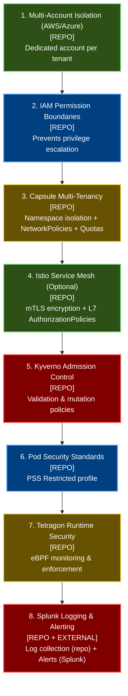
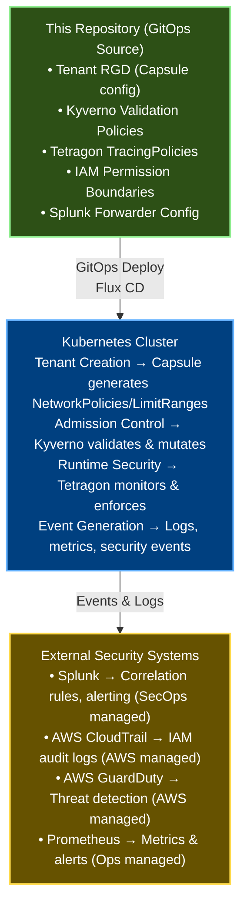

# Security Overview

## Overview

This document provides a high-level overview of the fedCORE platform's security model, including the three-layer architecture, environment-specific configuration, and comprehensive security controls summary.

The platform implements defense-in-depth security with multiple layers covering identity, access control, network security, runtime protection, and comprehensive auditing.

## Policy Scope

This document covers two types of security controls:

### 1. Repository-Managed Policies (This Repo)
Security policies defined, versioned, and deployed from this repository:
- ✅ Kyverno admission control policies (validation and mutation)
- ✅ Tetragon runtime security TracingPolicies
- ✅ Capsule multi-tenancy configuration (NetworkPolicies, LimitRanges, ResourceQuotas)
- ✅ AWS IAM permission boundaries
- ✅ Splunk log collection configuration
- ✅ Resource quota and limit validation policies

### 2. External Policies & Integrations (Managed Externally)
Security policies configured in external systems that consume events from this platform:
- 🔗 Splunk security alerts and correlation rules (managed by SecOps)
- 🔗 AWS CloudTrail monitoring (managed in AWS Console)
- 🔗 AWS GuardDuty threat detection (managed in AWS Security Hub)
- 🔗 Prometheus alerting rules (managed in Prometheus Operator)
- 🔗 Log retention policies (managed in Splunk/AWS)

## Environment-Specific Configuration

Security policies are configured differently across environments to balance security with developer velocity:

| Environment | Latest Tag | Resource Limits | Image Registry | Policy Enforcement |
|-------------|------------|-----------------|----------------|-------------------|
| **Development** | ✅ Allowed (Audit mode) | ⚠️ Recommended (Audit mode) | ⚠️ Recommended (Audit mode) | Relaxed - policies log warnings but don't block |
| **Staging** | ⚠️ Discouraged (Audit mode) | ⚠️ Recommended (Audit mode) | ⚠️ Recommended (Audit mode) | Moderate - most policies audit, critical ones enforce |
| **Production** | ❌ Blocked (Enforce mode) | ❌ Required (Enforce mode) | ❌ Required (Enforce mode) | Strict - all policies enforce |

### Configuration Details

**Development Environment:**
- `disallow_latest_tag: false` - Latest tags allowed for rapid iteration
- `require_resource_limits: false` - Resource limits optional to ease testing
- `enforce_image_registry: false` - Can pull from any registry for experimentation
- Security baseline policies still enforced (no privileged containers, etc.)

**Staging Environment:**
- `disallow_latest_tag: false` - Latest tags generate warnings
- `require_resource_limits: false` - Resource limits generate warnings
- `enforce_image_registry: false` - Registry restrictions generate warnings
- Closely mimics production configuration for realistic testing

**Production Environment:**
- `disallow_latest_tag: true` - Latest tags blocked ([prod overlay](../platform/components/kyverno-policies/overlays/prod/disallow-latest-tag.yaml))
- `require_resource_limits: true` - Resource limits required ([prod overlay](../platform/components/kyverno-policies/overlays/prod/require-resource-limits.yaml))
- `enforce_image_registry: true` - Only approved registries allowed
- All security policies enforced without exceptions

## Security Policies & Controls Summary

**Note:** The enforcement levels shown below reflect production configuration. See [Environment-Specific Configuration](#environment-specific-configuration) for dev/staging variations.

| Category | Component/Policy | Description | Enforcement Level | Auditing & Alerting | Policy Location |
|----------|------------------|-------------|-------------------|---------------------|-----------------|
| **Multi-Tenancy** | Capsule Operator | Hard multi-tenancy at Kubernetes namespace level with tenant-specific prefixes, resource quotas, NetworkPolicies, and LimitRanges | **Enforced** - Blocks non-compliant resources | Audit logs in Kubernetes API audit log | [capsule.yaml](../platform/components/capsule/base/capsule.yaml), [tenant-rgd.yaml](../platform/rgds/tenant/base/tenant-rgd.yaml) |
| **Admission Control** | Kyverno Policy Engine | 20+ validation and mutation policies for security enforcement | **Enforced** - Denies violations | Policy violation events sent to Splunk | [kyverno-policies/](../platform/components/kyverno-policies/base/) |
| **Container Security** | Privileged Container Block | Prevents privileged mode and privilege escalation via securityContext | **Enforced** - Deny | Violations logged to Splunk | [tenant-security-baseline.yaml:14-58](../platform/components/kyverno-policies/base/tenant-security-baseline.yaml#L14-L58) |
| **Container Security** | Non-Root Enforcement | All containers must run as non-root users (runAsNonRoot: true) | **Enforced** - Deny | Violations logged to Splunk | [tenant-security-baseline.yaml:60-95](../platform/components/kyverno-policies/base/tenant-security-baseline.yaml#L60-L95) |
| **Container Security** | Capabilities Restriction | Drops ALL capabilities, only allows safe ones (NET_BIND_SERVICE, CHOWN, DAC_OVERRIDE, SETGID, SETUID) | **Enforced** - Deny | Violations logged to Splunk | [tenant-security-baseline.yaml:97-147](../platform/components/kyverno-policies/base/tenant-security-baseline.yaml#L97-L147) |
| **Container Security** | Host Namespace Isolation | Prevents sharing host network, PID, or IPC namespaces | **Enforced** - Deny | Violations logged to Splunk | [tenant-security-baseline.yaml:183-231](../platform/components/kyverno-policies/base/tenant-security-baseline.yaml#L183-L231) |
| **Container Security** | Host Port Blocking | Prevents containers from binding to host ports | **Enforced** - Deny | Violations logged to Splunk | [tenant-security-baseline.yaml:233-266](../platform/components/kyverno-policies/base/tenant-security-baseline.yaml#L233-L266) |
| **Container Security** | Seccomp Profile Required | Enforces RuntimeDefault or Localhost seccomp profiles | **Enforced** - Deny | Violations logged to Splunk | [tenant-security-baseline.yaml:268-310](../platform/components/kyverno-policies/base/tenant-security-baseline.yaml#L268-L310) |
| **Container Security** | Volume Type Restrictions | Blocks hostPath and other dangerous volume types | **Enforced** - Deny | Violations logged to Splunk | [tenant-security-baseline.yaml:149-181](../platform/components/kyverno-policies/base/tenant-security-baseline.yaml#L149-L181) |
| **Container Security** | Sysctls Restriction | Only allows safe kernel parameters, blocks unsafe sysctls | **Enforced** - Deny | Violations logged to Splunk | [tenant-security-baseline.yaml:312-347](../platform/components/kyverno-policies/base/tenant-security-baseline.yaml#L312-L347) |
| **Network Security** | Default Deny All Ingress | NetworkPolicy blocks all incoming traffic by default | **Enforced** - Capsule auto-creates | Network policy events in Splunk | [tenant-rgd.yaml:181-184](../platform/rgds/tenant/base/tenant-rgd.yaml#L181-L184) |
| **Network Security** | Same-Tenant Communication | NetworkPolicy allows pod-to-pod communication within same tenant | **Enforced** - Capsule auto-creates | Network flow logs available | [tenant-rgd.yaml:188-195](../platform/rgds/tenant/base/tenant-rgd.yaml#L188-L195) |
| **Network Security** | DNS Access Control | Permits egress to CoreDNS for name resolution | **Enforced** - Capsule auto-creates | DNS query logs in Splunk | [tenant-rgd.yaml:199-214](../platform/rgds/tenant/base/tenant-rgd.yaml#L199-L214) |
| **Network Security** | Internet Egress Control | Configurable external access based on tenant requirements | **Enforced** - Capsule auto-creates | Egress connections logged | [tenant-rgd.yaml:220-231](../platform/rgds/tenant/base/tenant-rgd.yaml#L220-L231) |
| **Network Security** | Cross-Tenant Prevention Validation | Validates tenants cannot create NetworkPolicies that bypass isolation | **Enforced** - Kyverno deny | Violations logged to Splunk | [tenant-network-policies.yaml](../platform/components/kyverno-policies/base/tenant-network-policies.yaml) |
| **Runtime Security** | Tetragon eBPF Monitoring | Process, file, and network monitoring at kernel level | **Enforced** - Active monitoring | All events sent to Splunk (rate: 1000/sec/node) | [tetragon.yaml:1-138](../platform/components/tetragon/base/tetragon.yaml#L1-L138) |
| **Cloud IAM** | AWS Permission Boundary | IAM policy `TenantMaxPermissions` applied to all tenant roles | **Enforced** - IAM level | CloudTrail logs all IAM actions | [tenant-permission-boundary.yaml](../platform/components/cloud-permissions/overlays/aws/tenant-permission-boundary.yaml) |
| **Account Isolation** | Multi-Account Architecture | Each tenant receives dedicated AWS account via LZA | **Enforced** - Architecture | Account creation logged in LZA | [MULTI_ACCOUNT_ARCHITECTURE.md](./MULTI_ACCOUNT_ARCHITECTURE.md) |
| **Logging** | Splunk Connect for Kubernetes | Fluent Bit DaemonSet collecting all container logs and K8s events | **Active** - Continuous | All logs indexed in Splunk | [splunk-connect.yaml](../platform/components/splunk-connect/base/splunk-connect.yaml) |
| **RBAC** | Kubernetes RBAC | Tenant-scoped permissions via Capsule | **Enforced** - API level | RBAC denials in K8s audit log | [capsule.yaml](../platform/components/capsule/base/capsule.yaml) |
| **Monitoring** | Prometheus Metrics | Tetragon, Capsule, Kyverno metrics exported | **Active** - Continuous | Metrics scraped every 30s | [tetragon.yaml:72-79](../platform/components/tetragon/base/tetragon.yaml#L72-L79) |

For complete policy details, see:
- [Kyverno Policies](KYVERNO_POLICIES.md) - Admission control policies
- [Runtime Security](RUNTIME_SECURITY.md) - Tetragon and network security
- [Security Audit & Alerting](SECURITY_AUDIT_ALERTING.md) - Logging and monitoring

## Compliance & Standards

| Standard/Framework | Implementation | Evidence Location |
|-------------------|----------------|-------------------|
| Pod Security Standards (PSS) | Restricted profile enforced via Kyverno | [tenant-security-baseline.yaml](../platform/components/kyverno-policies/base/tenant-security-baseline.yaml) |
| CIS Kubernetes Benchmark | Network policies (Capsule), RBAC, admission control (Kyverno) | [tenant-rgd.yaml](../platform/rgds/tenant/base/tenant-rgd.yaml), [kyverno-policies/](../platform/components/kyverno-policies/base/) |
| NIST 800-190 (Container Security) | Runtime security, image scanning, resource limits | [tetragon.yaml](../platform/components/tetragon/base/tetragon.yaml) |
| SOC 2 - Security | Audit logging, access control, monitoring | [RUNTIME_SECURITY.md](./RUNTIME_SECURITY.md) |
| AWS Well-Architected Framework | Permission boundaries, multi-account, encryption | [MULTI_ACCOUNT_ARCHITECTURE.md](./MULTI_ACCOUNT_ARCHITECTURE.md) |
| Zero Trust Architecture | Least privilege, network segmentation, continuous monitoring | All policy files |

## Security Architecture Layers



**Legend:** `[REPO]` = Configured in this repository | `[EXTERNAL]` = Configured in external system

## Architecture: Capsule vs Kyverno Separation of Concerns

The platform uses a clear separation between **declarative resource generation** (Capsule) and **validation/mutation** (Kyverno):

### Capsule: Declarative Tenant Configuration

**Purpose:** Manages tenant-scoped resources declaratively via the Tenant CRD

**Responsibilities:**
- ✅ NetworkPolicy generation (4 policies per namespace)
- ✅ LimitRange generation (per namespace)
- ✅ ResourceQuota aggregation (tenant-level)
- ✅ Namespace isolation and ownership
- ✅ RBAC bindings

**Configuration Location:** [tenant-rgd.yaml](../platform/rgds/tenant/base/tenant-rgd.yaml) - Capsule Tenant `.spec` section

**Benefits:**
- Single source of truth for tenant configuration
- Synchronous resource creation (no generation delay)
- Declarative and versioned with tenant definition
- All tenant resources defined in one place

### Kyverno: Validation and Mutation

**Purpose:** Validates and mutates resources at admission time

**Responsibilities:**
- ✅ Validate security policies (no privileged containers, etc.)
- ✅ Validate image restrictions (registry allowlist, no latest tags)
- ✅ Validate NetworkPolicies don't bypass isolation
- ✅ Validate quotas and limits exist before pod creation
- ✅ Mutate resources to add cost tracking labels
- ⚠️ Generate per-namespace ResourceQuotas (optional, may be removed)

**Configuration Location:** [kyverno-policies/](../platform/components/kyverno-policies/base/)

**Benefits:**
- Focused on validation and mutation logic
- Prevents policy violations at admission time
- Provides detailed error messages to users
- Background scanning for continuous compliance

### Why This Architecture?

**Before (Problem):**
- Both Capsule AND Kyverno managed NetworkPolicies, LimitRanges
- Duplicate policy management in two places
- Async generation caused timing issues
- Unclear source of truth

**After (Solution):**
- Capsule owns declarative generation
- Kyverno owns validation/mutation
- Clear separation of concerns
- Single source of truth per responsibility

**Example Flow:**
```
1. Tenant Created → Capsule generates:
   - NetworkPolicies (default-deny, allow-same-tenant, allow-dns, allow-internet)
   - LimitRanges (container defaults, mins, maxs)
   - ResourceQuota (tenant-level aggregate)

2. User Creates Pod → Kyverno validates:
   - ✓ ResourceQuota exists in namespace? (validate-tenant-resource-quota-exists)
   - ✓ LimitRange exists in namespace? (validate-tenant-limitrange-exists)
   - ✓ Pod has resource requests/limits? (require-tenant-resource-limits)
   - ✓ Pod not privileged? (tenant-security-baseline)
   - ✓ Image from approved registry? (tenant-image-registry)
   → If all pass: Pod admitted
   → If any fail: Pod rejected with clear error message
```

### Policy Flow Diagram



## Related Documentation

- [Kyverno Policies](KYVERNO_POLICIES.md) - Admission control policy details
- [Runtime Security](RUNTIME_SECURITY.md) - Tetragon, network security, and Istio mTLS
- [Security Audit & Alerting](SECURITY_AUDIT_ALERTING.md) - Logging, monitoring, and compliance
- [Multi-Account Architecture](MULTI_ACCOUNT_ARCHITECTURE.md) - AWS account isolation design
- [Tenant Management](TENANT_ADMIN_GUIDE.md) - Creating and managing tenants

---

## Navigation

[← Previous: Troubleshooting](TROUBLESHOOTING.md) | [Next: Kyverno Policies →](KYVERNO_POLICIES.md)

**Handbook Progress:** Page 21 of 35 | **Level 5:** Security & Compliance

[📚 Back to Handbook](HANDBOOK_INTRO.md) | [📖 Glossary](GLOSSARY.md) | [🔧 Troubleshooting](TROUBLESHOOTING.md)
