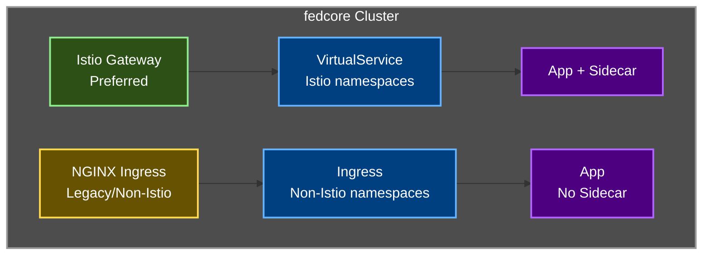

# NGINX Ingress Controller

Traditional Kubernetes Ingress support for tenants not using Istio service mesh.

## Overview

The NGINX Ingress Controller provides traditional Kubernetes Ingress support for tenants who:
- Don't use Istio service mesh (no sidecar injection)
- Have legacy applications not compatible with Istio
- Prefer simpler ingress without service mesh overhead
- Are gradually migrating to Istio

## Coexistence with Istio

Both ingress methods can coexist in the same cluster:



**When to use**:
- ✅ Namespace has `istio-injection: disabled` or no label
- ✅ Legacy applications incompatible with Istio
- ✅ Simple HTTP/HTTPS routing without service mesh features

**When NOT to use**:
- ❌ Namespace has `istio-injection: enabled` (use Istio Gateway instead)
- ❌ Need mTLS between services (use Istio)
- ❌ Need advanced traffic management (use Istio)

## Installation

NGINX Ingress Controller is deployed as a platform component:

```yaml
# In platform/clusters/{cluster-name}/cluster.yaml
components:
- name: ingress-nginx
  enabled: true
  version: "1.0.0"
```

## Directory Structure

```
platform/components/ingress-nginx/
├── base/
│   └── ingress-nginx.yaml        # Base NGINX installation
├── overlays/
│   ├── cloud/
│   │   ├── aws/
│   │   │   └── overlay.yaml      # AWS NLB configuration
│   │   ├── azure/
│   │   │   └── overlay.yaml      # Azure LB configuration
│   │   └── onprem/
│   │       └── overlay.yaml      # MetalLB/NodePort
└── README.md
```

## Configuration

### Base Configuration

**File**: [base/ingress-nginx.yaml](base/ingress-nginx.yaml)

- NGINX Ingress Controller with 2 replicas
- IngressClass: `nginx` (not default - Istio is preferred)
- Autoscaling enabled (2-5 replicas)
- Prometheus metrics enabled
- Security headers configured
- TLS protocols: TLSv1.2, TLSv1.3

### Cloud-Specific Overlays

**AWS** ([overlays/aws/overlay.yaml](overlays/aws/overlay.yaml)):
- Network Load Balancer (NLB)
- Cross-zone load balancing
- Connection draining (60s)
- Cost allocation tags

**Azure** ([overlays/azure/overlay.yaml](overlays/azure/overlay.yaml)):
- Azure Load Balancer Standard SKU
- TCP idle timeout (4 minutes)

**On-Prem** ([overlays/onprem/overlay.yaml](overlays/onprem/overlay.yaml)):
- MetalLB support
- NodePort fallback

## Usage

### Using WebApp RGD

The easiest way to create an Ingress:

```yaml
apiVersion: example.org/v1
kind: WebApp
metadata:
  name: my-app
  namespace: acme-frontend
spec:
  appName: my-app
  namespace: acme-frontend
  image: ghcr.io/acme/my-app:v1.0.0
  replicas: 3

  ingress:
    enabled: true
    type: "kubernetes"  # Use Kubernetes Ingress (not Istio)
    hostname: "my-app.prod.us-east-1.fedcore.io"
    path: "/"
    ingressClassName: "nginx"
    tlsSecretName: "my-app-tls"  # Must be created manually
```

### Manual Ingress Resource

For existing applications:

```yaml
apiVersion: networking.k8s.io/v1
kind: Ingress
metadata:
  name: my-app
  namespace: acme-frontend
  annotations:
    nginx.ingress.kubernetes.io/force-ssl-redirect: "true"
spec:
  ingressClassName: nginx
  rules:
  - host: my-app.prod.us-east-1.fedcore.io
    http:
      paths:
      - path: /
        pathType: Prefix
        backend:
          service:
            name: my-app
            port:
              number: 80
  tls:
  - hosts:
    - my-app.prod.us-east-1.fedcore.io
    secretName: my-app-tls
```

## TLS/Certificate Management

### Manual Certificate Provisioning

```bash
# 1. Generate or obtain certificate
openssl req -new -newkey rsa:2048 -nodes \
  -keyout app.key -out app.csr \
  -subj "/CN=my-app.prod.us-east-1.fedcore.io"

# 2. Get certificate signed by CA

# 3. Create Kubernetes secret
kubectl create secret tls my-app-tls \
  --cert=app.crt \
  --key=app.key \
  -n acme-frontend

# 4. Reference in Ingress
spec:
  tls:
  - hosts:
    - my-app.prod.us-east-1.fedcore.io
    secretName: my-app-tls
```

### Certificate Rotation

```bash
# Update the secret with new certificate
kubectl create secret tls my-app-tls \
  --cert=new-app.crt \
  --key=new-app.key \
  -n acme-frontend \
  --dry-run=client -o yaml | kubectl apply -f -

# NGINX will automatically reload the new certificate
```

## Advanced Configuration

### Path-Based Routing

```yaml
apiVersion: networking.k8s.io/v1
kind: Ingress
metadata:
  name: api-routing
  namespace: acme-backend
  annotations:
    nginx.ingress.kubernetes.io/force-ssl-redirect: "true"
    nginx.ingress.kubernetes.io/rewrite-target: /$2
spec:
  ingressClassName: nginx
  rules:
  - host: api.acme.prod.us-east-1.fedcore.io
    http:
      paths:
      # Route /v1/* to api-v1 service
      - path: /v1(/|$)(.*)
        pathType: ImplementationSpecific
        backend:
          service:
            name: api-v1
            port:
              number: 80
      # Route /v2/* to api-v2 service
      - path: /v2(/|$)(.*)
        pathType: ImplementationSpecific
        backend:
          service:
            name: api-v2
            port:
              number: 80
  tls:
  - hosts:
    - api.acme.prod.us-east-1.fedcore.io
    secretName: api-tls
```

### Custom Timeouts

```yaml
apiVersion: networking.k8s.io/v1
kind: Ingress
metadata:
  name: slow-app
  namespace: acme-frontend
  annotations:
    nginx.ingress.kubernetes.io/force-ssl-redirect: "true"
    # Increase timeouts for slow backends
    nginx.ingress.kubernetes.io/proxy-connect-timeout: "300"
    nginx.ingress.kubernetes.io/proxy-send-timeout: "300"
    nginx.ingress.kubernetes.io/proxy-read-timeout: "300"
spec:
  ingressClassName: nginx
  rules:
  - host: slow.acme.prod.us-east-1.fedcore.io
    http:
      paths:
      - path: /
        pathType: Prefix
        backend:
          service:
            name: slow-app
            port:
              number: 80
```

### Rate Limiting

```yaml
apiVersion: networking.k8s.io/v1
kind: Ingress
metadata:
  name: rate-limited-app
  namespace: acme-frontend
  annotations:
    nginx.ingress.kubernetes.io/force-ssl-redirect: "true"
    # Rate limit: 10 requests per second per IP
    nginx.ingress.kubernetes.io/limit-rps: "10"
spec:
  ingressClassName: nginx
  rules:
  - host: api.acme.prod.us-east-1.fedcore.io
    http:
      paths:
      - path: /
        pathType: Prefix
        backend:
          service:
            name: api
            port:
              number: 80
```

## Governance and Security

### Kyverno Policies

The platform automatically enforces:

1. **Hostname Validation**: Hostnames must match cluster ingress domain
2. **IngressClassName Required**: Must specify `nginx` ingressClassName
3. **HTTPS Redirect**: Must have `force-ssl-redirect: true` annotation
4. **TLS Configuration**: If TLS is configured, must have valid secretName
5. **Path Type**: Must be `Prefix` or `Exact` (not `ImplementationSpecific`)
6. **Dangerous Annotations Blocked**: Cannot use `configuration-snippet` or `server-snippet`

See [Kyverno Ingress Policies](../../kyverno-policies/base/kubernetes-ingress-policies.yaml)

## Monitoring and Troubleshooting

### Check Ingress Status

```bash
# List Ingress resources
kubectl get ingress -n acme-frontend

# Describe Ingress
kubectl describe ingress my-app -n acme-frontend

# Check NGINX controller logs
kubectl logs -n ingress-nginx -l app.kubernetes.io/name=ingress-nginx -f
```

### Get Load Balancer Address

```bash
# Get external IP/hostname
kubectl get svc -n ingress-nginx ingress-nginx-controller

# Test connectivity
INGRESS_IP=$(kubectl get svc -n ingress-nginx ingress-nginx-controller -o jsonpath='{.status.loadBalancer.ingress[0].hostname}')
curl -H "Host: my-app.prod.us-east-1.fedcore.io" http://$INGRESS_IP/
```

### Common Issues

#### 404 Not Found
**Cause**: Ingress not configured correctly or service not found

**Check**:
```bash
# Verify service exists
kubectl get svc my-app -n acme-frontend

# Check service endpoints
kubectl get endpoints my-app -n acme-frontend

# Verify Ingress configuration
kubectl get ingress my-app -n acme-frontend -o yaml
```

#### 503 Service Unavailable
**Cause**: Backend pods not healthy

**Check**:
```bash
# Check pod status
kubectl get pods -n acme-frontend -l app=my-app

# Check pod logs
kubectl logs -n acme-frontend -l app=my-app
```

#### TLS Certificate Errors
**Cause**: Certificate issues

**Check**:
```bash
# Verify secret exists
kubectl get secret my-app-tls -n acme-frontend

# Check certificate
kubectl get secret my-app-tls -n acme-frontend -o jsonpath='{.data.tls\.crt}' | base64 -d | openssl x509 -text -noout

# Test TLS handshake
openssl s_client -connect $INGRESS_IP:443 -servername my-app.prod.us-east-1.fedcore.io
```

## Migration Path: NGINX to Istio

When ready to migrate to Istio:

### 1. Enable Istio for Namespace

```bash
kubectl label namespace acme-frontend istio-injection=enabled
```

### 2. Restart Pods to Inject Sidecars

```bash
kubectl rollout restart deployment -n acme-frontend
```

### 3. Create VirtualService

```yaml
apiVersion: networking.istio.io/v1beta1
kind: VirtualService
metadata:
  name: my-app
  namespace: acme-frontend
spec:
  hosts:
  - "my-app.prod.us-east-1.fedcore.io"
  gateways:
  - istio-system/fedcore-gateway
  http:
  - route:
    - destination:
        host: my-app.acme-frontend.svc.cluster.local
        port:
          number: 80
```

### 4. Test Traffic Flow

Verify traffic works through Istio Gateway.

### 5. Delete Old Ingress

```bash
kubectl delete ingress my-app -n acme-frontend
```

## Cost Comparison

### Shared NGINX Ingress
- **Infrastructure**: ~$20-30/month (shared across all non-Istio tenants)
- **Simpler** than Istio for basic use cases
- **Less overhead** (no sidecar containers)

### Istio Gateway (Recommended Long-term)
- **Infrastructure**: ~$20-30/month (shared)
- **More features**: mTLS, traffic management, observability
- **Better for microservices**

## Best Practices

1. **Prefer Istio for new applications** - Better long-term
2. **Use NGINX for legacy apps** - Until they can be migrated
3. **Always enable HTTPS redirect** - Required by policy
4. **Specify ingressClassName** - Prevents ambiguity
5. **Use Prefix or Exact pathType** - Avoid ImplementationSpecific
6. **Monitor metrics** - Track request rates, latency, errors
7. **Plan migration to Istio** - For better service mesh integration

## Related Documentation

- [Ingress Management Guide](../../../docs/INGRESS_MANAGEMENT.md) - Platform ingress strategy
- [Istio Component](../istio/README.md) - Service mesh ingress
- [Kyverno Ingress Policies](../kyverno-policies/base/kubernetes-ingress-policies.yaml) - Governance
- [WebApp RGD](../../rgds/webapps/README.md) - Application deployment

---

**Status:** ✅ Production ready
