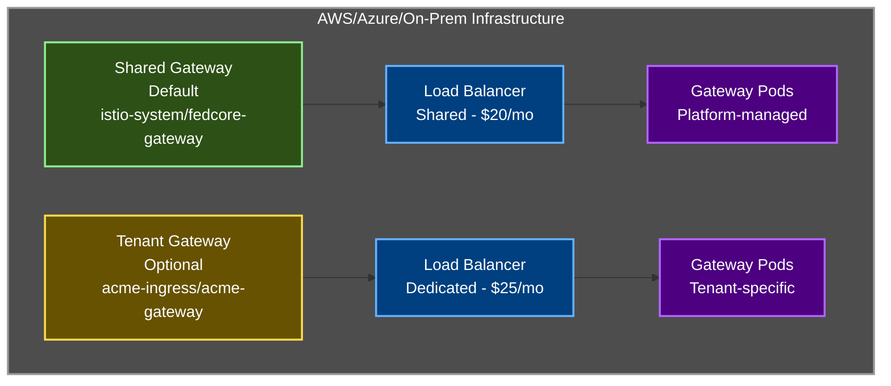

# Tenant Gateway RGD

Provision dedicated Istio ingress gateways with isolated load balancers for tenants requiring traffic isolation.

## Overview

The Tenant Gateway RGD allows tenants to create dedicated ingress gateways when the shared platform gateway doesn't meet their requirements. Each dedicated gateway provides:

- **Complete traffic isolation** - Separate load balancer and gateway pods
- **Custom TLS certificates** - Tenant-managed certificates
- **Independent scaling** - Autoscaling configured per tenant
- **Cost allocation** - Load balancer costs tagged to specific tenant

## When to Use

### Use Shared Gateway (Default)
Most tenants should use the shared `istio-system/fedcore-gateway`:
- ✅ Cost-effective (shared load balancer)
- ✅ Centralized TLS management
- ✅ Simple to use
- ✅ Strong isolation via Kyverno policies

### Use Dedicated Gateway
Create a dedicated gateway when you need:
- 🔒 **Regulatory compliance** - Physical traffic separation required
- 💰 **Billing chargeback** - Load balancer costs allocated to tenant budget
- 🔑 **Custom certificates** - Client certificates or specific CA requirements
- 📈 **Independent scaling** - Very different traffic patterns from other tenants
- 🔐 **Security posture** - Additional layer of isolation

## Architecture



## Usage

### Prerequisites

1. **Tenant must exist** (created via TenantOnboarding)
2. **TLS certificate** must be created manually:
   ```bash
   # Create certificate secret in tenant's gateway namespace
   kubectl create secret tls acme-tls-cert \
     --cert=acme.crt \
     --key=acme.key \
     -n acme-ingress
   ```

### Basic Example

```yaml
apiVersion: gateway.fedcore.io/v1alpha1
kind: TenantGateway
metadata:
  name: acme-gateway
  namespace: acme-cicd
spec:
  tenantName: acme
  gatewayName: acme-gateway
  namespace: acme-ingress

  replicas: 2

  tlsSecretName: acme-tls-cert

  hosts:
  - "*.acme.prod.us-east-1.fedcore.io"
  - "acme.prod.us-east-1.fedcore.io"
```

### Using the Gateway in VirtualServices

```yaml
apiVersion: networking.istio.io/v1beta1
kind: VirtualService
metadata:
  name: my-app
  namespace: acme-frontend
spec:
  hosts:
  - "my-app.acme.prod.us-east-1.fedcore.io"
  gateways:
  - acme-ingress/acme-gateway  # Reference tenant gateway
  http:
  - match:
    - uri:
        prefix: "/"
    route:
    - destination:
        host: my-app.acme-frontend.svc.cluster.local
        port:
          number: 8080
```

## Configuration

### Schema Reference

| Field | Type | Default | Description |
|-------|------|---------|-------------|
| `spec.tenantName` | string | *required* | Capsule tenant name |
| `spec.gatewayName` | string | *required* | Gateway identifier |
| `spec.namespace` | string | *required* | Namespace for gateway resources |
| `spec.replicas` | integer | `2` | Number of gateway pods |
| `spec.tlsSecretName` | string | `""` | TLS certificate secret name |
| `spec.hosts` | array | `[]` | Hostnames this gateway serves |
| `spec.resources.requests.cpu` | string | `"100m"` | CPU request per pod |
| `spec.resources.requests.memory` | string | `"128Mi"` | Memory request per pod |
| `spec.resources.limits.cpu` | string | `"2000m"` | CPU limit per pod |
| `spec.resources.limits.memory` | string | `"1Gi"` | Memory limit per pod |
| `spec.autoscaling.enabled` | boolean | `true` | Enable HPA |
| `spec.autoscaling.minReplicas` | integer | `2` | Minimum replicas |
| `spec.autoscaling.maxReplicas` | integer | `5` | Maximum replicas |
| `spec.autoscaling.targetCPUUtilization` | integer | `80` | Target CPU % |

### Platform Limits

The following limits are enforced by Kyverno policies:

- **CPU**: Maximum 4000m per replica
- **Memory**: Maximum 2Gi per replica
- **Replicas**: Maximum 10 replicas (maxReplicas)

## Cloud-Specific Configuration

### AWS

The gateway automatically configures:
- Network Load Balancer (NLB)
- Cross-zone load balancing
- Connection draining (60s)
- Cost allocation tags (tenant, gateway, cluster)

**Estimated cost**: ~$25-35/month per gateway + data transfer

### Azure

The gateway automatically configures:
- Azure Load Balancer Standard SKU
- TCP idle timeout (4 minutes)

**Estimated cost**: ~$25-45/month per gateway

### On-Premises

The gateway configures for:
- MetalLB (if available)
- NodePort (fallback)

## Certificate Management

### Manual Certificate Provisioning

1. **Generate certificate**:
   ```bash
   # Generate CSR
   openssl req -new -newkey rsa:2048 -nodes \
     -keyout acme.key -out acme.csr \
     -subj "/CN=*.acme.prod.us-east-1.fedcore.io"
   ```

2. **Get certificate signed** by your CA or certificate authority

3. **Create Kubernetes secret**:
   ```bash
   kubectl create secret tls acme-tls-cert \
     --cert=acme.crt \
     --key=acme.key \
     -n acme-ingress
   ```

4. **Reference in TenantGateway**:
   ```yaml
   spec:
     tlsSecretName: acme-tls-cert
   ```

### Certificate Rotation

To rotate certificates:

```bash
# Update the secret with new certificate
kubectl create secret tls acme-tls-cert \
  --cert=new-acme.crt \
  --key=new-acme.key \
  -n acme-ingress \
  --dry-run=client -o yaml | kubectl apply -f -

# Gateway pods will automatically reload the new certificate
```

## Monitoring and Observability

### Check Gateway Status

```bash
# Check TenantGateway resource
kubectl get tenantgateway acme-gateway -n acme-cicd

# Check gateway pods
kubectl get pods -n acme-ingress -l gateway=acme-gateway

# Check gateway service and load balancer
kubectl get svc -n acme-ingress

# Check HPA status
kubectl get hpa -n acme-ingress
```

### View Gateway Logs

```bash
# Gateway pod logs
kubectl logs -n acme-ingress -l gateway=acme-gateway -f

# Envoy access logs
kubectl logs -n acme-ingress -l gateway=acme-gateway -c istio-proxy -f
```

### Metrics

Gateway pods export Prometheus metrics:
- Request rate, latency, error rate
- Active connections
- Bytes sent/received
- TLS handshake metrics

## Governance

Kyverno policies enforce:

1. **Ownership validation** - TenantGateway must be created in tenant-owned namespace
2. **Resource limits** - CPU, memory, and replica limits enforced
3. **Gateway references** - VirtualServices can only reference owned gateways or shared gateway
4. **Shared gateway protection** - Tenants cannot modify `istio-system/fedcore-gateway`

## Troubleshooting

### Gateway Pods Not Starting

**Check**:
```bash
kubectl describe pod -n acme-ingress -l gateway=acme-gateway
```

**Common issues**:
- Insufficient resource quota in namespace
- Image pull failures
- Invalid service account

### Load Balancer Not Provisioning

**AWS**:
```bash
# Check service events
kubectl describe svc -n acme-ingress

# Check AWS Load Balancer Controller logs
kubectl logs -n kube-system -l app.kubernetes.io/name=aws-load-balancer-controller
```

**Azure**:
```bash
# Check cloud controller manager
kubectl logs -n kube-system -l component=cloud-controller-manager
```

### TLS Certificate Issues

**Check secret exists**:
```bash
kubectl get secret acme-tls-cert -n acme-ingress
```

**Verify certificate**:
```bash
kubectl get secret acme-tls-cert -n acme-ingress -o jsonpath='{.data.tls\.crt}' | base64 -d | openssl x509 -text -noout
```

**Common issues**:
- Secret not in correct namespace
- Certificate expired
- Hostname mismatch

### VirtualService Not Working

**Check VirtualService**:
```bash
kubectl describe virtualservice my-app -n acme-frontend
```

**Verify gateway reference**:
```bash
# Should reference: acme-ingress/acme-gateway
kubectl get virtualservice my-app -n acme-frontend -o yaml | grep -A5 gateways
```

## Examples

See [examples/](examples/) directory:
- [basic-gateway.yaml](examples/basic-gateway.yaml) - Standard gateway with defaults
- [high-traffic-gateway.yaml](examples/high-traffic-gateway.yaml) - High-traffic configuration

## Cost Comparison

### Shared Gateway (Recommended for Most)
- **Infrastructure**: ~$20-30/month (shared across all tenants)
- **Per-tenant cost**: $0
- **Total for 10 tenants**: ~$20-30/month

### Dedicated Gateways
- **Infrastructure**: ~$25-35/month per tenant
- **Total for 10 tenants**: ~$250-350/month

**💡 Recommendation**: Start with shared gateway, create dedicated gateways only when needed.

## Related Documentation

- [Istio Component README](../../components/istio/README.md) - Platform Istio configuration
- [Shared Gateway Configuration](../../components/istio/base/istio.yaml) - Platform gateway
- [Kyverno Gateway Policies](../../components/kyverno-policies/base/istio-gateway-policies.yaml) - Governance
- [Ingress Best Practices Guide](../../../docs/INGRESS_MANAGEMENT.md) - Platform ingress strategy

---

**Status:** ✅ Production ready
